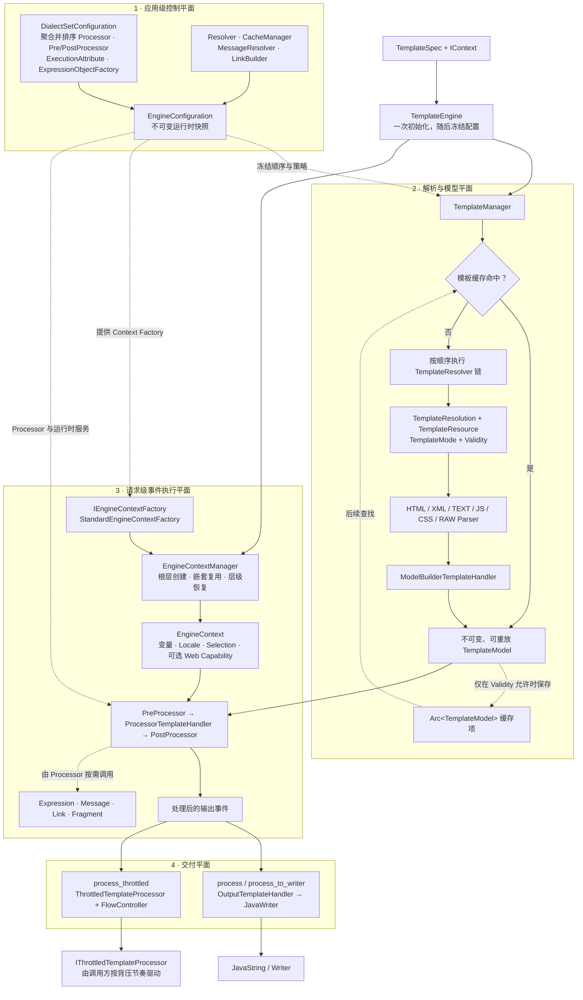
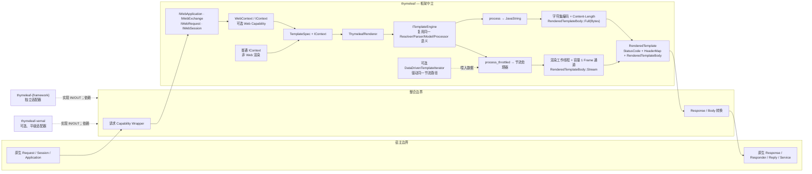
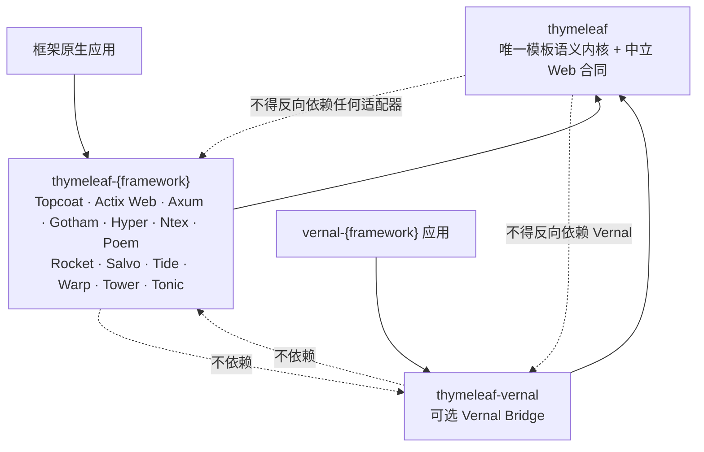

<a id="readme-top"></a>

<div align="center">

# thymeleaf-rust

**迁移 Thymeleaf 核心语义、面向 Rust 的框架中立模板引擎。**

[](#项目状态)
[](LICENSE)

[English](README.md) | [简体中文](README.zh-CN.md)

[项目概览](#项目概览) · [架构](#架构) · [Crate 模型](#crate-模型) ·
[集成模型](#集成模型) · [后续路线](#后续路线) · [参与贡献](#参与贡献)

</div>

---

> **项目状态：运行时承接面已实现，语义验证与发布准备进行中**
>
> `thymeleaf` 核心 Engine、六种 Parser 模式、事件模型、Standard Dialect、Processor、
> 表达式安全子集、中立 Web 输出、13 个独立框架整合 crate 和 `thymeleaf-vernal`
> 已进入 Workspace。固定上游的对象、方法、JUnit 和 `.thtest` 均已登记处置，但
> 491 个主对象中当前已有 202 个达到对象级 `BEHAVIOR_VERIFIED`；crates.io 尚未发布，
> 框架适配器的真实 HTTP Full/Stream/Error/Cancellation 测试仍需加强。

## 项目概览

`thymeleaf-rust` 是项目和 Git 仓库名称，是使用 Rust 对
[Thymeleaf](https://www.thymeleaf.org/) 3.1.5.RELEASE 核心模板语义进行对象级、
方法级和行为级迁移的动态内容渲染引擎。

对外发布的核心 crate 名称是 **`thymeleaf`**，当前尚未上传 crates.io。框架整合
crate 使用 `thymeleaf-{framework}` 模式；不会发布或创建任何 `thymeleaf-rust-*`
crate 或 Rust 模块。

项目计划同时支持两条地位相同的集成路径：

1. 与 Rust Web 框架直接、独立集成；
2. 作为 Vernal 及其 Web 适配器的可选动态内容渲染引擎。

引擎 Core 将保持对 Topcoat、Actix Web、Axum、Gotham、Hyper、Ntex、Poem、Rocket、Salvo、Tide、Warp、Tower、Tonic 和 Vernal 的完全中立。

本项目是独立项目，不是 Thymeleaf 官方项目。

## 目标与边界

### 项目目标

- 提供具有 Thymeleaf 风格处理语义的自然 HTML 模板。
- 支持变量、选择表达式、消息、链接、Fragment、Processor 和 Dialect。
- 构建不可变、可缓存、可重放的模板模型。
- 支持完整渲染和具有背压能力的流式渲染。
- 暴露中立的 `RenderedTemplate`/HTTP Body 合同。
- 为目标 Rust Web 框架提供独立版本的适配器。
- 提供可选的 `thymeleaf-vernal` bridge，同时避免 Vernal 成为 Core 依赖。
- 通过可追溯的 Parity Test 和 Golden Test 推进上游兼容。

### 非目标

- 在 Core 中复制 Java 继承、反射、Servlet 或 Spring 类型。
- 在发布版本化兼容矩阵前宣称完全兼容 Thymeleaf。
- 让某个框架的 Response 类型进入引擎公共 API。
- 自动把运行时模板转换成 Topcoat 响应式组件。
- 把 gRPC Payload 当作普通浏览器 HTML Response。
- 把规划中的 crate、API、测试或性能结果描述为已经实现。

## 架构

```text
模板 + Model + Locale
          │
          ▼
┌────────────────────────────── thymeleaf ──────────────────────────────┐
│ 控制平面      EngineConfiguration · DialectSetConfiguration · Cache  │
│     │                                                                │
│     ▼                                                                │
│ 模型平面      Resolver → Resource → Parser → 不可变 TemplateModel     │
│     │                                                                │
│     ▼                                                                │
│ 执行平面      Pre → ProcessorTemplateHandler → Post → 输出事件       │
│     │                                                                │
│     ▼                                                                │
│ 交付平面      process → String/Writer                                │
│               process_throttled → IThrottledTemplateProcessor        │
│                                                                      │
│ 共享语义：Expression · Message · Link · Fragment · Dialect           │
│ 中立 Web：ThymeleafRenderer 调用交付 API                             │
│           → RenderedTemplate(Status、Header、Full/Stream Body)       │
└──────────────────────────────────┬───────────────────────────────────┘
                                   │ 稳定的中立合同
                  ┌────────────────┴─────────────────┐
                  ▼                                  ▼
        thymeleaf-{framework}                thymeleaf-vernal
        直接宿主适配器                        可选、平级 Bridge
                  │                                  │
                  ▼                                  ▼
        框架原生 Response                     vernal-{framework}
```

上图箭头表示运行时数据流。Cargo 依赖方向与之相反：应用和整合 crate 依赖
`thymeleaf`，核心永远不依赖宿主框架或 Vernal。

```text
宿主应用 → thymeleaf-{framework} → thymeleaf
Vernal 应用 → thymeleaf-vernal → thymeleaf

禁止：
thymeleaf crate → 框架整合
thymeleaf crate → Vernal
```

### 核心渲染调用链

CodeGraph 验证的当前实现保留了 Thymeleaf 的事件驱动拓扑，而不是把模板转交给
Tera、Askama 或 Handlebars：



当前 Rust 实现在每次缓存未命中时都会物化 `TemplateModel`。缓存有效性只决定是否保留
该模型，不决定 Parser 是否绕过 Model。完整渲染和节流渲染共享解析、Parser、
Processor、表达式和输出事件语义；差别只在输出驱动和背压边界。

每次根模板处理由 `StandardEngineContextFactory` 根据 `IWebContext` capability 创建
`EngineContext` 或 `WebEngineContext`；嵌套模板不复制上下文，而由
`EngineContextManager` 提升层级、压入 `TemplateData`，结束时再恢复上一层。这一
生命周期保证普通渲染与 Web 渲染只在 Context 能力上分流，不会形成两套模板引擎。

核心架构由四个彼此约束的平面组成：配置平面在首次初始化时聚合并冻结方言能力；解析
与模型平面负责把资源变成可重放事件；请求执行平面解释事件并调用 Processor；交付
平面才选择完整、节流或 HTTP 输出。Web 整合只有两个合法的宿主触点：入站
Capability Wrapper 提供 Request/Session/Application 可观察能力，出站把
`RenderedTemplate` 转换成框架原生 Response/Body。整合层不得操作配置、Parser、
TemplateModel、Processor 链或表达式语义。

### 中立 Web 与适配器



中立性是双向的：入站时，适配器只暴露 Context、LinkBuilder 和 Web 模板资源所需的
Web 能力；出站时，只转换 Status、Header 和 Body 类型。整合 crate 不得重复实现
Resolver、Parser、Expression、Processor、Charset 编码或节流控制。独立框架适配与
`thymeleaf-vernal` 是同一组中立合同的平级消费者，两条路径互不依赖。详细设计、
调用链证据和风险见
[可行性与架构设计](docs/Thymeleaf-Rust-可行性与架构设计.md)。

当前 Hyper 宿主桥已经实现中立入站 trait；其他框架 crate 目前主要完成
`RenderedTemplate` 出站转换，对等的原生 Request/Session/Application Wrapper 仍属于
各框架验收工作，不能把架构合同误报为已经全部实现。

| 边界 | `thymeleaf` 负责 | 整合 crate 负责 |
|:---|:---|:---|
| 请求侧 | 中立 Web Capability trait 与模板 Context 语义 | 原生 Request/Session/Application Wrapper |
| 渲染 | Resolver、Parser、Model、Processor、Expression、Link、Message、Fragment、Cache | 不承载任何模板语义 |
| 响应侧 | `RenderedTemplate`、元数据、Charset 编码、Full/Stream Body | 原生 Response/Responder/Reply/Service 转换 |
| 生命周期 | 节流推进、Frame 错误、数据驱动 Signal | 请求作用域、断连观察、宿主错误映射 |

失败也必须沿同一边界传播：

| 失败阶段 | 对外可观察行为 | 责任归属 |
|:---|:---|:---|
| Engine 初始化 / Dialect 聚合 | 在开始渲染前同步失败，不产生响应 Body | `thymeleaf` |
| Full 模式中的 Resolver / Parser / Processor | `render_full` 同步返回错误，不产生响应 Body | `thymeleaf` |
| Stream 模式中的 Resolver / Parser / Processor | 作为 `RenderedTemplateBody::Stream` 的错误项结束流，不能再改写已发送 Header | `thymeleaf` 定义，适配器无损转发 |
| 客户端断连 / Body 被丢弃 | 停止消费并触发发送端关闭；宿主负责观察连接生命周期 | 整合 crate |
| 框架 Response 转换失败 | 转换为宿主原生错误，不得重新执行模板 | 整合 crate |

因此“中立”不是只统一成功响应，而是统一成功、初始化失败、渲染失败和流式晚期失败的
语义，再由宿主适配器负责生命周期与错误类型转换。

同一个核心在不改变模板语义的前提下支持三种部署模式：

| 模式 | 依赖路径 | Web 能力 | 输出 |
|:---|:---|:---|:---|
| 非 Web 渲染 | 应用 → `thymeleaf` | 无，使用普通 `IContext` | `JavaString` 或 `JavaWriter` |
| Web 直接集成 | 应用 → `thymeleaf-{framework}` → `thymeleaf` | 适配器包装原生 Request/Session/Application | 框架原生 Response |
| Vernal 集成 | Vernal 应用 → `thymeleaf-vernal` → `thymeleaf` | Vernal Bridge 提供同一组中立 Capability | Vernal HTTP/View 结果 |

直接框架适配器与 `thymeleaf-vernal` 是平级消费者；任何一方都不是另一方必须经过的
“标准路径”。



图中实线是 Cargo/API 依赖方向；渲染结果的运行时数据流方向相反，从 `thymeleaf`
产生 `RenderedTemplate`，再由对应适配器转换为宿主响应。

## 命名与发布合同

| 层级 | 名称 | 状态 |
|:---|:---|:---:|
| 项目与 Git 仓库 | `thymeleaf-rust` | 已确认 |
| crates.io 核心 | `thymeleaf` | Workspace 已创建，尚未发布 |
| Rust 公共路径 | `thymeleaf::...` | Foundation API 已实现 |
| 整合 crate | `thymeleaf-{framework}` | 13 个适配 crate 已实现，基础响应合同通过，端到端验证待加强 |
| 可选 Vernal 整合 | `thymeleaf-vernal` | HTTP 协议桥已实现，状态/Header/Data/Trailer 合同通过 |

明确排除 `thymeleaf-rust-core`、`thymeleaf-rust-axum` 和 Rust 根模块 `thymeleaf_rust` 等名称。

## Crate 模型

引擎是一个内聚的核心 crate。Parser 模式、表达式处理、Standard Dialect、中立 Web 输出和测试支持均作为 `thymeleaf` 的内部模块或测试基础设施存在，不拆分为独立发布的 crate。

| 核心 crate | 职责 |
|:---|:---|
| `thymeleaf` | Engine、Context、TemplateModel、各 Parser 模式、表达式求值、Standard Dialect 与 `th:*` Processor、中立渲染输出、稳定公共 API 和核心测试基础设施 |

其余 crate 均为整合 crate：`thymeleaf-{framework}` 将 `thymeleaf` 的中立输出适配到单个宿主框架，`thymeleaf-vernal` 提供可选 Vernal 整合，其名称与 `thymeleaf-spring` 一样遵循“核心在前”的命名约定。整合 crate 必须保持薄层，禁止复制解析或渲染逻辑。

## 集成模型

架构为每个目标框架定义独立使用和可选 Vernal 组合两种方式。独立适配器当前已有实现；
各 `vernal-{framework}` 组合是否可用，仍取决于 Vernal 对应宿主适配器。

| 宿主 | 独立适配器 | Vernal 组合 | 预期输出 |
|:---|:---|:---|:---|
| Topcoat | `thymeleaf-topcoat` | `thymeleaf-vernal` + `vernal-topcoat` | View、Page、Fragment、受控 RawHtml |
| Actix Web | `thymeleaf-actix-web` | `thymeleaf-vernal` + `vernal-actix-web` | Responder、MessageBody、Stream |
| Axum | `thymeleaf-axum` | `thymeleaf-vernal` + `vernal-axum` | IntoResponse 与 Body |
| Gotham | `thymeleaf-gotham` | `thymeleaf-vernal` + `vernal-gotham` | Handler 与 Response |
| Hyper | `thymeleaf-hyper` | `thymeleaf-vernal` + `vernal-hyper` | 标准 HTTP Response/Body |
| Ntex | `thymeleaf-ntex` | `thymeleaf-vernal` + `vernal-ntex` | Responder、Service、Body |
| Poem | `thymeleaf-poem` | `thymeleaf-vernal` + `vernal-poem` | IntoResponse、Endpoint、Stream |
| Rocket | `thymeleaf-rocket` | `thymeleaf-vernal` + `vernal-rocket` | Responder 与 ByteStream |
| Salvo | `thymeleaf-salvo` | `thymeleaf-vernal` + `vernal-salvo` | Handler 与 Response Body |
| Tide | `thymeleaf-tide` | `thymeleaf-vernal` + `vernal-tide` | Endpoint 与 Response |
| Warp | `thymeleaf-warp` | `thymeleaf-vernal` + `vernal-warp` | Reply 与 Rejection 映射 |
| Tower | `thymeleaf-tower` | `thymeleaf-vernal` + `vernal-tower` | Service、Layer、Response Body |
| Tonic | `thymeleaf-tonic` | `thymeleaf-vernal` + `vernal-tonic` | 动态 String/Bytes、Gateway、服务内容 |

发布顺序可以分阶段推进，但架构不得要求独立用户依赖 Vernal。

## 项目状态

| 交付物 | 状态 | 证据 |
|:---|:---:|:---|
| 可行性与架构基线 | 已有，CodeGraph 复核 | [`docs/Thymeleaf-Rust-可行性与架构设计.md`](docs/Thymeleaf-Rust-可行性与架构设计.md) |
| 命名与中立性决策 | 已记录 | 架构提案 ADR |
| Cargo Workspace | 已有 | [`Cargo.toml`](Cargo.toml) |
| Rust 核心 API | 语义清单已闭合 | Engine、配置、Resolver、六种 Parser、事件模型、Context、缓存、Standard Dialect、Processor SPI、表达式安全子集与中立 Web 输出均有真实实现 |
| 框架适配器 | 已有，宿主测试待加强 | Workspace 中 13 个独立框架 crate 与 `thymeleaf-vernal` 均可编译；28 个适配器/Hyper 宿主合同测试通过 |
| 上游兼容矩阵 | 结构清单已闭合，行为验证进行中 | 491 个主对象、69 个内部对象和 4,291 个方法都有处置；主对象状态为 202 已验证、277 已实现待验证、12 个 Java-only 宿主等价映射 |
| 迁移治理 | 已自动化 | `cargo xtask migration-check` 校验基线、清单、布局、来源注释和红线 |
| 测试与 CI | 语义门禁通过 | Java 五模块基线 2,156/2,156；SOURCE_PARITY 875/875、0 缺失；Rust 与 2,595/2,595 个可比较 `.thtest` 一致；源码覆盖率仅作诊断 |
| crates.io 包 | 未发布 | `thymeleaf` 仍是规划发布名 |

## 文档快速开始

针对固定上游检出复现完整语义一致性门禁：

```bash
git clone --branch dev https://github.com/easy-4-rust/thymeleaf-rust.git
cd thymeleaf-rust
cargo test --workspace --all-features
THYMELEAF_UPSTREAM=/absolute/path/to/thymeleaf \
THYMELEAF_SCOPE=semantic_all \
cargo test --test thtest_upstream_plain_batch

# 可选诊断，不设置 fail-under 阈值
cargo llvm-cov --workspace --all-features --summary-only
```

然后阅读：

- [可行性与架构基线](docs/Thymeleaf-Rust-可行性与架构设计.md)
- [迁移路线图](docs/migration/迁移路线图.md)
- [对象级对照表](docs/migration/对象级对照表.md)
- [方法级对照表](docs/migration/方法级对照表.md)
- [语义迁移对照表](docs/migration/语义迁移对照表.md)
- [对象名称一致性检查](docs/migration/对象名称一致性检查.md)
- [迁移技术要求](docs/migration/Thymeleaf-Rust-迁移技术要求.md)
- [迁移测试对照表](docs/migration/迁移测试对照表.md)
- [English README](README.md)

## 兼容方向

兼容基线固定为 Thymeleaf 3.1.5.RELEASE 提交
`10f9dd2eb8cbd98515ce14b149d115e0287d0add`。现有证据包括对象与方法清单、
覆盖 2,156 个 Java 运行时 case 的 875/875 SOURCE_PARITY 处置、61 组共 4,384 条
Java/Rust Golden，以及 2,595 个可比较上游 `.thtest` 结果。最新闭合的
`ConfigurationPrinterHelper`、`EngineConfiguration` 与 `IEngineConfiguration`
批次验证了不可变有序快照、按接口能力查询 Dialect、并发 ModelFactory 发布，以及
完整 DEBUG/TRACE 配置诊断。
Engine Context 工厂/管理器生命周期批次还验证了普通/Web 分流、有序变量复制、
内建 Web capability 保留、嵌套上下文身份以及 TemplateData 栈恢复。

后续证据工作集中在提升保守的对象级成熟度标签、扩展适配器 Full/Stream/Error/
Cancellation 测试，以及持续维护显式差异登记。

Thymeleaf 上游采用 Apache License 2.0。任何从上游调整而来的源码、测试或 Fixture 都必须保留适用的版权、许可证、NOTICE、署名和修改说明。

## 后续路线

| 阶段 | 规划交付物 | 退出条件 |
|:---|:---|:---|
| P0 | 框架适配器验收 | 每个适配器具备 Full/Stream/Error/Cancellation 真实 HTTP 测试 |
| P0 | 流式运行模型 | 压测每响应一线程模型；必要时引入可配置执行器或受控线程池 |
| P1 | 第三方 Dialect 兼容套件 | 自定义 Processor、Pre/PostProcessor、表达式对象工厂通过插件合同测试 |
| P1 | 发布能力矩阵 | 明确安全 OGNL 子集、宿主策略差异、MSRV 和支持平台 |
| P2 | crates.io 发布 | Package、文档、安全审计和 Parity 门禁通过 |

在宿主框架验收、流式负载、安全和打包门禁闭合前，发布路线不提供时间承诺。

## 使用状态

核心 API 已能从 Workspace 源码使用，但 crate 尚未发布。发布前请通过 Git 检出和本页
“文档快速开始”命令验证；在 README 明确标记 crates.io 已发布之前，请勿执行
`cargo add thymeleaf`。

## 参与贡献

项目当前欢迎以下方面的实现和验证：

- HTML Parser 保真与 SourceSpan；
- 不可变 Event/Model 表示；
- 表达式安全与 Rust 值访问；
- Processor 与 Dialect 合同；
- Full/Stream 输出语义；
- 框架适配边界；
- 上游兼容与测试方法。

进入实现阶段后，变更应包含文档、测试、兼容影响和清晰的依赖方向检查。

## 安全

Parser 和渲染 Runtime 已可执行。默认表达式求值采用只读安全子集，不开放任意 Class、
反射或静态方法调用。发布前仍需固定输入大小、递归深度、渲染输出、慢 Processor
取消、线程预算和未转义内容策略。

请勿在公开 Issue 中披露疑似漏洞或敏感验证数据。项目会在发布可执行版本前确定私密报告渠道。

## 许可证

本仓库采用 [MIT License](LICENSE)。

上游衍生材料仍受其原许可证和署名要求约束。

---

<div align="center">

[返回顶部](#readme-top) · [架构文档](docs/Thymeleaf-Rust-可行性与架构设计.md) ·
[Issues](https://github.com/easy-4-rust/thymeleaf-rust/issues)

</div>
