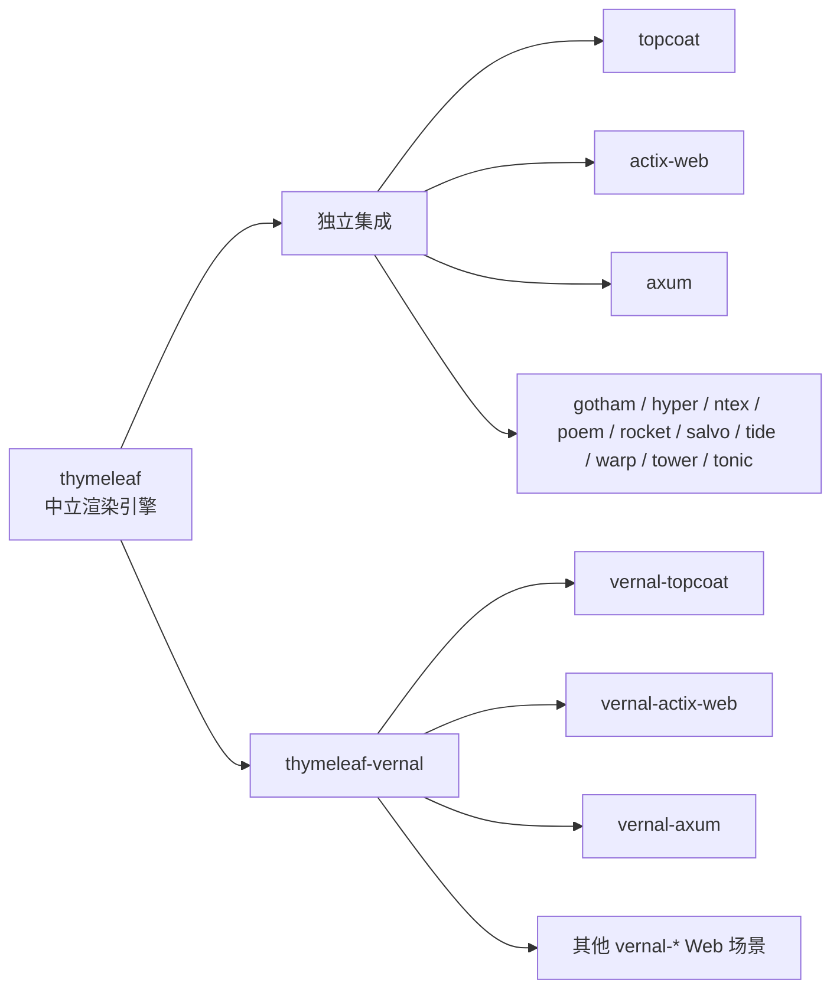
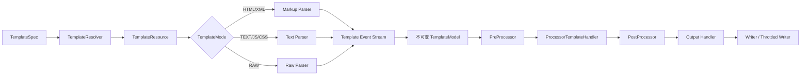
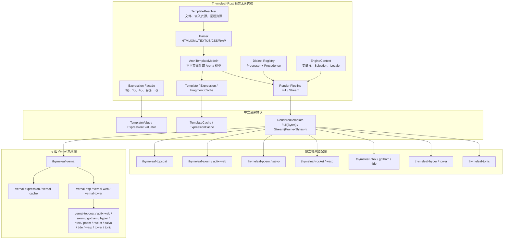
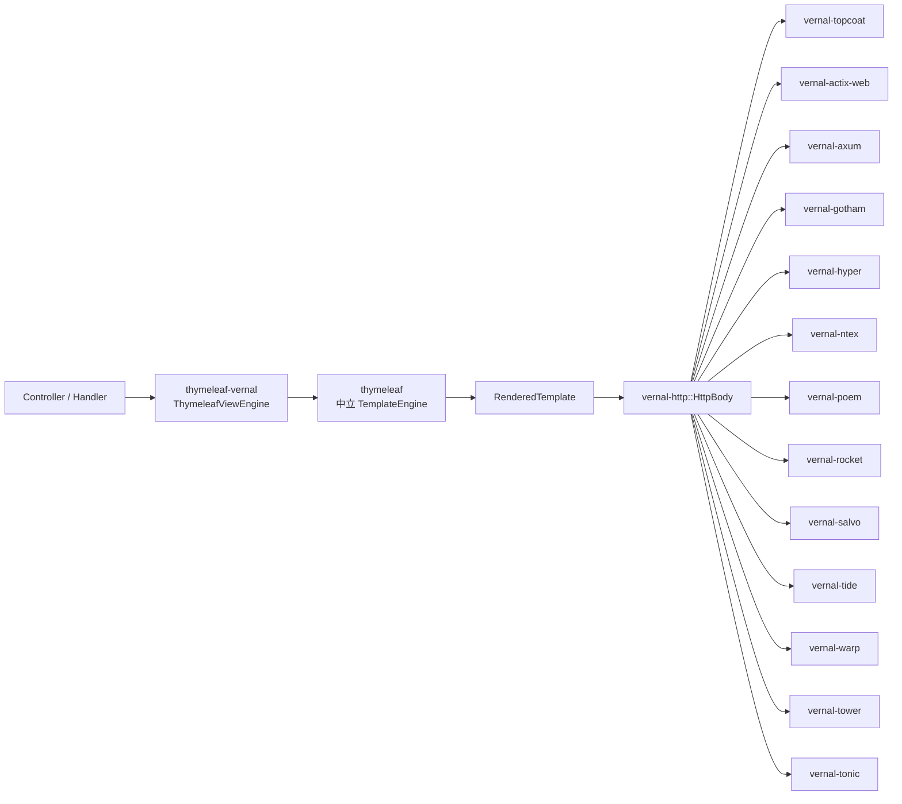
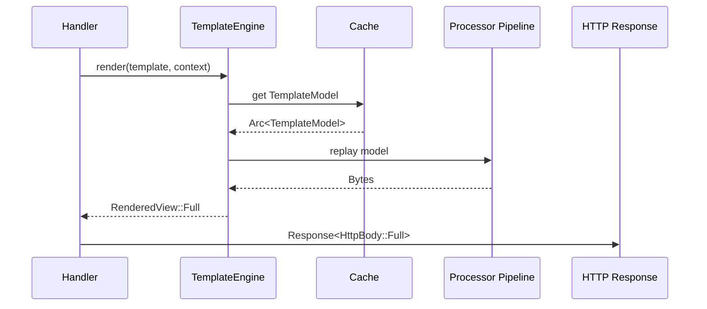
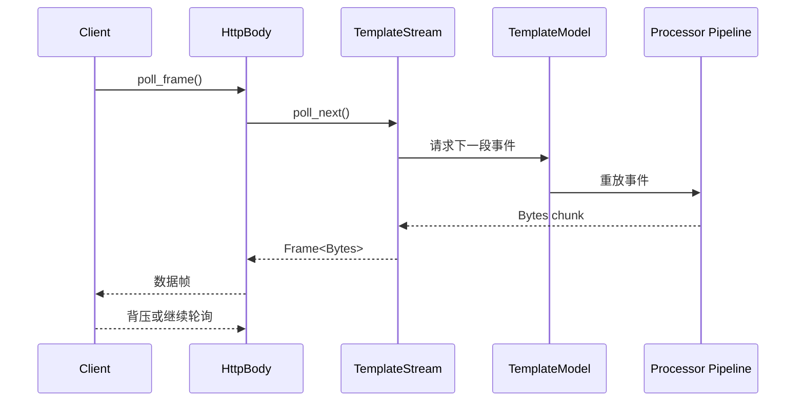
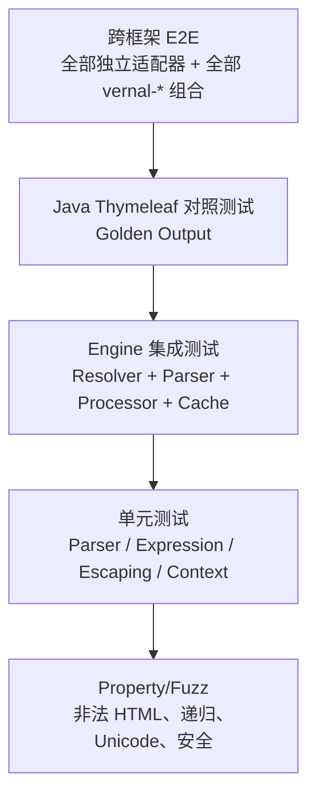
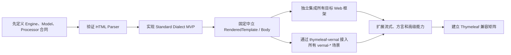

# Thymeleaf-Rust 可行性与架构设计

> 文档状态：架构提案
> 版本：v0.3
> 日期：2026-07-28
> 项目/仓库名称：`thymeleaf-rust`
> 对外发布主 crate：`thymeleaf`
> 核心定位：Web 框架中立、Vernal 中立
> 独立集成：`thymeleaf-{framework}`
> Vernal 集成：`thymeleaf-vernal`

## 1. 文档目的

本文评估在 Rust 中实现一个兼容 Thymeleaf 核心模板语义的服务端渲染引擎，并将其提供给 Topcoat、Actix Web、Axum、Gotham、Hyper、Ntex、Poem、Rocket、Salvo、Tide、Warp、Tower、Tonic 等框架使用的可行性。

本文重点回答：

1. Thymeleaf-Rust 是否可行；
2. 应复用 Thymeleaf 的哪些架构思想；
3. 如何设计框架无关的 Rust 渲染内核；
4. 如何在保持完全中立的前提下选择性复用 Vernal Framework 组件；
5. 各 Rust Web 框架的适配优先级；
6. 实施过程中最主要的技术困难、风险和优势；
7. 建议的分阶段落地路线。

本评估基于以下代码与设计资料：

- [Thymeleaf 上游源码](https://github.com/thymeleaf/thymeleaf)
- Vernal Framework 的 Spring 组件替换约定与 Web 组件设计资料
- Vernal HTTP、Web、Expression、Cache、Tower 及各 Web 框架适配器源码

## 2. 核心结论

### 2.1 可行性判断

实现一个 Rust 原生、兼容 Thymeleaf 主要模板语义的 SSR 模板引擎是可行的。它必须首先是一个独立、中立的模板引擎，然后才可以选择性接入 Vernal Framework。

但需要区分两个目标：

| 目标 | 可行性 | 判断 |
|---|---:|---|
| 实现 Thymeleaf 风格的自然模板、表达式、Processor、Fragment、Dialect、缓存和流式渲染 | 高 | 推荐实施 |
| 达到 Thymeleaf 3.1 全部行为、Spring 集成和边界输出完全兼容 | 中低 | 长期工程，不应作为首期目标 |

推荐的产品定位是：

> Thymeleaf-Rust 是一个兼容 Thymeleaf 核心模板语义、采用 Rust 原生架构实现、通过中立渲染协议接入多个 Web 框架的运行时动态内容渲染引擎。它既可以独立集成任意 Web 框架，也可以作为 Vernal 的可选渲染框架。

不建议采用以下方案：

- 不建议逐类翻译 Thymeleaf Java 源码；
- 不建议复制 Java 的继承层次和反射模型；
- 不建议让渲染内核依赖 Axum、Actix Web、Topcoat、Vernal 或其他宿主框架；
- 不建议在不同适配器中复制模板解析和渲染逻辑；
- 不建议在兼容矩阵尚未完成前宣称“完全兼容 Thymeleaf”。

### 2.2 强制中立性原则

以下原则属于项目架构红线：

1. 核心 crate `thymeleaf` 不依赖任何 Web 框架；
2. 核心 crate `thymeleaf` 不依赖 Vernal；
3. `thymeleaf::web` 内部模块只依赖 `http`、`http-body`、`bytes`、`mime` 等中立协议 crate；
4. Topcoat、Actix Web、Axum、Gotham、Hyper、Ntex、Poem、Rocket、Salvo、Tide、Warp、Tower、Tonic 均通过独立可选适配器直接接入；
5. `thymeleaf-vernal` 是消费者和桥接层，不是 Thymeleaf-Rust 核心的上游依赖；
6. 所有独立适配器和 Vernal 适配器必须复用同一个 TemplateEngine、TemplateModel、Processor 和渲染协议；
7. 任何框架专属类型都不得进入 `thymeleaf` 的 Engine、Parser、Expression、Standard Dialect 等公共 API。

两种集成模式必须同时成立：



### 2.3 推荐的中立渲染边界

Thymeleaf-Rust 自身的公共结果应为中立类型：

```rust
RenderedTemplate
```

它可以表达：

```text
RenderedTemplate
├── Full(Bytes)
└── Stream(Stream<Frame<Bytes>>)
```

核心 crate 的 `thymeleaf::web` 模块可以进一步提供中立的：

```rust
http::Response<ThymeleafBody>
```

随后形成两条彼此独立的转换路径：

- 独立框架适配器：转换为各框架的 `Response`、`Responder`、`Reply`、`Body` 或 `Service`；
- Vernal 适配器：转换为 `vernal_http::HttpBody` 和 Vernal `ViewEngine`。

Vernal 已有的 `HttpBody` 支持：

- 空 Body；
- 完整 `Bytes` Body；
- 流式 `Frame<Bytes>` Body；
- HTTP Trailer；
- 下游背压；
- 客户端取消；
- 显式限制大小的 Body 收集。

这使其非常适合作为 Vernal 场景的渲染输出协议，但它不是 Thymeleaf-Rust 独立适配器的强制依赖。

### 2.4 命名与发布合同

项目名称、发布名称和 Rust 模块名称必须严格区分：

| 层级 | 名称 | 说明 |
|---|---|---|
| Git 仓库/项目目录 | `thymeleaf-rust` | 仅用于代码仓库和项目识别 |
| crates.io 核心 crate | `thymeleaf` | 用户默认依赖；包含 Engine、Parser、Expression、Standard Dialect 与中立 Web 输出 |
| 框架整合 crate | `thymeleaf-axum`、`thymeleaf-actix-web` 等 | 统一使用 `thymeleaf-{framework}` |
| Rust 根路径 | `thymeleaf::...` | 业务代码面向的稳定 API |
| Rust 内部模块 | `engine`、`context`、`parser`、`expression`、`standard`、`web` 等 | 不带项目名重复前缀 |
| Vernal 整合 crate | `thymeleaf-vernal` | 由 Thymeleaf 侧提供、面向 Vernal 的可选整合；命名与 `thymeleaf-spring` 一致 |

禁止发布或创建：

- `thymeleaf-rust-core`；
- `thymeleaf-rust-web`；
- `thymeleaf-rust-axum`；
- `thymeleaf_rust` Rust 根模块；
- 其他任何 `thymeleaf-rust-*` 子 crate 或模块。

推荐的用户 API：

```rust
use thymeleaf::{Context, TemplateEngine};
use thymeleaf::web::{RenderedTemplate, ThymeleafBody};
```

使用 Axum 等独立适配器时，依赖名称为 `thymeleaf-axum`。该整合 crate 通过扩展 trait 暴露能力，但面向业务的核心类型仍来自 `thymeleaf::...`。

## 3. Thymeleaf 核心架构分析

Thymeleaf 不是简单的 HTML 字符串替换器。它采用模板解析、事件模型、Processor 链和输出 Handler 组合的执行架构。

### 3.1 核心执行链



核心调用路径如下：

1. `TemplateEngine.process()` 接收模板、Context 和输出 Writer；
2. 调用 `TemplateManager.parseAndProcess()`；
3. 根据缓存键查找已经解析的 `TemplateModel`；
4. 缓存未命中时由 TemplateResolver 解析模板资源；
5. 根据 TemplateMode 选择 HTML、XML、TEXT、JAVASCRIPT、CSS 或 RAW Parser；
6. Parser 产生模板事件；
7. 可缓存模板被构造成不可变 `TemplateModel`；
8. `TemplateModel` 将事件重放给 Processor Handler 链；
9. Processor 对元素、属性、文本、注释、模板边界等事件进行处理；
10. 最终由 Output Handler 写入 Writer 或受背压控制的输出器。

### 3.2 最值得复用的设计思想

Rust 版应重点复用以下设计：

- TemplateResolver 链；
- TemplateMode；
- 不可变、可缓存、可重放的 TemplateModel；
- 基于事件的 Processor Pipeline；
- Dialect 与 Processor precedence；
- Context 层级和局部变量栈；
- Fragment 模型及其参数；
- Template、Expression 分层缓存；
- 完整渲染和受背压流式渲染双模式；
- 输出模式相关的转义策略。

不应照搬以下 Java 实现细节：

- Java 反射；
- 运行时 Class 实例化；
- 大量抽象类继承；
- Java `Object` 作为所有 Context 值；
- Writer 作为唯一输出边界；
- 依赖 Java GC SoftReference 的缓存策略；
- Spring、Servlet、Reactive Streams 类型直接进入核心层。

## 4. 推荐总体架构

### 4.1 分层架构



### 4.2 推荐 crate 模型

引擎只发布一个核心 crate。Engine、Context、TemplateModel、事件、错误、Processor/Dialect SPI、各模板 Parser、表达式系统、Standard Dialect、中立 Web 输出和核心测试设施均属于 `thymeleaf` 的内部模块，不再拆分成独立 crate。

| 类型 | Crate | 职责 |
|---|---|---|
| 核心 | `thymeleaf` | 完整模板引擎、稳定公共 API 与中立渲染协议 |
| 整合 | `thymeleaf-topcoat` | Topcoat 独立适配 |
| 整合 | `thymeleaf-actix-web` | Actix Web 独立适配 |
| 整合 | `thymeleaf-axum` | Axum 独立适配 |
| 整合 | `thymeleaf-gotham` | Gotham 独立适配 |
| 整合 | `thymeleaf-hyper` | Hyper 独立适配 |
| 整合 | `thymeleaf-ntex` | Ntex 独立适配 |
| 整合 | `thymeleaf-poem` | Poem 独立适配 |
| 整合 | `thymeleaf-rocket` | Rocket 独立适配 |
| 整合 | `thymeleaf-salvo` | Salvo 独立适配 |
| 整合 | `thymeleaf-tide` | Tide 独立适配 |
| 整合 | `thymeleaf-warp` | Warp 独立适配 |
| 整合 | `thymeleaf-tower` | Tower Service/Layer 独立适配 |
| 整合 | `thymeleaf-tonic` | Tonic 动态内容生成和服务集成 |
| 整合 | `thymeleaf-vernal` | 可选 Vernal bridge、starter、自动配置和 ViewResolver 注册 |

除 `thymeleaf` 外，发布的 crate 都是整合层。框架整合是正式支持面，而不是 Vernal 的附属实现；它们应保持为薄层并独立发布、独立 feature gate、独立测试，不得复制模板解析、表达式求值、Processor 或渲染逻辑。`thymeleaf-vernal` 与上述框架整合并列存在，负责 Vernal 场景的自动装配。

## 5. 核心领域模型

### 5.1 TemplateEngine

`TemplateEngine` 是只读、线程安全、初始化后冻结的引擎入口。

建议职责：

- 保存 EngineConfiguration；
- 管理 TemplateResolver；
- 管理 Dialect；
- 管理 Parser；
- 管理 Template、Expression 和 Fragment 缓存；
- 提供完整和流式渲染入口；
- 创建请求级 EngineContext；
- 记录 tracing span 和 metrics。

建议公开能力：

```rust
render(template, context) -> Result<RenderedTemplate>

render_to_writer(template, context, writer) -> Result<()>

render_stream(template, context) -> Result<TemplateStream>

clear_template_cache()

clear_expression_cache()
```

Parser 和渲染 Processor 本质上主要是 CPU 工作，不应为了“全异步”而让每一个模板事件都经过 `async fn`。

推荐：

- TemplateResolver 可提供同步和异步实现；
- 模板解析和普通表达式求值保持同步；
- 输出层将渲染事件转换为受背压控制的异步 Stream；
- 真正需要异步访问的数据应在 Controller/Service 中准备；
- 后续再引入显式 `AsyncValue` 或 data-driver，而不是让所有 Processor 异步化。

### 5.2 TemplateModel

推荐使用不可变模型：

```text
Arc<TemplateModel>
```

内部可以采用：

- 紧凑事件数组；
- Arena 索引；
- Interned element/attribute names；
- SourceSpan；
- 子模型范围；
- 预解析表达式引用；
- Fragment 索引。

不建议默认使用可变 DOM。主要原因：

- 每个请求复制 DOM 成本高；
- Processor 的执行顺序难以保持；
- 流式输出能力下降；
- 缓存模型的共享粒度差；
- 原始 HTML 格式容易被 DOM Serializer 规范化。

### 5.3 TemplateEvent

建议支持的事件包括：

```text
TemplateStart
TemplateEnd
DocumentType
XmlDeclaration
OpenElement
CloseElement
StandaloneElement
Attribute
Text
Comment
CData
ProcessingInstruction
Raw
```

每个事件应尽量保留：

- SourceSpan；
- 原始文本片段；
- 规范化名称；
- TemplateMode；
- 当前模板标识；
- 父元素或模型范围；
- 预解析的 Processor 匹配信息。

### 5.4 Processor 与 Dialect

Processor 推荐分为：

- Element Tag Processor；
- Element Model Processor；
- Attribute Processor；
- Text Processor；
- Comment Processor；
- Template Boundary Processor；
- PreProcessor；
- PostProcessor。

每个 Processor 应有确定性排序键：

```text
dialect_precedence
processor_precedence
registration_order
```

最后一个字段用于保证同 precedence 下结果稳定，避免 HashMap 遍历顺序影响模板输出。

Dialect 应负责提供：

- Processor 集合；
- Expression Object；
- Execution Attribute；
- PreProcessor；
- PostProcessor；
- Prefix；
- Dialect precedence。

## 6. 表达式系统设计

### 6.1 外层语法必须由 Thymeleaf-Rust 管理

Thymeleaf 表达式包含不同语义：

| 表达式 | 含义 | 推荐实现 |
|---|---|---|
| `${...}` | Variable Expression | 委托核心 `NativeVariableExpressionEvaluator` |
| `*{...}` | Selection Variable Expression | 设置 Selection Root 后委托同一原生 evaluator |
| `#{...}` | Message Expression | 委托 MessageResolver |
| `@{...}` | Link URL Expression | 委托 LinkBuilder |
| `~{...}` | Fragment Expression | 委托 FragmentResolver |
| `__${...}__` | Preprocessing | 首期谨慎支持或延后 |

`thymeleaf::expression` 内部模块必须提供框架无关的 Parser、AST、值模型和 evaluator。
`thymeleaf-vernal` 只负责把 Vernal Web 请求/响应和上下文接到该合同，不能用
`vernal-expression`（SpEL 语义）替换 OGNL evaluator，也不能让核心反向依赖 Vernal。
Rhai、CEL、evalexpr、JSONPath/JMESPath 都不是 Java OGNL 语法兼容实现，不能作为
默认求值器偷换语言语义。

crates.io 上的 `ognlib` 也只是名称相似的练习项目，不是 Object-Graph Navigation
Language 实现，不能作为迁移依赖。Rhai 适合另行提供完整嵌入式脚本，CEL 适合安全
规则和 Guardrails，evalexpr 适合简单算术/布尔表达式，JSONPath/JMESPath 适合查询
`serde_json::Value`；这些都是应用可选的其他语言，不进入 `thymeleaf` 的 OGNL
兼容合同。

不能直接将整个属性内容交给某一个通用表达式引擎，因为 `#{...}` 在 Thymeleaf 中是消息表达式，而通用模板表达式 Parser 可能将其解释为另一种嵌入表达式。

### 6.2 Rust 值模型

Rust 没有 Java 式反射，因此需要显式值模型。

建议提供：

- `TemplateValue`；
- `ExpressionValue` 适配；
- `PropertyAccessor`；
- `IndexAccessor`；
- `MethodResolver`；
- `FunctionRegistry`；
- `BeanResolver`；
- `TypeConverter`；
- `#[derive(TemplateModel)]` 或等价宏；
- `serde::Serialize` 到模板值的受控转换。

推荐支持的基础值：

```text
Null
Bool
Integer
Float
Decimal
String
Bytes
List
Map
DateTime
Object
Function
SafeHtml
```

### 6.3 OGNL 兼容边界

Rust 生态目前没有成熟、主流且兼容 Java OGNL 语法的实现，因此核心采用：

```text
OGNL source
  → Native Parser / AST
  → TemplateValue
  → property / index / method capability
  → ACL
  → evaluator
```

默认兼容面面向 Thymeleaf 模板的只读求值，覆盖属性和索引访问、方法调用、集合
projection/selection、条件/逻辑/算术/包含/位运算、局部表达式变量、静态成员和构造器
语法。Java 反射无法在 Rust 中隐式复制，宿主对象通过 `TemplateObject` 暴露属性与
方法；静态成员、构造器和宿主类型关系通过 `OgnlRuntime` 显式注册，并继续执行
Thymeleaf 的类型、成员和受限执行上下文 ACL。

`serde_json::Value` 可以作为一种输入适配，但不能成为唯一内部值模型，否则会丢失
Java UTF-16 字符串、数字包装类型、对象身份以及“变量不存在”和“值为 null”的区别。
默认运行时不开放任意对象写入、任意类型反射或脚本执行；这些能力既不是安全的模板
渲染默认值，也不能通过换用另一门脚本语言来冒充 OGNL 兼容。

上游 `.thtest` 的 `%CONTEXT` 是测试夹具，不是模板语法。Rust runner 先通过生产
`VariableExpression`/OGNL 求值器顺序建立 `Context`，再处理未经包装的原模板；不能
把整段 Context 塞进一个虚构的 `th:with`，否则会错误改变 TEXT 模式节点、双花括号
集合字面量、源码行列和赋值作用域。Java 测试专用 Bean、lazy variable、静态工厂与
构造器通过窄化 `TemplateObject`/`OgnlRuntime` 夹具注册，不得扩大默认反射权限。

固定上游 `3.1.5.RELEASE` 语料的统一验证结果为：Parsing 69 / 69、Plain 200 / 200、
Standard Engine Context 996 / 996、专用 Dialect 61 / 61。前三者中 Parsing 被 Plain
包含，Context 与 Plain 不重叠；专用 Dialect 批次包含 13 个 `elementstack` 和 48 个
`inlining/nostandard` 用例，也不与前两批重叠，因此 `verified` 统一范围当前结算
1,257 / 1,257 个不同 `.thtest`。专用批次按 Java 测试的真实方言组合执行，并验证了
Dialect/Processor 优先级、属性/文本/模型处理、片段插入、元素栈以及没有
Standard Dialect 时不执行标准内联。

全部 500 个 `%EXCEPTION` 用例随后作为独立语义域统一执行，严格校验 Java 异常类、
消息和 cause 链；结果为 500 / 500。该批次覆盖 Reader 与嵌套模板异常、模板名和行列、
内联模式、命名模板模式、Dialect 优先级、lazy variable、危险链接协议以及 OGNL
类型化异常和属性 ACL。它与 `verified` 不重叠，因此 `validated` 并集为
1,757 / 1,757。后续语义域继续覆盖 directive、multi-input、Link、内联交互、
Conversion、Aggregation、Markup、Context、Precedence、Web exchange 以及
remove/replace/surround Processor。最终 2,608 个可执行资源全部处置：2,595 个不同
用例通过 Rust 行为验证，12 个上游已禁用 `execinfo` 资源和 1 个任意 Java 反射链
具名处置，0 未解释。CI 原样全 workspace 覆盖率仍只有 region 43.20%、
function 37.04%、line 44.11%，因此源码覆盖率门禁尚未闭合。

上游 `instancestaticrestrictions29.thtest` 中
`''.getClass().getClass().getName()` 依赖 Java `Class` 反射链。该语义被登记为默认
安全配置下的有意差异：核心不会为复刻这一用例向模板暴露任意运行时类型对象。宿主若
确有受控类型查询需求，应通过 `TemplateObject`/`OgnlRuntime` 显式注册窄能力，而不是
启用通用反射。

### 6.3 表达式 Guardrails

默认安全策略应包括：

- 禁止任意类型定位；
- 禁止任意构造器调用；
- 禁止进程、文件和网络访问；
- 禁止反射式私有字段访问；
- 默认禁用表达式赋值；
- 只允许显式注册的方法、函数和 Bean；
- 限制表达式 AST 深度；
- 限制集合投影和递归计算量；
- 限制模板递归深度；
- 限制单次渲染输出大小；
- 对求值错误输出模板名和 SourceSpan，但不泄露敏感值。

## 7. 可选 Vernal 集成建议

Thymeleaf-Rust 不依赖 Vernal。根据 `Spring-组件替换约定.md`，Vernal Web 层采用全栈应用线与 API 后端线并存的双轨架构，因此可以通过 `thymeleaf-vernal` 将中立渲染引擎接入两条轨道。

### 7.1 Vernal 场景建议接入的组件

| Vernal 组件 | Thymeleaf-Rust 用途 | 结论 |
|---|---|---|
| `vernal-web` | Vernal `ViewEngine`、`ViewResolver`、`ModelAndView` | Vernal bridge 接入 |
| `vernal-webmvc` | Controller 返回模板名和 Model | Vernal MVC 场景 |
| `vernal-webflux` | 流式 HTML、背压、取消传播 | Vernal 响应式场景 |
| `vernal-http` | 将中立 `RenderedTemplate` 转成 Vernal Response/Body | Vernal bridge 接入 |
| `vernal-tower` | Service/Layer 及请求作用域生命周期 | Vernal Tower 场景 |
| `vernal-expression` | 可选的 `${}`、`*{}` 求值实现 | 通过 ExpressionEvaluator 适配 |
| `vernal-cache` | 可选的模板和表达式缓存实现 | 通过 Cache trait 适配 |
| Moka | 默认或 Vernal 场景的本地缓存实现 | 可选实现，不进入公共合同 |
| `vernal-context` | Request Scope、Locale、请求变量 | Vernal Context 桥接 |
| `vernal-beans` | BeanResolver 和组件注入 | Vernal IoC 桥接 |
| `serde`/`serde_json` | Model 转换、JS 内联序列化 | 中立基础依赖，可由双方复用 |
| `tracing` | 解析和渲染链路追踪 | 中立观测协议，可由双方复用 |
| `metrics`/`vernal-actuator` | 缓存和渲染指标 | Vernal 生产集成 |
| `mime` | Content-Type | 中立 Web 层依赖 |
| `validator` | 表单绑定与错误展示 | 可选 Vernal 表单集成 |

### 7.2 Vernal 双层集成模型

同一个 Thymeleaf-Rust Engine 在 Vernal 中有两层使用方式：

1. `thymeleaf-vernal` 提供统一的 `ThymeleafViewEngine`、配置、Bean、Context、Expression、Cache 和 HTTP bridge；
2. 每个 `vernal-{framework}` 场景将 `ThymeleafViewEngine` 的结果转换成对应框架响应。



### 7.3 当前 Vernal 的真实缺口

在当前源码中，需要优先处理以下问题：

1. `Spring-组件替换约定.md` 规划了 `View`、`ViewResolver` 和 `WebHandler`，但 `vernal-web` 当前尚未提供完整实现；
2. `vernal-webmvc` 和 `vernal-webflux` 仍处于待建状态；
3. `vernal-web::DataBuffer` 内部使用 `Vec<u8>`，部分操作产生复制，不适合作为模板流式输出热路径；
4. 文档中的 Moka 示例使用异步 API，但 Workspace 当前启用的是 Moka `sync` feature；
5. 多个框架适配器已经处理 Request Scope 和 Body 生命周期，但尚未形成统一 View 渲染协议；
6. Topcoat 尚未出现在 Vernal Workspace 依赖中，文档版本与公开版本需要在实施前重新校准。

这些缺口只影响 Vernal bridge，不得阻塞或污染 Thymeleaf-Rust 的独立框架适配。

### 7.4 Moka 缓存建议

模板 AST、表达式 AST 和 Fragment 索引是同步 CPU 对象，推荐使用 Moka sync cache：

```text
TemplateModelCache
ExpressionCache
FragmentSelectorCache
```

只有以下场景需要 Moka future cache：

- 远程模板加载；
- 对象存储模板；
- 配置中心模板；
- 需要异步 single-flight 的模板刷新。

文档和实际 Cargo feature 应统一，避免 API 示例与实现不一致。

## 8. View 抽象建议

### 8.1 ModelAndView

建议在 `vernal-web` 中新增框架无关模型：

```text
ModelAndView
├── view_name
├── model
├── status
├── headers
├── locale
└── render_hints
```

`render_hints` 可包括：

- 完整渲染或流式渲染；
- TemplateMode；
- Content-Type；
- 输出字符集；
- 是否允许缓存；
- 最大输出大小；
- Fragment selector；
- SSE/data-driven 提示。

### 8.2 ViewEngine

概念接口：

```rust
pub trait ViewEngine: Send + Sync {
    fn name(&self) -> &str;

    fn supports(&self, view_name: &str, media_type: Option<&mime::Mime>) -> bool;

    fn render(
        &self,
        request: ViewRenderRequest,
    ) -> ViewRenderFuture;
}
```

由于稳定 Rust 中 trait async 的对象安全和装箱策略需要统一，正式接口可选择：

- `async-trait`；
- 返回 `Pin<Box<dyn Future<...>>>`；
- 静态泛型接口与 dyn-compatible 接口分层。

### 8.3 RenderedView

建议统一为：

```text
RenderedView
├── Full(Bytes)
└── Stream(Stream<Frame<Bytes>>)
```

并携带：

- StatusCode；
- HeaderMap；
- Content-Type；
- 可选 Content-Length；
- 可选 CancellationToken；
- 渲染诊断信息。

`RenderedView` 可以被独立框架适配器直接转换，也可以由 `thymeleaf-vernal` 转换为 `vernal_http::HttpResponse`。

## 9. HTML Parser 技术选型

### 9.1 解析器要求

HTML Parser 需要同时满足：

- 容忍不规范 HTML；
- 支持自然模板属性；
- 尽量保留原始空白、注释、属性顺序和文本；
- 提供 SourceSpan；
- 支持 Fragment selector；
- 支持 Element/Attribute/Text 事件；
- 支持子模型捕获和重放；
- 支持大模板；
- 不依赖浏览器 DOM；
- 满足 `#![forbid(unsafe_code)]` 项目约束。

### 9.2 候选方案

#### html5ever

优势：

- 提供 HTML5 Tokenizer；
- 提供 Tree Builder；
- 支持 fragment parsing；
- 生态成熟。

困难：

- 完整 DOM/Tree Builder 可能规范化不规范 HTML；
- Serializer 可能改变原始属性和空白表现；
- 自然模板希望尽可能保留设计稿原貌；
- 需要自定义 TreeSink 或事件模型。

#### lol_html

优势：

- 低延迟流式 HTML 重写；
- 内置 CSS Selector；
- 提供 SourceLocation；
- 对大文档和低内存场景友好。

困难：

- 目标是流式重写器，不是模板 AST；
- `th:each`、递归 Fragment 和模型替换需要缓存子树；
- 某些不规范 HTML 场景无法在纯流式模式下回溯；
- Processor precedence 和跨模板 Fragment 不属于它的职责。

#### quick-xml

适合：

- XML TemplateMode；
- XHTML 严格模式；
- 事件式 XML 读取和输出。

不适合直接作为 HTML 模式解析器，因为 HTML 不是严格 XML。

### 9.3 推荐方案

首期建议：

1. 定义 Thymeleaf-Rust 自己的 Parser 和 TemplateEvent 接口；
2. HTML 模式评估 `html5ever` tokenizer 或 `lol_html` tokenizer/rewriter能力；
3. 输出统一转换为自有不可变事件模型；
4. 不在公共 API 中泄漏第三方 Parser 类型；
5. XML 模式使用 `quick-xml`；
6. TEXT/JS/CSS/RAW 模式实现独立轻量 Parser。

Parser 技术选型应通过兼容性原型决定，而不是只比较 benchmark。

原型至少覆盖：

- 非法嵌套 HTML；
- 可选闭合标签；
- `<script>`/`<style>` 内容；
- HTML entity；
- Unicode；
- `th:each` 子树捕获；
- Fragment selector；
- `th:replace`；
- Comment 和 Doctype；
- 原始空白和属性顺序；
- SourceSpan 错误定位。

## 10. Processor 和结构修改难点

简单 Processor 如 `th:text` 并不困难，真正复杂的是结构级 Processor。

### 10.1 结构操作

需要支持：

- 删除元素但保留子内容；
- 删除整个元素和子树；
- 替换当前元素；
- 在元素内部插入模型；
- 在元素之前或之后插入模型；
- 重复当前子模型；
- 设置局部变量；
- 改变 selection target；
- 改变 inliner；
- 修改当前元素属性；
- 重新处理插入的模型；
- 控制 Processor 是否继续执行。

### 10.2 th:each

`th:each` 必须：

1. 捕获当前 ElementModel；
2. 求值集合或迭代器；
3. 为每次迭代建立局部 Context level；
4. 注入迭代变量和状态变量；
5. 重放子模型；
6. 在每次迭代后恢复 Context；
7. 支持嵌套循环；
8. 对大集合提供流式输出；
9. 对无限流或异步数据源提供显式 data-driver，而不是隐式阻塞。

### 10.3 Fragment

Fragment 系统至少需要：

- `template :: fragment`；
- 当前模板 Fragment；
- Fragment 参数；
- 命名和位置参数；
- `th:insert`；
- `th:replace`；
- Fragment selector；
- 空 Fragment；
- 无操作 Fragment；
- 模板栈；
- 循环引用检测；
- 最大递归深度；
- Fragment 模型缓存。

建议 Fragment 持有：

```text
Arc<TemplateModel>
ParameterBindings
SyntheticParameterFlag
SourceTemplate
Selector
```

## 11. 输出转义与安全

### 11.1 输出上下文

至少需要区分：

- HTML Text；
- HTML Attribute；
- XML Text；
- XML Attribute；
- URL；
- JavaScript String；
- JavaScript Inline Object；
- CSS String；
- CSS URL；
- RAW；
- SafeHtml。

不能用一个通用 `escape_html()` 处理所有场景。

### 11.2 th:text 与 th:utext

- `th:text`：默认按当前 TemplateMode 和输出位置转义；
- `th:utext`：明确输出不转义内容；
- `SafeHtml`：只能由显式受信任 API 创建；
- 普通 String 不得自动升级为 SafeHtml；
- 日志和错误中不得输出完整敏感 Model 值。

### 11.3 JavaScript 内联

JS 内联应使用 `serde_json` 生成合法 JSON/JavaScript 数据，不能通过字符串拼接实现。

还需要处理：

- `</script>` 提前结束；
- U+2028/U+2029；
- HTML-sensitive 字符；
- JSON null、数字和对象；
- Safe JavaScript 与普通 String 的类型区分。

## 12. 流式渲染与背压

### 12.1 两种渲染模式

#### Full Render

适用：

- 普通页面；
- 小型 Fragment；
- 需要 Content-Length；
- 渲染失败后必须完整返回错误页。

流程：



#### Stream Render

适用：

- 大页面；
- 大集合；
- 数据驱动渲染；
- 需要降低首字节时间；
- SSE 或分块输出。

流程：



### 12.2 流式错误策略

HTTP Header 一旦发送，后续渲染错误不能再切换为标准 500 页面。

需要明确：

- Header 发送前的错误：返回完整 Problem Details/错误页；
- Header 发送后的错误：终止 Body，并记录 tracing error；
- 开发模式可向 HTML 注入安全注释；
- 生产模式不得把表达式、路径或 Model 值发送给客户端；
- 记录已输出字节数、模板名、SourceSpan；
- 客户端断开时立即取消剩余渲染。

## 13. 缓存设计

### 13.1 TemplateModel Cache

缓存键建议包括：

```text
owner_template
template_name
template_selectors
template_mode
resolver_attributes
locale_if_required
resolver_version
engine_configuration_version
```

缓存值建议为：

```text
Arc<TemplateModel>
```

### 13.2 Expression Cache

缓存键必须区分：

- 外层表达式类型；
- 原始表达式文本；
- Parser configuration；
- TemplateMode；
- 安全策略版本。

缓存值为不可变 Expression AST。

### 13.3 Fragment Selector Cache

对于常用 layout 和 Fragment，可缓存：

```text
(template_model_id, selector) -> ModelRange
```

### 13.4 开发热更新

开发模式可以使用：

- 文件 mtime；
- 文件大小；
- 内容哈希；
- 文件监听；
- 手动清理 API。

生产模式建议：

- 默认不轮询文件；
- 有界容量；
- 可配置 TTL/TTI；
- 暴露缓存命中和逐出指标；
- 支持 Actuator 清理指定模板缓存。

## 14. Web 框架适配评估

### 14.1 双通道支持要求

每个宿主框架都必须允许两种接入方式：

1. 不使用 Vernal：直接依赖 `thymeleaf-{framework}`；
2. 使用 Vernal：通过 `thymeleaf-vernal` 与对应 `vernal-{framework}` 组合。

| 宿主框架 | 独立集成 | Vernal 场景 | 主要集成形态 |
|---|---|---|---|
| Topcoat | `thymeleaf-topcoat` | `thymeleaf-vernal` + `vernal-topcoat` | ViewEngine、Page、Fragment、动态 RawHtml |
| Actix Web | `thymeleaf-actix-web` | `thymeleaf-vernal` + `vernal-actix-web` | Responder、MessageBody、Stream |
| Axum | `thymeleaf-axum` | `thymeleaf-vernal` + `vernal-axum` | IntoResponse、Body、Extension |
| Gotham | `thymeleaf-gotham` | `thymeleaf-vernal` + `vernal-gotham` | Handler、Response、Middleware |
| Hyper | `thymeleaf-hyper` | `thymeleaf-vernal` + `vernal-hyper` | `Response<Body>`、Service |
| Ntex | `thymeleaf-ntex` | `thymeleaf-vernal` + `vernal-ntex` | Responder、Service、Body |
| Poem | `thymeleaf-poem` | `thymeleaf-vernal` + `vernal-poem` | IntoResponse、Endpoint、Stream |
| Rocket | `thymeleaf-rocket` | `thymeleaf-vernal` + `vernal-rocket` | Responder、ByteStream、Fairing |
| Salvo | `thymeleaf-salvo` | `thymeleaf-vernal` + `vernal-salvo` | Writer、Handler、ResBody |
| Tide | `thymeleaf-tide` | `thymeleaf-vernal` + `vernal-tide` | Endpoint、Response、Body |
| Warp | `thymeleaf-warp` | `thymeleaf-vernal` + `vernal-warp` | Reply、Filter、Rejection |
| Tower | `thymeleaf-tower` | `thymeleaf-vernal` + `vernal-tower` | Service、Layer、Response Body |
| Tonic | `thymeleaf-tonic` | `thymeleaf-vernal` + `vernal-tonic` | 动态 String/Bytes、状态详情、Gateway/Service 集成 |

发布阶段可以按优先级逐步完成，但架构和公共 API 不得把任何一个框架定义成二等集成，也不得要求独立用户引入 Vernal。

### 14.2 Axum

推荐提供：

```text
ThymeleafView -> IntoResponse
Result<ThymeleafView, ThymeleafError> -> IntoResponse
```

完整和流式 Body 都可以通过 `axum::body::Body::new()` 包装标准 `http_body::Body`。

Axum 是首批适配的最佳选择之一。

### 14.3 Actix Web

推荐提供：

```text
ThymeleafView -> Responder
TemplateStream -> MessageBody
```

也可以将 Stream 转换为 Actix streaming response。

需要重点测试：

- 非 `Send` Body 边界；
- ServiceResponse 生命周期；
- 请求作用域保持到 Body 结束；
- 客户端取消；
- 错误类型转换。

### 14.4 Poem 与 Salvo

两者都适合提供薄适配器：

- 将 `RenderedView::Full` 转换为 Bytes Body；
- 将 `RenderedView::Stream` 转换为框架 Stream Body；
- 复制 Status、Header 和 Content-Type；
- 保持 CancellationToken。

### 14.5 Rocket

Rocket 原始 Stream 不能直接作为 Handler 返回值，需要：

- 自定义 `Responder`；
- 或使用 ByteStream/ReaderStream；
- 处理 Rocket Response 的生命周期参数；
- 将模板错误映射为 Rocket Status/Catcher。

### 14.6 Warp

Warp 的主要适配难点不是模板渲染，而是：

- Filter 组合类型；
- Reply 抽象；
- Body 类型封装；
- Rejection 错误映射。

应提供一个简单的 `ThymeleafReply`，避免业务侧感知底层 Body 转换。

### 14.7 Hyper 与 Tower

Hyper 和 Tower 更适合作为底层协议和 Service 抽象，而不是面向业务的 MVC 开发体验。

它们对 Thymeleaf-Rust 的价值很高：

- Hyper 提供标准 HTTP Server 和 Body；
- Tower 提供 Service/Layer；
- Axum 和多个框架可以共享 Tower 适配；
- 独立适配器可以直接消费 `ThymeleafBody`；
- Vernal 场景则由 `vernal-tower` 处理请求作用域与 Body 生命周期，并使用 `vernal_http::HttpBody`。

### 14.8 Topcoat

Topcoat 自身已经提供：

- `view!` 编译期宏；
- 类型检查的 Rust 模板；
- async component；
- 服务端渲染；
- signal；
- shard；
- 客户端响应式表达式。

Thymeleaf-Rust 的定位与它并不相同：

| Topcoat View | Thymeleaf-Rust |
|---|---|
| Rust 源码中的 `view!` 宏 | 外部 HTML 模板 |
| 编译期类型检查 | 运行时解析和表达式求值 |
| 原生组件和 shard | Fragment 和 Dialect |
| 支持客户端响应式转换 | 主要是服务端 SSR |
| Rust 开发者友好 | Java/Spring/设计师迁移友好 |

独立 Topcoat 应用可以注册 Thymeleaf-Rust View/Page adapter；Vernal Topcoat 应用则通过 `thymeleaf-vernal` 注册不同 `ViewEngine`：

```text
TopcoatViewEngine
ThymeleafViewEngine
```

根据 View 名、文件扩展名或 Content-Type 选择。

Thymeleaf 模板不能自动获得 Topcoat 的客户端响应式能力。若需要二者组合，应使用：

- Thymeleaf 渲染完整 MPA 页面；
- Thymeleaf 页面嵌入 Topcoat shard 占位；
- Topcoat 页面将 Thymeleaf 渲染结果作为受控 RawHtml Fragment；
- 不允许未经安全标记的模板输出直接进入 RawHtml。

Topcoat 仍处于 early-stage。无论独立集成还是 Vernal 集成，都必须由适配器隔离其 API，不应让 Topcoat 类型泄漏到 Thymeleaf-Rust 核心。

### 14.9 Tonic

Tonic 是正式支持的独立集成目标，但集成语义是“动态内容渲染”，不能只用传统 MVC HTML Response 衡量。

`thymeleaf-tonic` 应提供：

- gRPC 方法返回 HTML String/Bytes 字段；
- 邮件模板、消息模板或报告模板内部使用 Thymeleaf-Rust；
- 将模板结果写入 Protobuf `string`/`bytes` 字段；
- 为 gRPC 状态详情、调试页面或管理协议生成动态内容；
- 在 Tonic Service/Interceptor 中注入共享 TemplateEngine；
- 为 gRPC Gateway/BFF 提供模板渲染服务；
- Tonic 与 Hyper/Axum 在同一进程或端口运行，HTML 请求由 HTTP Router 处理；
- gRPC Gateway 将数据交给 Web 层后渲染；
- 后台管理服务内部生成静态 HTML。

`vernal-tonic` 场景通过 `thymeleaf-vernal` 获取同一个 `ThymeleafViewEngine`、Context、Expression、Cache 和观测能力。Tonic adapter 不应把普通 HTML 冒充为 gRPC 协议响应，而应明确地把渲染结果映射到消息字段、Gateway HTTP Response 或内部业务输出。

## 15. 主要技术困难

### 15.1 HTML 解析保真与结构语义冲突

模板引擎既希望保留原始 HTML，又需要理解不规范 HTML 的真实结构。

纯 Token 模型难以处理浏览器式树纠正，完整 DOM 又可能改变原始输出。需要在以下目标之间平衡：

- 自然模板保真；
- HTML5 容错；
- SourceSpan；
- Processor 结构修改；
- Fragment selector；
- 流式输出；
- 内存占用。

这是整个项目最难、最应该先做原型验证的部分。

### 15.2 Java 动态对象到 Rust 强类型模型的迁移

Rust 无法无成本复制：

- 任意 getter；
- 任意方法调用；
- Class/静态方法访问；
- 任意 Bean；
- 动态 Proxy；
- Java Collection 统一接口。

需要明确 Rust 风格的值、Accessor 和 derive 宏，否则模板使用体验会明显弱于 Java Thymeleaf。

### 15.3 Processor precedence 和重处理

结构被 Processor 修改后：

- 后续 Processor 是否处理新结构；
- 原元素 Processor 是否继续；
- 插入 Fragment 是否重新执行；
- 局部 Context 如何恢复；
- Processor 如何跳过自身避免无限递归；
- Dialect 间顺序如何保持稳定。

这些行为必须在 Engine Contract 中明确，并通过兼容性测试固定。

### 15.4 Fragment、Layout 和递归

Fragment 是模板引擎从“变量替换”走向“页面组件系统”的关键，也容易引入：

- 循环依赖；
- 深度递归；
- 参数遮蔽；
- Context 泄漏；
- selector 性能问题；
- 跨模板缓存失效；
- Fragment 输出模式冲突。

### 15.5 流式渲染错误

输出一旦发送就无法回滚到完整错误页。必须定义：

- 何时提交 Header；
- 首个 Chunk 前缓冲多少；
- 中途错误如何终止；
- 是否允许模板自行声明容错区域；
- 客户端断开时如何释放 Context；
- Drop 是否足以完成清理；
- tracing span 何时结束。

### 15.6 多框架生命周期差异

不同框架在以下方面存在差异：

- Body 类型；
- Send/Sync 要求；
- Response 生命周期；
- 错误/拒绝模型；
- Request Scope 存活时间；
- Cancellation；
- Trailer 支持；
- 流式 Response API；
- Header 默认行为。

统一 `http::Response<HttpBody>` 可以大幅降低差异，但不能完全消除专属适配代码。

### 15.7 安全和 XSS

模板引擎会直接生成浏览器可执行内容，因此安全要求高于普通字符串模板：

- 转义上下文错误会导致 XSS；
- URL 表达式可能产生开放重定向；
- Bean 调用可能越权；
- Fragment 路径可能目录穿越；
- `th:utext` 和 RawHtml 可能绕过转义；
- 表达式求值可能造成 DoS；
- 热更新目录可能被非授权写入。

### 15.8 兼容性测试规模

需要长期维护 Java Thymeleaf 与 Rust 引擎的差异矩阵。

兼容性不是简单的“模板能运行”，而包括：

- Processor 执行顺序；
- 空值和布尔转换；
- 数字和日期格式；
- HTML entity；
- 属性序列化；
- Fragment 参数；
- Locale 和 Message；
- URL 编码；
- 异常位置；
- 缓存失效；
- 流式 Chunk 边界。

## 16. 主要优势

### 16.1 跨框架统一 SSR

一套模板可以在多个 Rust Web 框架中运行，业务模板不再绑定 Axum、Actix Web 或 Rocket。

### 16.2 Spring/Thymeleaf 迁移路径

对于已有 Spring MVC/Thymeleaf 团队：

- 模板语法熟悉；
- 页面设计方式熟悉；
- Controller + Model + View 模式熟悉；
- Fragment/Layout 思维熟悉；
- 表达式和 Message 使用方式接近。

这能显著降低 Java 到 Rust 的迁移成本。

### 16.3 自然模板

包含 `th:*` 属性的 HTML 可以尽量保持为浏览器和设计工具可打开的普通页面。

这比完全写在 Rust 宏中的模板更适合：

- 前端设计人员；
- UI 外包协作；
- 运营页面；
- 邮件模板；
- 主题系统；
- 运行时可更新页面。

### 16.4 Rust 运行时优势

- 无 JVM；
- 启动快；
- 内存更容易控制；
- 不依赖 GC；
- 线程安全约束更明确；
- `Send + Sync` 边界可验证；
- 错误模型可使用 `thiserror`；
- 可以满足 `#![forbid(unsafe_code)]`；
- 与 Tokio、Bytes、http-body 原生集成。

### 16.5 流式和低复制输出

通过 `Bytes`、`Frame<Bytes>` 和标准 `http_body::Body` 可以实现：

- 避免构造超大 String；
- 降低首字节时间；
- 支持背压；
- 支持取消；
- 保留 Trailer；
- 让 Hyper/Axum/Tower 直接消费；
- 让其他框架只做薄转换。

### 16.6 可选 Vernal 生态复用

在使用 Vernal 的部署场景中，`thymeleaf-vernal` 可以选择性桥接和复用：

- SpEL 风格表达式；
- Bean Container；
- Request Scope；
- Cache；
- HTTP Body；
- Tower Service；
- Web 适配器；
- tracing；
- metrics；
- Actuator；
- Validator。

这可以减少 Vernal 应用的重复建设，但不会改变 Thymeleaf-Rust 的中立性；不使用 Vernal 的应用仍可以只依赖 Core、中立 Web 合同和目标框架适配器。

### 16.7 Dialect 生态

未来可以建立 Rust 方言：

- `vernal-security-dialect`；
- `vernal-form-dialect`；
- `vernal-layout-dialect`；
- `vernal-i18n-dialect`；
- `vernal-htmx-dialect`；
- `vernal-topcoat-dialect`；
- `vernal-assets-dialect`；
- `vernal-csrf-dialect`。

## 17. 可观测性与生产要求

### 17.1 tracing

建议 span：

```text
thymeleaf.render
thymeleaf.resolve
thymeleaf.parse
thymeleaf.cache.lookup
thymeleaf.expression.parse
thymeleaf.expression.evaluate
thymeleaf.fragment.resolve
thymeleaf.processor.execute
thymeleaf.output.stream
```

关键属性：

- template name；
- template mode；
- fragment selector；
- cache hit/miss；
- processor count；
- render mode；
- output bytes；
- chunk count；
- locale；
- framework adapter；
- error kind。

禁止记录：

- 完整 Model；
- 密码、Token、Cookie；
- 未脱敏表达式结果；
- 用户输入的完整敏感值。

### 17.2 metrics

建议指标：

```text
thymeleaf_render_duration_seconds
thymeleaf_render_total
thymeleaf_render_errors_total
thymeleaf_parse_duration_seconds
thymeleaf_template_cache_hits_total
thymeleaf_template_cache_misses_total
thymeleaf_expression_cache_hits_total
thymeleaf_fragment_depth
thymeleaf_output_bytes
thymeleaf_stream_chunks
thymeleaf_stream_cancellations_total
```

### 17.3 Actuator

建议端点：

```text
/actuator/thymeleaf
/actuator/thymeleaf/caches
/actuator/thymeleaf/templates
```

写操作必须受权限控制：

- 清理全部模板缓存；
- 清理指定模板；
- 重新加载 Resolver；
- 查看配置摘要；
- 不返回模板源码和敏感 Context。

## 18. 测试和评估体系

完整迁移采用独立、可审计的治理基线：

- [迁移路线图](migration/迁移路线图.md)：定义上游基线、完成口径、阶段依赖和发布门禁；
- [对象级对照表](migration/对象级对照表.md)：逐项登记 Java 主对象、内部对象及 Rust 落点；
- [方法级对照表](migration/方法级对照表.md)：登记 Java 方法、构造器、重载、参数与 Rust API；
- [语义迁移对照表](migration/语义迁移对照表.md)：固定处理链、模板模式、表达式、Processor、Web 与错误语义；
- [对象名称一致性检查](migration/对象名称一致性检查.md)：约束类型名、文件名、目录布局和允许的 Rust 化例外。

### 18.1 测试金字塔



### 18.2 Java 对照运行器

建议维护独立测试工具：

```text
template
context.json
configuration.json
expected.html
expected-error.json
```

同一测试分别由：

- Thymeleaf Java 3.1；
- Thymeleaf-Rust；

执行，然后比较：

- 输出；
- 错误类型；
- 错误位置；
- Fragment 结果；
- 转义结果；
- 缓存行为。

对于非字节级兼容场景，需要使用规范化比较器，并明确为什么允许差异。

### 18.3 Fuzz 与安全测试

重点目标：

- HTML Tokenizer；
- 表达式 Parser；
- Fragment Parser；
- URL Builder；
- JS/CSS Inline；
- SourceSpan；
- 深度递归；
- 超大属性；
- 非法 Unicode；
- HTML entity；
- Processor 重处理；
- 模板路径规范化。

## 19. 分阶段实施路线

### 19.1 Phase 0：架构合同与技术原型

目标：

- 固定核心 trait；
- 固定 Core 不依赖 Web 框架和 Vernal 的中立性合同；
- 验证 HTML Parser；
- 验证不可变 TemplateModel；
- 验证中立 `ThymeleafBody` 流式输出；
- 验证适配器可以在不修改 Core 的情况下转换 Full/Stream 结果。

交付物：

- `TemplateResolver`；
- `TemplateParser`；
- `TemplateModel`；
- `TemplateEvent`；
- `Processor`；
- `ExpressionEvaluator`；
- `TemplateCache`；
- `ViewEngine`；
- `RenderedView`；
- `ThymeleafBody`；
- HTML Parser 对比报告；
- Axum Hello Template；
- Hyper/Tower Body 原型；
- 兼容性测试骨架。

退出条件：

- 可以解析和原样输出普通 HTML；
- SourceSpan 正确；
- TemplateModel 可缓存和并发重放；
- Axum 和 Hyper 能独立返回 Full 和 Stream Body；
- 客户端取消能终止流。

### 19.2 Phase 1：可用 MVP

支持：

- HTML TemplateMode；
- FileSystemResolver；
- EmbeddedResolver；
- `${}`；
- `th:text`；
- `th:utext`；
- `th:if`；
- `th:unless`；
- `th:each`；
- `th:with`；
- `th:attr`；
- 常用固定属性 Processor；
- `th:classappend`；
- `th:styleappend`；
- `th:insert`；
- `th:replace`；
- 命名 Fragment；
- HTML 转义；
- Template/Expression Cache；
- 完整 Bytes 响应；
- Axum、Actix Web、Hyper、Tower 和 Topcoat 独立原型适配；
- `thymeleaf-vernal` bridge 原型，但不成为 MVP Engine 的依赖。

### 19.3 Phase 2：独立框架适配套件

支持：

- `thymeleaf-topcoat`；
- `thymeleaf-actix-web`；
- `thymeleaf-axum`；
- `thymeleaf-gotham`；
- `thymeleaf-hyper`；
- `thymeleaf-ntex`；
- `thymeleaf-poem`；
- `thymeleaf-rocket`；
- `thymeleaf-salvo`；
- `thymeleaf-tide`；
- `thymeleaf-warp`；
- `thymeleaf-tower`；
- `thymeleaf-tonic`；
- 每个适配器的 Full、Stream、取消、错误映射和 E2E 测试；
- 各适配器独立 feature、依赖和版本管理。

### 19.4 Phase 3：Vernal Web 正式集成

支持：

- `thymeleaf-vernal`；
- `vernal-web::ViewEngine`；
- `ViewResolver`；
- `ModelAndView`；
- `vernal-webmvc`；
- `vernal-webflux`；
- `vernal-http::HttpBody` 流式渲染；
- 对接所有已存在的 `vernal-{framework}` 适配器；
- Vernal Bean、Context、Expression、Cache、Tracing 和 Metrics 桥接；
- 确保 Vernal bridge 不改变独立适配器公共合同；
- CancellationToken；
- MessageResolver；
- LinkBuilder；
- Selection Expression；
- Locale；
- 热更新；
- tracing；
- metrics。

### 19.5 Phase 4：方言与高级模式

支持：

- Dialect SPI；
- PreProcessor/PostProcessor；
- XML；
- TEXT；
- JAVASCRIPT；
- CSS；
- RAW；
- Decoupled Logic；
- data-driven rendering；
- 表单绑定；
- Validator；
- Security Dialect；
- Layout Dialect。

### 19.6 Phase 5：兼容性与生产化

目标：

- Thymeleaf 3.1 核心功能兼容矩阵；
- 性能基准；
- 故障注入；
- 模板资源限流；
- 缓存运维；
- Actuator；
- 安全审计；
- fuzz；
- 多框架 E2E；
- 版本迁移策略；
- 稳定 Dialect API。

## 20. MVP 范围控制

### 20.1 首期应实现

- HTML；
- 常用变量、条件、循环和属性；
- Fragment；
- 自动转义；
- 文件和嵌入模板；
- 缓存；
- 完整渲染；
- 基本流式渲染；
- 至少两个独立 Web 框架接入；
- 可选 Vernal bridge 原型；
- Golden Test。

### 20.2 首期不应实现

- 全部 Spring Security Dialect；
- 全部 Thymeleaf Extras；
- Servlet/WebFlux API 一比一复制；
- 任意 Java 方法语义；
- 完整 OGNL 兼容；
- 客户端响应式框架；
- 远程分布式模板缓存；
- 所有 Web 框架适配器同时达到 GA，但它们仍属于正式规划的独立支持面；
- XML/JS/CSS 模式全部一次完成；
- 对外承诺完全兼容。

## 21. 性能设计原则

建议遵循：

- TemplateModel 使用 `Arc` 共享；
- 模板名、属性名和 Processor 匹配信息尽量 intern；
- Expression 在模板解析阶段预解析；
- 缓存命中后不重新扫描全部 `th:*` 属性；
- Full Render 使用 `BytesMut`；
- Stream Render 使用有界 Chunk；
- 避免每个事件进行 async 调度；
- 避免 `Vec<u8> -> String -> Vec<u8>` 往返转换；
- 避免在热路径使用 `dyn Any` 多次 downcast；
- 对 Processor 列表预排序；
- 对 Fragment selector 建立索引；
- 限制单次循环和递归深度；
- benchmark 同时测量吞吐、P50/P95/P99、分配和首字节时间。

建议基准场景：

1. 静态 HTML；
2. 100 个表达式；
3. 1000 项 `th:each`；
4. 嵌套 Fragment/Layout；
5. 缓存冷启动；
6. 缓存热命中；
7. Full Render；
8. Stream Render；
9. 多线程并发；
10. 客户端中途取消。

## 22. 许可证和命名

Thymeleaf 源码采用 Apache License 2.0。

如果复用或翻译其源码、测试或实现细节，需要：

- 保留 Apache-2.0 License；
- 保留适用的版权声明；
- 分发时包含 NOTICE；
- 标注修改；
- 不暗示项目由 Thymeleaf 官方维护；
- 谨慎使用 Thymeleaf 名称和 Logo；
- 在 README 中明确“兼容/受启发”而非“官方 Rust 版本”。

推荐描述：

> Thymeleaf-Rust is an independent Rust implementation inspired by and aiming for compatibility with Thymeleaf template semantics. It is not an official Thymeleaf project.

正式发布前仍应进行独立的许可证和商标审查。

## 23. 架构决策建议

### ADR-001：内核不依赖具体 Web 框架

状态：建议接受。

决策：

- Core 不依赖 Axum、Actix Web、Topcoat、Vernal 或其他宿主框架；
- Web 层依赖 `http`、`bytes`、`http-body`；
- 每个宿主框架提供独立、可选、薄适配器；
- Vernal 集成放入独立的 `thymeleaf-vernal`；
- 独立适配和 Vernal 适配是并列通道，不是上下级关系。

### ADR-002：采用不可变、可重放的 TemplateModel

状态：建议接受。

决策：

- Parser 输出不可变模型；
- 缓存使用 `Arc<TemplateModel>`；
- 每次渲染只创建 Context 和执行游标；
- Processor 通过结构指令改变输出，不直接共享可变 DOM。

### ADR-003：Thymeleaf 外层表达式与 SpEL 求值分离

状态：建议接受。

决策：

- `${}`、`*{}`、`#{}`、`@{}`、`~{}` 由 Thymeleaf-Rust Parser 识别；
- `${}`、`*{}` 的内部 AST 委托中立 `ExpressionEvaluator`；
- `vernal-expression` 只是 `thymeleaf-vernal` 可注册的一个实现；
- Message、URL、Fragment 使用专属 Resolver；
- 避免 `#{}` 语义冲突。

### ADR-004：统一输出为中立 RenderedTemplate 和标准 HTTP Body

状态：建议接受。

决策：

- Full Render 输出 `Bytes`；
- Stream Render 输出 `Stream<Frame<Bytes>>`；
- `thymeleaf::web` 模块提供中立 `ThymeleafBody`；
- 独立适配器将其转换为各框架 Response；
- `thymeleaf-vernal` 将其转换为 `vernal_http::HttpBody`；
- Core 不暴露任何框架或 Vernal 类型。

### ADR-005：Topcoat 与 Thymeleaf-Rust 作为并列 ViewEngine

状态：建议接受。

决策：

- 不让 Thymeleaf-Rust 核心依赖 Topcoat；
- 不尝试把运行时模板自动编译成 Topcoat reactive expression；
- 允许独立 Topcoat 应用直接集成 Thymeleaf-Rust；
- 允许同一 Vernal Topcoat 应用同时注册两个 ViewEngine；
- 通过文件扩展名、View 前缀或显式配置选择。

### ADR-006：Tonic 是正式的动态内容集成目标

状态：建议接受。

决策：

- 提供独立的 `thymeleaf-tonic`；
- 提供 `thymeleaf-vernal` + `vernal-tonic` 组合；
- 支持将渲染结果映射到 Protobuf String/Bytes、Gateway Response 和内部动态内容；
- 支持在 Tonic Service/Interceptor 中注入共享 TemplateEngine；
- 不把普通 HTML Body 冒充为 gRPC 协议响应。

### ADR-007：仓库名称与发布名称分离

状态：建议接受。

决策：

- 项目和 Git 仓库名称固定为 `thymeleaf-rust`；
- crates.io 主 crate 固定为 `thymeleaf`；
- 对外 Rust API 根路径固定为 `thymeleaf::...`；
- 框架整合 crate 统一命名为 `thymeleaf-{framework}`；
- 禁止创建或发布 `thymeleaf-rust-*` crate；
- 禁止使用 `thymeleaf_rust` 作为 Rust 根模块；
- `thymeleaf-vernal` 表示 Thymeleaf 面向 Vernal 的可选整合 crate，命名遵循与 `thymeleaf-spring` 相同的“核心在前、宿主在后”约定。

## 24. 最终建议

Thymeleaf-Rust 值得实施，但应遵循以下主线：



最重要的工程判断是：

1. 复用 Thymeleaf 的事件模型、Processor Pipeline、Fragment、Dialect 和缓存思想；
2. 不复制 Java 继承、反射和 Spring 类型；
3. 使用 Rust 原生的不可变模型、显式值访问、`Arc`、`Bytes` 和 `http_body::Body`；
4. Core 不依赖任何 Web 框架，也不依赖 Vernal；
5. 为 Topcoat、Actix Web、Axum、Gotham、Hyper、Ntex、Poem、Rocket、Salvo、Tide、Warp、Tower、Tonic 提供独立适配；
6. 通过 `thymeleaf-vernal` 将同一 Engine 接入所有对应 `vernal-*` 场景；
7. 将 Topcoat 视为可以独立组合、也可以在 Vernal 中并列注册的编译期响应式 ViewEngine；
8. 将 Tonic 视为正式的动态 String/Bytes、Gateway 和服务内容渲染目标；
9. 用 Java/Rust 双运行 Golden Test 驱动兼容性；
10. 首期聚焦最常用的 HTML 和 Standard Dialect 能力；
11. 在实现前先完成 HTML Parser、TemplateModel 和中立流式 Body 三个技术原型。

建议项目命名：

- 引擎项目：`thymeleaf-rust`
- 对外主 crate：`thymeleaf`
- 独立适配器：`thymeleaf-{framework}`
- Vernal 集成：`thymeleaf-vernal`
- Vernal 宿主组合：`thymeleaf-vernal` + `vernal-{framework}`
- 对外定位：独立、中立、面向 Thymeleaf 核心模板语义兼容的 Rust 动态内容渲染引擎
