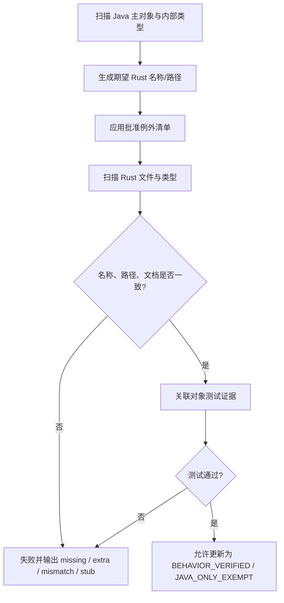

# thymeleaf-rust 与 Thymeleaf 对象名称一致性检查

> **文档说明**：定义 Java/Rust 对象名称、文件路径、内部对象和例外映射的检查规则，并记录设计阶段基线结果。
>
> **文档版本**：v1.0.0
> **检查日期**：2026-07-29
> **上游基线**：Thymeleaf `3.1.5.RELEASE`，提交 `10f9dd2eb8cbd98515ce14b149d115e0287d0add`
> **Rust 状态**：Cargo workspace 已建立；Foundation、方言基础配置、缓存对象族、文件/字符串模板资源、聚合与 Array/List/Set/Map/Object 表达式垂直切片实施完成

## 1. 检查结论

### 1.1 上游对象基线

| 维度 | 数量 | 证据 |
|:---|---:|:---|
| Java 主对象/文件 | 491 | `lib/thymeleaf/src/main/java` |
| 内部/伴随对象 | 69 | CodeGraph type nodes |
| Java 类型合计 | 560 | 491 + 69 |
| 主对象 class | 390 | CodeGraph |
| 主对象 interface | 96 | CodeGraph |
| 主对象 enum | 5 | CodeGraph |
| 目标主文件路径 | 491 | 规则生成 |
| 目标路径碰撞 | 0 | 规则生成 |

### 1.2 当前 Rust 对照结果

| 状态 | 主对象 | 全部类型 | 说明 |
|:---|---:|---:|:---|
| `BEHAVIOR_VERIFIED` | 48 | 50 | Java Golden、Rust 测试和 100% slice coverage 通过；`VersionSpec`、`ContentType` 为紧耦合内部对象 |
| `IMPLEMENTED_UNVERIFIED` | 2 | 4 | `UrlTemplateResource` 待通用 URL handler；`StandardCache`（含两个内部对象）待 JVM SoftReference 自动回收等价性 |
| `NOT_STARTED` | 441 | 506 | 后续 S1–S9 范围 |
| `JAVA_ONLY_EXEMPT` | 0 | 0 | 完全语义迁移目标不预设删除项 |
| `RUST_EXTENSION` | 47 | 47 | 内容类型字符集值及错误、既有类型化错误、属性值容器、集合别名、`SetView`/`SetTarget`/`JavaSet` 与 `ListView`/`ListTarget`/`JavaList` 适配、Java 比较/列表类型信息、`JavaObjectArray`/`ObjectsError` 运行时数组适配、`ArrayTarget`/`JavaArray`/`JavaArrayElement`/`JavaArrayType`/`ArrayUtilsError` JVM 数组转换适配、`JavaString`/`JavaStringResult` UTF-16 与身份适配、Java `Pattern` 编译结果包装、UTF-16 版本限定符，以及 `JavaBigDecimal`/`JavaNumber`/`JavaAggregateObject`/`JavaNumberIterable`/`JavaNumberList`/`AggregateError` 聚合运行时适配，不计入 Java 分子 |

当前检查既记录全量目标，也区分已验证的 Foundation 切片与尚未开始的主体迁移，不能把局部 100% 覆盖率解释为全项目完成。

## 2. 名称一致性规则

### 2.1 类型名称

1. Java 主对象的简单名称默认原样保留为 Rust 类型名称；
2. Java interface 映射为 Rust trait，但保留 `I` 前缀，例如：
   - `ITemplateEngine` → `ITemplateEngine` trait；
   - `IContext` → `IContext` trait；
   - `IProcessor` → `IProcessor` trait。
3. 保留 `I` 前缀是本项目的迁移一致性决定。上游同时存在 `ITemplateEngine` 和 `TemplateEngine` 等接口/实现对，删除前缀会造成命名冲突并降低对象可追踪性。
4. Java class 通常映射为 struct；有限状态集合可映射为 enum；抽象基类可映射为 trait + 共享状态 struct，但对外对象名仍需可追踪。
5. Java enum 映射为同名 Rust enum，成员语义和序列化/显示规则单独验证。
6. 内部类、内部 enum 和伴随 Builder 与主对象同 `.rs` 文件，默认保留名称。

### 2.2 文件与目录

| Java | Rust |
|:---|:---|
| `TemplateEngine.java` | `template_engine.rs` |
| `IEngineConfiguration.java` | `i_engine_configuration.rs` |
| `StandardTextTagProcessor.java` | `standard_text_tag_processor.rs` |
| `OGNLVariableExpressionEvaluator.java` | 批准例外：`native_variable_expression_evaluator.rs` |

路径算法：

1. 去除 `lib/thymeleaf/src/main/java/org/thymeleaf/`；
2. 取 Java package 的最后一级作为 Rust 模块目录；
3. Java 文件名从 PascalCase/缩写转换为 snake_case；
4. 根包对象直接放在 `src/`；
5. 内部对象不生成第二个文件；
6. `mod.rs` 只声明模块并重导出，不定义对象。

本次对 491 个主对象应用该算法，路径碰撞为 0。

### 2.3 方法与参数

| Java 形式 | Rust 形式 | 规则 |
|:---|:---|:---|
| `parseAndProcess` | `parse_and_process` | 方法 snake_case |
| `templateSpec` | `template_spec` | 参数 snake_case |
| `getTemplateMode` | `get_template_mode` | 保留 getter 语义，名称 snake_case |
| overload | 不同 trait/辅助参数对象 | 每个上游入口必须可追踪 |
| checked exception | `Result<T, E>` | 错误类别和触发条件一致 |
| nullable | `Option<T>` | Null 与缺省语义分开 |

对象名称一致性检查不能替代方法签名和行为检查；后续门禁必须同时检查公开方法清单。

## 3. 直接名称对齐目标

除本文件第 4 节批准的运行时差异外，目标为：

| 维度 | 目标 |
|:---|---:|
| 直接对齐 Java 类型 | 540 / 560 |
| 直接对齐主对象 | 472 / 491 |
| 直接对齐内部/伴随对象 | 68 / 69 |
| 未登记名称变化 | 0 |
| 目标路径碰撞 | 0 |

当前直接名称检查结果：

| 维度 | 当前 |
|:---|---:|
| 已实现且名称直接对齐的 Java 主对象 | 42 |
| 已验证 Java 方法/构造器 | 289 |
| 已登记 Java 方法/构造器 | 4,291 |
| 已登记 Java 参数 | 6,936 |
| Rust 特有公共类型 | 42 |
| 未登记名称变化 | 0 |

示例：

| Java 对象 | Rust 文件 | Rust 对象 |
|:---|:---|:---|
| `TemplateEngine` | `src/template_engine.rs` | `TemplateEngine` |
| `TemplateManager` | `src/engine/template_manager.rs` | `TemplateManager` |
| `TemplateModel` | `src/engine/template_model.rs` | `TemplateModel` |
| `IModel` | `src/model/i_model.rs` | `IModel` |
| `StandardDialect` | `src/standard/standard_dialect.rs` | `StandardDialect` |
| `StandardExpressionParser` | `src/expression/standard_expression_parser.rs` | `StandardExpressionParser` |
| `StandardTextTagProcessor` | `src/processor/standard_text_tag_processor.rs` | `StandardTextTagProcessor` |
| `HTMLTemplateParser` | `src/markup/html_template_parser.rs` | `HTMLTemplateParser` |
| `TemplateMode` | `src/templatemode/template_mode.rs` | `TemplateMode` |

完整 491 行清单见[对象级对照表](对象级对照表.md)。

## 4. 批准的名称/形态例外（20 个类型）

例外只允许解决 Java 运行时机制差异，不能用于省略语义。

### 4.1 OGNL → Rust 原生 evaluator（5）

| Java 类型 | Rust 类型 | 文件 | 保留语义 |
|:---|:---|:---|:---|
| `OGNLContextPropertyAccessor` | `NativeContextPropertyAccessor` | `src/expression/native_context_property_accessor.rs` | Context 属性访问 |
| `OGNLExpressionObjectsWrapper` | `NativeExpressionObjectsWrapper` | `src/expression/native_expression_objects_wrapper.rs` | 表达式对象可见性 |
| `OGNLShortcutExpression` | `NativeShortcutExpression` | `src/expression/native_shortcut_expression.rs` | 快捷属性路径求值 |
| `OGNLShortcutExpressionNotApplicableException` | `NativeShortcutExpressionNotApplicableError` | 与主对象同文件 | 快捷路径不可用信号 |
| `OGNLVariableExpressionEvaluator` | `NativeVariableExpressionEvaluator` | `src/expression/native_variable_expression_evaluator.rs` | `${}`/`*{}` 内部求值 |

`thymeleaf-vernal` 可以提供基于 `vernal-expression` 的 evaluator，但核心默认实现不得依赖 Vernal。

### 4.2 Java ClassLoader → Rust Resource Loader（3）

| Java 类型 | Rust 类型 | 文件 | 保留语义 |
|:---|:---|:---|:---|
| `ClassLoaderTemplateResolver` | `EmbeddedTemplateResolver` | `src/templateresolver/embedded_template_resolver.rs` | 资源命名、prefix/suffix、mode、cache |
| `ClassLoaderTemplateResource` | `EmbeddedTemplateResource` | `src/templateresource/embedded_template_resource.rs` | reader、exists、relative、description |
| `ClassLoaderUtils` | `ResourceLoaderUtils` | `src/util/resource_loader_utils.rs` | 资源定位和错误诊断 |

### 4.3 Servlet → 中立 Web + 宿主整合（12）

| Java 类型 | Rust 等价 |
|:---|:---|
| `IServletWebApplication` | `thymeleaf::web::IWebApplication` + host adapter |
| `IServletWebExchange` | `thymeleaf::web::IWebExchange` + host adapter |
| `IServletWebRequest` | `thymeleaf::web::IWebRequest` + host adapter |
| `IServletWebSession` | `thymeleaf::web::IWebSession` + host adapter |
| `JakartaServletWebApplication` | `thymeleaf-{framework}::HostWebApplication` |
| `JakartaServletWebExchange` | `thymeleaf-{framework}::HostWebExchange` |
| `JakartaServletWebRequest` | `thymeleaf-{framework}::HostWebRequest` |
| `JakartaServletWebSession` | `thymeleaf-{framework}::HostWebSession` |
| `JavaxServletWebApplication` | `thymeleaf-{framework}::HostWebApplication` |
| `JavaxServletWebExchange` | `thymeleaf-{framework}::HostWebExchange` |
| `JavaxServletWebRequest` | `thymeleaf-{framework}::HostWebRequest` |
| `JavaxServletWebSession` | `thymeleaf-{framework}::HostWebSession` |

Jakarta/Javax 双实现的差异不应复制到 Rust。每个宿主整合 crate 只实现一次对应框架的 request/session/application/exchange 映射。

## 5. 内部/伴随对象检查

CodeGraph 识别 69 个内部/伴随对象。处理规则：

- 与主对象同文件；
- 名称默认保持一致；
- private helper 可保持非公开；
- Builder 可与主对象同文件；
- 不得因其不是独立 Java 文件而忽略语义。

代表性对象：

| 主对象 | 内部/伴随对象 |
|:---|:---|
| `EngineConfiguration` | `TemplateResolverComparator`、`MessageResolverComparator`、`LinkBuilderComparator` |
| `StandardCache` | `CacheDataContainer`、`CacheEntry` |
| `EngineContext` | `SelectionTarget` |
| `WebEngineContext` | request/session/application maps、`SelectionTarget`、`NoOpMapImpl` |
| `OGNLShortcutExpression` | `OGNLShortcutExpressionNotApplicableException`（批准改名） |
| `OGNLVariableExpressionEvaluator` | computed expression 与访问控制内部对象 |

完整列表已嵌入[对象级对照表](对象级对照表.md)的“内部/伴随对象”列。

## 6. 自动化门禁

### 6.1 已实现命令

当前命令：

```bash
cargo xtask migration-check \
  --upstream ../thymeleaf \
  --baseline 10f9dd2eb8cbd98515ce14b149d115e0287d0add \
  --json target/migration-check.json
```

`xtask` 是不发布且排除在核心 workspace 覆盖率分母之外的工程工具；核心 workspace
仍只有 `thymeleaf` 一个产品 crate。CI 独立执行 xtask 的格式、Clippy、单元测试和
迁移检查。

### 6.2 检查流程



### 6.3 必须检查的规则

1. Java 主对象是否全部存在于 manifest；
2. 目标 `.rs` 路径是否唯一；
3. 目标文件是否真实存在；
4. 目标文件是否定义预期类型；
5. 是否出现一个文件承载多个无关 Java 主对象；
6. `lib.rs`、`mod.rs` 是否定义业务类型；
7. 是否存在 wildcard import；
8. 是否存在 `todo!()`、`unimplemented!()`、空函数体或仅返回默认值的 STUB；
9. 公开类型是否有中文 doc 注释和 Java 全限定名；
10. 公共方法是否有参数/返回说明；
11. 是否存在未登记的 Rust 公共对象；
12. 批准例外是否有语义测试和 ADR。

### 6.4 建议报告格式

```text
baseline:
  version: 3.1.5.RELEASE
  commit: 10f9dd2eb8cbd98515ce14b149d115e0287d0add
objects:
  java_primary: 491
  java_nested: 69
  exact_expected: 540
  equivalent_expected: 20
result:
  exact: 50
  equivalent: 0
  behavior_verified: 48
  implemented_unverified: 2
  missing: 441
  extra: 0
  path_collisions: 0
  stubs: 0
```

CI 同时输出人类可读表格，并写入稳定 JSON，便于比较提交之间的变化。

## 7. 上游升级检查

升级 Thymeleaf 基线时，不得直接覆盖对象表。流程：

1. 固定新的上游 commit；
2. 重新建立 CodeGraph 索引；
3. 比较 Java 主对象、内部对象、方法和枚举成员；
4. 输出 added/removed/renamed/changed 清单；
5. 评估语义和测试夹具变化；
6. 新建升级 ADR；
7. 更新四份迁移文档后才允许实现。

移除的 Java 对象不能自动从 Rust 删除；必须先做影响分析和兼容策略。

## 8. 当前阻断项

| 阻断项 | 影响 | 解除阶段 |
|:---|:---|:---:|
| S1 根包仍有七个对象尚未迁移 | `TemplateEngine` 与配置主体尚不可用 | S1 |
| 506 个 Java 类型尚未迁移 | 主体功能仍不可用 | S1–S9 |
| Parity runner 仅覆盖 Foundation、方言基础配置、缓存对象族、文件/字符串模板资源及部分通用/表达式对象 | 其余对象没有 Java/Rust 差分证据 | S1 起，S11 完成 |
| 2,609 个 `.thtest` 尚未迁移 | 无法声明模板处理兼容 | S3 起，S11 完成 |

这些是实现状态，不是文档缺陷；文档已经给出确定的目标和解除条件。

## 9. 验收标准

- 当前基线统计可从固定上游提交重复得到；
- 491 个主对象均出现在对象表中一次且仅一次；
- 69 个内部/伴随对象均归属一个主对象；
- 491 个默认目标路径无碰撞；
- 20 个名称/形态例外全部列明原因和保留语义；
- 除批准例外外，任何名称偏差都使 CI 失败；
- 名称对齐后仍需语义和测试门禁，不能单独标记完成。

---

**文档版本**：v1.0.0
**创建日期**：2026-07-28
**最后更新**：2026-07-29
**文档状态**：迁移实施中；46 / 491 个主对象名称与行为已验证，2 个主对象名称对齐且已实现待完整验证
