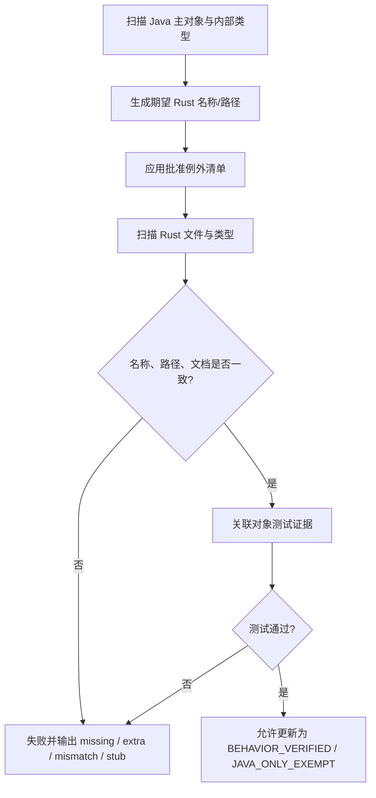

# thymeleaf-rust 与 Thymeleaf 对象名称一致性检查

> **文档说明**：定义 Java/Rust 对象名称、文件路径、内部对象和例外映射的检查规则，并记录设计阶段基线结果。
>
> **文档版本**：v1.1.0
> **检查日期**：2026-07-31
> **上游基线**：Thymeleaf `3.1.5.RELEASE`，提交 `10f9dd2eb8cbd98515ce14b149d115e0287d0add`
> **Rust 状态**：S1–S10 生产对象已按语义域批量落位；S11 对象级验证仍在进行。202 个主对象达到 BEHAVIOR_VERIFIED，277 个主对象为 IMPLEMENTED_UNVERIFIED，12 个 Servlet 运行时对象为 JAVA_ONLY_EXEMPT。

## 1. 检查结论

### 1.1 上游对象基线

| 维度 | 数量 | 证据 |
|:---|---:|:---|
| Java 主对象/文件 | 491 | `lib/thymeleaf/src/main/java` |
| 内部/伴随对象 | 69 | 固定基线源码、机器清单与当前 CodeGraph 索引 |
| Java 类型合计 | 560 | 491 + 69 |
| 主对象 class | 390 | 固定基线源码机器清单 |
| 主对象 interface | 96 | 固定基线源码机器清单 |
| 主对象 enum | 5 | 固定基线源码机器清单 |
| 目标主文件路径 | 491 | 规则生成 |
| 目标路径碰撞 | 0 | 规则生成 |

### 1.2 冻结 Rust 对照结果（2026-07-29，非实时状态）

| 状态 | 主对象 | 全部类型 | 说明 |
|:---|---:|---:|:---|
| `BEHAVIOR_VERIFIED` | 89 | 108 | Java Golden、Rust 测试和对象级差分通过；模板资源域、Resolver 域与 LinkBuilder 域均已闭环 |
| `IMPLEMENTED_UNVERIFIED` | 2 | 4 | `UrlTemplateResource` 待通用 URL handler；`StandardCache`（含两个内部对象）待 JVM SoftReference 自动回收等价性 |
| `NOT_STARTED` | 400 | 460 | 2026-07-29 快照值；后续批量迁移已使该值失效 |
| `JAVA_ONLY_EXEMPT` | 0 | 0 | 完全语义迁移目标不预设删除项 |
| `RUST_EXTENSION` | 84 | 84 | 包括 `JavaCharSequence`、`TextUtilsError`、`TextParseCause`、`ProcessorSet`、各 text parsing/runtime error、`TextParserReader` 适配和 handler runtime error 等 Rust/JVM 边界适配，不计入 Java 分子 |

该表是用于比较后续批次的冻结基线，不是工作树实时扫描结果。“400 个未开始”不得继续
用作当前进度。S1–S10 生产对象已按语义域批量迁移；当前统一运行对象/方法清单、
Java Golden、`.thtest` 和覆盖率审计，再生成行为结算快照。

### 1.3 实时静态门禁（2026-07-31）

`xtask migration-check` 对当前工作树重新扫描后通过：

| 维度 | 当前值 |
|:---|---:|
| 主对象 exact / approved equivalent | 474 / 17 |
| `BEHAVIOR_VERIFIED` / `IMPLEMENTED_UNVERIFIED` / `JAVA_ONLY_EXEMPT` | 202 / 277 / 12 |
| missing / type mismatch / stub / path collision | 0 / 0 / 0 / 0 |
| Rust extension/辅助文件 | 34 |
| Java 方法 declared / review required | 4,291 / 0 |

34 个 Rust extension/辅助文件包含 Java/Rust 运行时边界对象及共享签名别名，例如
`ContextVariableEntries`，以及 OGNL 集合桥接使用的 `JavaIterator`、`JavaMapEntry`
和 `JavaStream`。`OgnlException`、`ClassNotFoundException` 与
`NoSuchMethodException` 对应外部 OGNL/JDK 异常身份；模板资源域拆出的
`TemplateResourceError`、`JavaCharsetDecoder` 与 `TranscodingReader` 则承接 Rust
错误分类及 Java Reader/Charset 边界；`TemplateHandlerClass` 绑定 Java Handler
`Class` 的名称和可失败构造能力，`DialectSetConfigurationError` 区分 Java
`IllegalArgumentException` 与 `ConfigurationException`。这些对象均不计入
Thymeleaf Java 对象完成分子。静态门禁
通过只证明对象和方法都有明确处置，不把 285 个待验证对象升级为行为已验证。

## 2. 名称一致性规则

### 2.1 类型名称

1. Java 主对象的简单名称默认原样保留为 Rust 类型名称；
2. Java interface 映射为 Rust trait，但保留 `I` 前缀，例如：
   - `ITemplateEngine` → `ITemplateEngine` trait；
   - `IContext` → `IContext` trait；
   - `IProcessor` → `IProcessor` trait。
3. 保留 `I` 前缀是本项目的迁移一致性决定。上游同时存在 `ITemplateEngine` 和 `TemplateEngine` 等接口/实现对，删除前缀会造成命名冲突并降低对象可追踪性。
4. Java class 通常映射为 struct；有限状态集合可映射为 enum；抽象基类可映射为 trait + 共享状态 struct，但对外对象名仍需可追踪。
5. Java enum 映射为同名 Rust enum，成员语义和序列化/显示规则单独验证。
6. 内部类、内部 enum 和伴随 Builder 与主对象同 `.rs` 文件，默认保留名称。

### 2.2 文件与目录

| Java | Rust |
|:---|:---|
| `TemplateEngine.java` | `template_engine.rs` |
| `IEngineConfiguration.java` | `i_engine_configuration.rs` |
| `StandardTextTagProcessor.java` | `standard_text_tag_processor.rs` |
| `OGNLVariableExpressionEvaluator.java` | 批准例外：`native_variable_expression_evaluator.rs` |

路径算法：

1. 去除 `lib/thymeleaf/src/main/java/org/thymeleaf/`；
2. 取 Java package 的最后一级作为 Rust 模块目录；
3. Java 文件名从 PascalCase/缩写转换为 snake_case；
4. 根包对象直接放在 `src/`；
5. 内部对象不生成第二个文件；
6. `mod.rs` 只声明模块并重导出，不定义对象。

本次对 491 个主对象应用该算法，路径碰撞为 0。

### 2.3 方法与参数

| Java 形式 | Rust 形式 | 规则 |
|:---|:---|:---|
| `parseAndProcess` | `parse_and_process` | 方法 snake_case |
| `templateSpec` | `template_spec` | 参数 snake_case |
| `getTemplateMode` | `get_template_mode` | 保留 getter 语义，名称 snake_case |
| overload | 不同 trait/辅助参数对象 | 每个上游入口必须可追踪 |
| checked exception | `Result<T, E>` | 错误类别和触发条件一致 |
| nullable | `Option<T>` | Null 与缺省语义分开 |

对象名称一致性检查不能替代方法签名和行为检查；后续门禁必须同时检查公开方法清单。

## 3. 直接名称对齐目标

除本文件第 4 节批准的运行时差异外，目标为：

| 维度 | 目标 |
|:---|---:|
| 直接对齐 Java 类型 | 540 / 560 |
| 直接对齐主对象 | 474 / 491 |
| 直接对齐内部/伴随对象 | 68 / 69 |
| 未登记名称变化 | 0 |
| 目标路径碰撞 | 0 |

当前实时名称/路径检查结果（不代表行为验证）：

| 维度 | 当前 |
|:---|---:|
| 已实现且名称直接对齐的 Java 主对象 | 474 |
| 已登记批准等价名称的 Java 主对象 | 17 |
| 有生产落点的 Java 主对象 | 491 / 491 |
| 有生产落点的内部/伴随对象 | 69 / 69 |
| 已登记 Java 方法/构造器 | 4,291 |
| 已登记 Java 参数 | 6,936 |
| 方法映射待人工复核 | 0 |
| 缺失对象 / 类型不匹配 / 路径碰撞 / STUB | 0 / 0 / 0 / 0 |
| 未登记名称变化 | 0 |

示例：

| Java 对象 | Rust 文件 | Rust 对象 |
|:---|:---|:---|
| `TemplateEngine` | `src/template_engine.rs` | `TemplateEngine` |
| `TemplateManager` | `src/engine/template_manager.rs` | `TemplateManager` |
| `TemplateModel` | `src/engine/template_model.rs` | `TemplateModel` |
| `IModel` | `src/model/i_model.rs` | `IModel` |
| `StandardDialect` | `src/standard/standard_dialect.rs` | `StandardDialect` |
| `StandardExpressionParser` | `src/expression/standard_expression_parser.rs` | `StandardExpressionParser` |
| `StandardTextTagProcessor` | `src/processor/standard_text_tag_processor.rs` | `StandardTextTagProcessor` |
| `HTMLTemplateParser` | `src/markup/html_template_parser.rs` | `HTMLTemplateParser` |
| `TemplateMode` | `src/templatemode/template_mode.rs` | `TemplateMode` |

完整 491 行清单见[对象级对照表](对象级对照表.md)。

## 4. 批准的名称/形态例外（20 个类型）

例外只允许解决 Java 运行时机制差异，不能用于省略语义。

### 4.1 OGNL → Rust 原生 evaluator（5）

| Java 类型 | Rust 类型 | 文件 | 保留语义 |
|:---|:---|:---|:---|
| `OGNLContextPropertyAccessor` | `NativeContextPropertyAccessor` | `src/expression/native_context_property_accessor.rs` | Context 属性访问 |
| `OGNLExpressionObjectsWrapper` | `NativeExpressionObjectsWrapper` | `src/expression/native_expression_objects_wrapper.rs` | 表达式对象可见性 |
| `OGNLShortcutExpression` | `NativeShortcutExpression` | `src/expression/native_shortcut_expression.rs` | 快捷属性路径求值 |
| `OGNLShortcutExpressionNotApplicableException` | `NativeShortcutExpressionNotApplicableError` | 与主对象同文件 | 快捷路径不可用信号 |
| `OGNLVariableExpressionEvaluator` | `NativeVariableExpressionEvaluator` | `src/expression/native_variable_expression_evaluator.rs` | `${}`/`*{}` 内部求值 |

`vernal-expression` 实现的是 SpEL 语义，不是 OGNL 兼容实现，因此
`thymeleaf-vernal` 不得用它替换核心 evaluator。核心使用自有 Parser/AST、
`TemplateValue`、`TemplateObject` 与 `OgnlRuntime`；Vernal 仅提供宿主对象和 Web
上下文适配。

外部 OGNL/JDK 异常身份由独立对象
`expression/ognl_exception.rs::OgnlException`、
`expression/class_not_found_exception.rs::ClassNotFoundException` 和
`expression/no_such_method_exception.rs::NoSuchMethodException` 承接。它们不是
Thymeleaf 上游主对象，不改变 491 个分母；独立文件保证 cause 链可以按 Java 类名严格
验证，也符合“一对象一文件”规则。

### 4.2 Java ClassLoader → Rust Resource Loader（3）

| Java 类型 | Rust 类型 | 文件 | 保留语义 |
|:---|:---|:---|:---|
`ClassLoaderTemplateResolver` 与 `ClassLoaderTemplateResource` 均已恢复 Java 简单名称和
snake_case 文件的一对一映射。Java ClassLoader 的运行时装载能力在 Rust 中由有序资源根
表达；旧的 `EmbeddedTemplateResolver` / `EmbeddedTemplateResource` 仅保留为
`mod.rs` 重导出兼容名，不再计入批准等价映射。
`ClassLoaderTemplateResource` 位于
`src/templateresource/class_loader_template_resource.rs::ClassLoaderTemplateResource` 的
1:1 主对象。
| `ClassLoaderUtils` | `ResourceLoaderUtils` | `src/util/resource_loader_utils.rs` | 资源定位和错误诊断 |

### 4.3 Servlet → 中立 Web + 宿主整合（12）

| Java 类型 | Rust 等价 |
|:---|:---|
| `IServletWebApplication` | `thymeleaf::web::IWebApplication` + host adapter |
| `IServletWebExchange` | `thymeleaf::web::IWebExchange` + host adapter |
| `IServletWebRequest` | `thymeleaf::web::IWebRequest` + host adapter |
| `IServletWebSession` | `thymeleaf::web::IWebSession` + host adapter |
| `JakartaServletWebApplication` | `thymeleaf-{framework}::HostWebApplication` |
| `JakartaServletWebExchange` | `thymeleaf-{framework}::HostWebExchange` |
| `JakartaServletWebRequest` | `thymeleaf-{framework}::HostWebRequest` |
| `JakartaServletWebSession` | `thymeleaf-{framework}::HostWebSession` |
| `JavaxServletWebApplication` | `thymeleaf-{framework}::HostWebApplication` |
| `JavaxServletWebExchange` | `thymeleaf-{framework}::HostWebExchange` |
| `JavaxServletWebRequest` | `thymeleaf-{framework}::HostWebRequest` |
| `JavaxServletWebSession` | `thymeleaf-{framework}::HostWebSession` |

Jakarta/Javax 双实现的差异不应复制到 Rust。每个宿主整合 crate 只实现一次对应框架的 request/session/application/exchange 映射。

## 5. 内部/伴随对象检查

CodeGraph 识别 69 个内部/伴随对象。处理规则：

- 与主对象同文件；
- 名称默认保持一致；
- private helper 可保持非公开；
- Builder 可与主对象同文件；
- 不得因其不是独立 Java 文件而忽略语义。

代表性对象：

| 主对象 | 内部/伴随对象 |
|:---|:---|
| `EngineConfiguration` | `TemplateResolverComparator`、`MessageResolverComparator`、`LinkBuilderComparator` |
| `StandardCache` | `CacheDataContainer`、`CacheEntry` |
| `EngineContext` | `SelectionTarget` |
| `WebEngineContext` | request/session/application maps、`SelectionTarget`、`NoOpMapImpl` |
| `OGNLShortcutExpression` | `OGNLShortcutExpressionNotApplicableException`（批准改名） |
| `OGNLVariableExpressionEvaluator` | computed expression 与访问控制内部对象 |

完整列表已嵌入[对象级对照表](对象级对照表.md)的“内部/伴随对象”列。

## 6. 自动化门禁

### 6.1 已实现命令

当前命令：

```bash
cargo xtask migration-check \
  --upstream ../thymeleaf \
  --baseline 10f9dd2eb8cbd98515ce14b149d115e0287d0add \
  --json target/migration-check.json
```

`xtask` 是不发布且排除在核心 workspace 覆盖率分母之外的工程工具；核心 workspace
仍只有 `thymeleaf` 一个产品 crate。CI 独立执行 xtask 的格式、Clippy、单元测试和
迁移检查。

### 6.2 检查流程



### 6.3 必须检查的规则

1. Java 主对象是否全部存在于 manifest；
2. 目标 `.rs` 路径是否唯一；
3. 目标文件是否真实存在；
4. 目标文件是否定义预期类型；
5. 是否出现一个文件承载多个无关 Java 主对象；
6. `lib.rs`、`mod.rs` 是否定义业务类型；
7. 是否存在 wildcard import；
8. 是否存在 `todo!()`、`unimplemented!()`、空函数体或仅返回默认值的 STUB；
9. 公开类型是否有中文 doc 注释和 Java 全限定名；
10. 公共方法是否有参数/返回说明；
11. 是否存在未登记的 Rust 公共对象；
12. 批准例外是否有语义测试和 ADR。

### 6.4 批次结算报告格式

```text
baseline:
  version: 3.1.5.RELEASE
  commit: 10f9dd2eb8cbd98515ce14b149d115e0287d0add
objects:
  java_primary: 491
  java_nested: 69
  exact_expected: 540
  equivalent_expected: 20
result:
  exact: 91
  equivalent: 0
  behavior_verified: 89
  implemented_unverified: 2
  missing: 400
  extra: 0
  path_collisions: 0
  stubs: 0
```

上述示例数字属于 2026-07-29 冻结基线。CI 在完整语义域或统一验证阶段结算时同时输出
人类可读表格和稳定 JSON；迁移过程中不因每新增一个对象反复改写统计。

2026-07-31 实时静态结算：

```text
objects:
  java_primary: 491
  java_nested: 69
result:
  exact: 474
  equivalent: 17
  behavior_verified: 202
  implemented_unverified: 277
  java_only_exempt: 12
  missing: 0
  type_mismatches: 0
  path_collisions: 0
  stubs: 0
methods:
  declared: 4291
  explicit: 2686
  dynamic: 340
  idiom_or_constructor: 876
  trait_or_flow_merged: 218
  private_merged: 175
  review_required: 0
```

## 7. 上游升级检查

升级 Thymeleaf 基线时，不得直接覆盖对象表。流程：

1. 固定新的上游 commit；
2. 重新建立 CodeGraph 索引；
3. 比较 Java 主对象、内部对象、方法和枚举成员；
4. 输出 added/removed/renamed/changed 清单；
5. 评估语义和测试夹具变化；
6. 新建升级 ADR；
7. 更新四份迁移文档后才允许实现。

移除的 Java 对象不能自动从 Rust 删除；必须先做影响分析和兼容策略。

## 8. 当前阻断项

| 阻断项 | 影响 | 解除阶段 |
|:---|:---|:---:|
| 293 个核心生产对象尚无完整对象级差分证据 | 只能标记 `IMPLEMENTED_UNVERIFIED`，不能声明兼容 | S11 |
| 12 个 Servlet 宿主等价映射尚待统一整合矩阵 | 可标记 `JAVA_ONLY_EXEMPT`，但不能跳过宿主行为验证 | S11 |
| 技能严格全仓布局审计仍报告 351 error / 1,341 warning | 包含确定性路径、对象边界和中文来源注释候选；必须逐项复核并清零真实 blocker | S11 |
| Java SOURCE_PARITY 清单已形成并锁定 875 / 875、运行时 2,156 / 2,156 | 清单不再阻断，但每个对象仍须绑定足够的行为证据 | S11 |
| 2,608 个可执行 `.thtest` 已全部处置：2,595 行为通过、13 具名安全/上游禁用、0 未解释 | 不再阻断语料清单闭合；13 项不得表述为成功执行 | S11 |
| 当前全 workspace `cargo llvm-cov` 为 region 79.57%、function 75.32%、line 80.82%（2026-08-02 复测） | 信息性诊断指标，不阻断语义兼容结论 | S11 |

当前不存在对象源码缺失阻断；剩余项都是统一验证与证据阻断。

2026-07-31 的 `messageresolver` 深化批次没有引入对象拆分或合并：
`AbstractMessageResolver`、`IMessageResolver`、`StandardMessageResolutionUtils` 和
`StandardMessageResolver` 仍分别落入一个同名 snake_case 文件。新增
`with_template_messages_hook`、`with_origin_messages_hook`、
`with_message_formatter_hook` 和 `with_absent_message_hook` 是对 Java protected
override 的 Rust 组合式扩展机制，不是新的上游主对象，也不改变 491 / 69 分母。

2026-07-30 专用 Dialect 批次新增的七个 Java 测试 fixture 对象也完成了名称审计：
`Dialect01`、`Dialect01DivProcessor`、`Dialect01TextProcessor`、
`ElementStackDialect`、`ElementStackAttrProcessor`、`ElementStackTextProcessor` 和
`ElementStackModelProcessor` 均保持 Java 简单名称，分别落入独立 snake_case `.rs`
文件。它们属于 SOURCE_PARITY 测试资产，不改变 491 / 69 的生产对象分母。

2026-07-31 Dialect 贡献聚合批次保持五个主对象各自独立落位：
`DialectSetConfiguration`、`IExecutionAttributeDialect`、
`IExpressionObjectDialect`、`IPreProcessorDialect` 和
`IPostProcessorDialect` 分别位于同名 snake_case 文件。Java 私有内部类
`AggregateExpressionObjectFactory` 按规则与主对象同文件；新增的类型化错误
`DialectSetConfigurationError` 是 Rust extension，不伪装成第六个 Java 主对象。

Exception 批次的 `ExceptionThrowingBean`、`ExceptionLazyContextVariable`、
`TestLinkBuilder`、`PrecedenceDialect` 和
`PrecedenceModifyLocalVariableModelProcessor` 也分别落入独立 snake_case `.rs`
文件。它们保留 Java fixture 的对象职责和可观察语义，统一通过生产 SPI 执行，不计入
生产对象分母。

`org.thymeleaf.inline` 批次保持两个一对一对象边界：`IInliner` 位于
`src/inline/i_inliner.rs`，`NoOpInliner` 位于 `src/inline/no_op_inliner.rs`。
Java 私有构造器和 `public static final INSTANCE` 分别由不可外部构造的
`#[non_exhaustive]` 单元结构、`OnceLock<Arc<NoOpInliner>>`、`instance()` 与
`shared()` 承接；这些是同一对象的 Rust 单例入口，不增加主对象分母。

## 9. 验收标准

- 当前基线统计可从固定上游提交重复得到；
- 491 个主对象均出现在对象表中一次且仅一次；
- 69 个内部/伴随对象均归属一个主对象；
- 491 个默认目标路径无碰撞；
- 20 个名称/形态例外全部列明原因和保留语义；
- 除批准例外外，任何名称偏差都使 CI 失败；
- 名称对齐后仍需语义和测试门禁，不能单独标记完成。

---

**文档版本**：v1.0.0
**创建日期**：2026-07-28
**最后更新**：2026-07-30
**文档状态**：491 / 491 个主对象与 69 / 69 个内部对象已有生产落点；202 个主对象具有对象级行为验证证据，277 个核心主对象继续进入 S11 验证
