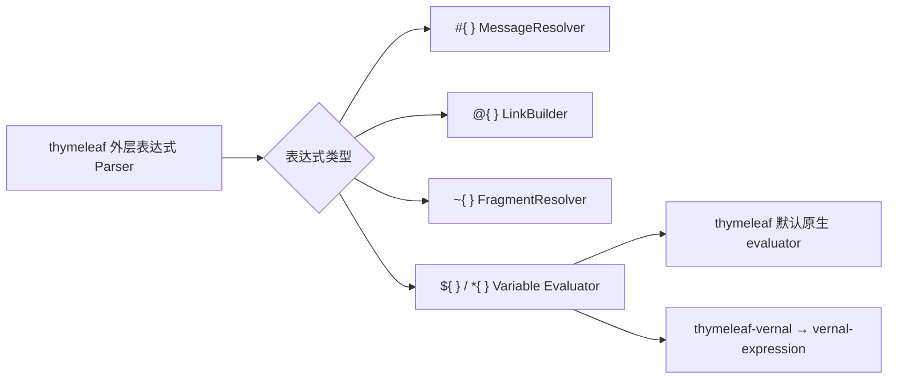

# Thymeleaf → thymeleaf-rust 功能语义迁移对照表

> **文档说明**：从可观察行为角度定义 Thymeleaf Core 到 `thymeleaf` 的迁移合同。本表回答“功能语义是否存在且是否有证据”，对象落点见[对象级对照表](对象级对照表.md)。
>
> **文档版本**：v1.0.0
> **最后更新**：2026-07-29
> **上游基线**：Thymeleaf `3.1.5.RELEASE`，提交 `10f9dd2eb8cbd98515ce14b149d115e0287d0add`
> **当前状态**：迁移实施中；Foundation、方言基础配置、缓存对象族、文件/字符串模板资源及部分标准表达式垂直切片已完成 Java/Rust Golden 差分；URL 模板资源已实现 file/HTTP/HTTPS，通用协议语义待补齐

## 1. 迁移判定规则

### 1.1 状态图例

| 状态 | 含义 |
|:---|:---|
| `BEHAVIOR_VERIFIED` | Java/Rust 差分或等价合同测试通过 |
| `IMPLEMENTED_UNVERIFIED` | 存在真实实现，但尚未证明行为一致 |
| `SKELETON` | 只有形态或签名，不计入完成 |
| `NOT_STARTED` | 尚未迁移 |
| `JAVA_ONLY_EXEMPT` | JVM 运行时形态使用批准的 Rust 等价机制 |
| `PLANNED_BLOCKED` | 存在明确外部阻断 |
| `RUST_EXTENSION` | Rust 特有能力，不计入 Java 迁移分子 |

### 1.2 语义一致的五个维度

每个功能域必须同时检查：

1. **输入**：模板、Context、Locale、Resolver attributes、selector、配置；
2. **输出**：字节、事件、Model、Response、错误；
3. **顺序**：Resolver、Processor、Dialect、Handler、迭代和作用域顺序；
4. **副作用**：缓存、Context level、变量、日志、资源读写；
5. **边界**：Null、空值、malformed 输入、递归、并发、取消和资源限制。

仅有同名 API 不能判定语义一致。

## 2. Engine 与配置

| 上游对象/入口 | 上游语义 | Rust 目标 | 验收证据 | 状态 |
|:---|:---|:---|:---|:---:|
| `TemplateEngine` | 首次 process 时初始化，之后配置冻结 | `TemplateEngine` + immutable configuration | 初始化并发、重复配置、冻结测试 | NOT_STARTED |
| `ITemplateEngine.process` | String、selector、TemplateSpec、Writer 多入口收敛 | 字符串/Bytes/Writer/Stream API 收敛到 `TemplateSpec` | 所有入口输出相同 | NOT_STARTED |
| `TemplateSpec` | template、selectors、mode、resolution attributes、output MIME/SSE | 同名对象 + 类型化属性值 | 289 条 Java Golden、Rust 合同测试、100% slice coverage | `BEHAVIOR_VERIFIED` |
| `EngineConfiguration` | 聚合 Resolver、Dialect、Message、Link、Cache、ContextFactory | 同名不可变配置 | 配置快照与排序测试 | NOT_STARTED |
| `DialectConfiguration` | prefix 与 Dialect 配对，区分未指定和显式 null | 同名对象 + `Arc<dyn IDialect>` | 23 条方言 Java Golden、实例同一性与前缀边界 | `BEHAVIOR_VERIFIED` |
| `DialectSetConfiguration` | 聚合 Processor、Pre/Post、ExpressionObject | 同名对象 | 多 Dialect 聚合快照 | NOT_STARTED |
| `ConfigurationPrinterHelper` | 输出可诊断配置 | 同名内部对象 + tracing | 诊断快照不泄漏敏感值 | NOT_STARTED |
| `Thymeleaf` | 从正式制品属性读取版本、构建时间和稳定性 | 编译期固化同一制品元数据 | 8 条正式制品 Java Golden | `BEHAVIOR_VERIFIED` |

### 2.1 `TemplateSpec` 已验证语义

| 可观察语义 | Rust 映射 | 验收证据 | 状态 |
|:---|:---|:---|:---:|
| `template` 必填，空字符串允许 | `Option<&str>` 构造边界 + `TemplateSpecError` | `null` 精确错误消息 | `BEHAVIOR_VERIFIED` |
| selector 的 `null`/空白拒绝、空集合归一、多值排序 | `TemplateSelectorSet` → Java UTF-16 顺序的不可变切片 | null、empty、blank、single、multi、Unicode Golden | `BEHAVIOR_VERIFIED` |
| resolution attributes 防御性复制并参与相等/哈希 | `TemplateResolutionAttributes` + 类型擦除值容器 | copy、null key/value、unmodifiable、Eq/Hash 测试 | `BEHAVIOR_VERIFIED` |
| mode 与 output content type 互斥 | `Result<TemplateSpec, TemplateSpecError>` | package 构造器合同测试 | `BEHAVIOR_VERIFIED` |
| MIME 大小写、参数和别名推导模板模式 | 归一化 MIME → `TemplateMode` | HTML/XML/JS/CSS/TEXT 全表差分 | `BEHAVIOR_VERIFIED` |
| `text/event-stream` 启用 SSE 但不强制模式 | `is_output_sse` | SSE/unknown/blank 差分 | `BEHAVIOR_VERIFIED` |
| `StringTokenizer` 的分号边界 | 忽略连续/前导分号；全分号返回类型化错误 | malformed Java 异常差分 | `BEHAVIOR_VERIFIED` |
| Java `equals` 的字段顺序与空内容类型 NPE | `equals_java` 类型化保留；`PartialEq` 安全使用 | identity/type/字段差异/NPE 差分 | `BEHAVIOR_VERIFIED` |
| `toString` 的字段顺序、换行替换和长名称截断 | `Display` 按 Java UTF-16 长度计算 | short/long/complete Golden | `BEHAVIOR_VERIFIED` |

Rust `Hash` 保留“相等对象必须产生相等哈希”的跨语言合同；JVM 的字符串、枚举和
对象数值哈希不是稳定跨运行时协议，因此不把 Java `int hashCode()` 的具体数值作为
Rust 公共兼容承诺。

### 2.2 `ContentTypeUtils` 已验证语义

| 可观察语义 | Rust 映射 | 验收证据 | 状态 |
|:---|:---|:---|:---:|
| 九组 MIME 主类型和别名识别 | `ContentTypeUtils::is_content_type_*` | 所有 HTML/XML/RSS/Atom/JS/JSON/CSS/TEXT/SSE 别名 | `BEHAVIOR_VERIFIED` |
| MIME 参数解析、重复键和插入顺序 | 私有 `ContentType` + `IndexMap` | 连续分号、无等号参数、重复键覆盖和 `Display` Golden | `BEHAVIOR_VERIFIED` |
| 模板名称扩展名归一化 | 最后扩展名执行 Java ASCII trim 与小写 | 大写、尾空白、多点、未知扩展名 | `BEHAVIOR_VERIFIED` |
| 请求路径扩展名规则 | 依次剥离 query、fragment、矩阵参数，不归一化扩展名 | null、大小写、路径段和三类后缀边界 | `BEHAVIOR_VERIFIED` |
| 模板模式与标准 MIME 推导 | 复用同一 `TemplateMode`，RSS/Atom→XML、JSON→JAVASCRIPT | 内容类型、模板名、请求路径三入口 | `BEHAVIOR_VERIFIED` |
| 字符集读取与规范名称 | `Charset` 值对象 + `encoding_rs`/Java 必备字符集映射 | UTF-8、Latin-1、UTF-16/32、Windows-1252、Shift_JIS、非法/不支持名称 | `BEHAVIOR_VERIFIED` |
| 字符集合并及原参数位置 | 覆盖已有 `charset` 不改位置，新参数追加 | null 字符集原样返回、参数顺序与大小写规范化 | `BEHAVIOR_VERIFIED` |
| Java 隐式异常边界 | `ContentTypeError` 类型化区分空令牌、null 请求路径和非法字符集 | 异常类别与 JDK 21 消息 Golden | `BEHAVIOR_VERIFIED` |

`TemplateSpec` 已删除自身重复的 MIME 匹配表，构造时直接调用
`ContentTypeUtils::compute_template_mode_for_content_type` 与
`is_content_type_sse`，恢复上游真实调用链。375 条固定 Java Golden 覆盖 21 个内容
类型输入、16 个模板名称、14 个请求路径、44 个字符集输入和 7 组字符集合并输入。

### 2.3 `SetUtils` / `Sets` 已验证语义

| 可观察语义 | Rust 映射 | 验收证据 | 状态 |
|:---|:---|:---|:---:|
| 已有 `Set` 原样返回 | `SetTarget::Set` → borrowed `JavaSet` | `LinkedHashSet`/`IndexSet` 指针身份和原迭代顺序 | `BEHAVIOR_VERIFIED` |
| 数组与 Iterable 转换 | owned `JavaSet` + `IndexSet` | 重复值保留首次位置、null 元素、空输入和顺序 Golden | `BEHAVIOR_VERIFIED` |
| primitive array 强转失败 | `SetUtilsError::ClassCast` | Java `int[]` 的 `ClassCastException` 类别差分 | `BEHAVIOR_VERIFIED` |
| 非 Iterable 类型拒绝 | `SetTarget::Unsupported` | Integer、Iterator 的 Java 类名和精确错误文本 | `BEHAVIOR_VERIFIED` |
| size/empty/contains | `SetView` 只读动态视图 | `IndexSet`、`HashSet`、`BTreeSet` 与 null target | `BEHAVIOR_VERIFIED` |
| 两个 `containsAll` 重载 | array / collection 独立 Rust API | 不同校验文本、校验顺序、空/重复/缺失元素 | `BEHAVIOR_VERIFIED` |
| 不可修改单例集合 | owned `JavaSet` 无可变入口 | 普通/null 元素及 Java `UnsupportedOperationException` Oracle | `BEHAVIOR_VERIFIED` |
| `#sets` 表达式对象委托 | `Sets` → `SetUtils` | 六个公开操作和两个重载均走真实委托链 | `BEHAVIOR_VERIFIED` |

47 条固定 Java Golden 直接编译固定基线的 `SetUtils.java` 与 `Sets.java`。
`SetView`、`SetTarget`、`JavaSet` 和类型化错误仅解决 Rust 静态类型、借用及只读
边界，不改变 Java 集合的可观察合同。

### 2.4 `ListUtils` / `Lists` 已验证语义

| 可观察语义 | Rust 映射 | 验收证据 | 状态 |
|:---|:---|:---|:---:|
| 已有 `List` 原样返回 | `ListTarget::List` → borrowed `JavaList` | LinkedList 指针身份、类型、顺序、重复/null 元素 | `BEHAVIOR_VERIFIED` |
| 对象数组与纯 Iterable 转换 | owned `JavaList` + ArrayList 类型 | 顺序、重复/null、空输入和输出类型 Golden | `BEHAVIOR_VERIFIED` |
| primitive array 与非 Iterable 拒绝 | `ClassCast` / `CannotConvert` | `int[]`、Integer、Iterator 的异常类别和精确文本 | `BEHAVIOR_VERIFIED` |
| size/empty/contains | `ListView` 只读动态视图 | LinkedList、Vec、null target 与 null element | `BEHAVIOR_VERIFIED` |
| 两个 `containsAll` 重载 | array / collection 独立 Rust API | 不同校验文本、校验顺序、空/重复/缺失元素 | `BEHAVIOR_VERIFIED` |
| 自然稳定排序 | `JavaComparable` + 稳定归并排序 | 原列表不变、独立结果、UTF-16 String、Double 的 -0/NaN/Infinity、null/异构异常 | `BEHAVIOR_VERIFIED` |
| nullable Comparator | `JavaComparator` + 两个静态类型入口 | null 回退自然顺序、降序、相等键稳定性、非 Comparable 类型和异常传播 | `BEHAVIOR_VERIFIED` |
| 结果类型反射构造 | `JavaListType` + `ListView::fill_sorted` | LinkedList/公开自定义类型保留；固定/私有构造回退 ArrayList；构造后 add 异常传播 | `BEHAVIOR_VERIFIED` |
| `#lists` 表达式对象委托 | `Lists` → `ListUtils` | 八个公开操作与两个排序入口均走真实委托链 | `BEHAVIOR_VERIFIED` |

66 条固定 Java Golden 直接编译固定基线的 `Validate.java`、`ListUtils.java` 与
`Lists.java`。Rust 适配对象显式承接 JVM 动态类型、借用身份、自然比较和 Comparator，
不把排序简化为 Rust `Ord`，也不吞掉 Java 列表实现抛出的运行时异常。

### 2.5 `Maps` / `Objects` 已验证语义

| 可观察语义 | Rust 映射 | 验收证据 | 状态 |
|:---|:---|:---|:---:|
| `#maps` 全操作委托 | `Maps` → `MapUtils` | 九个公开方法/构造器、两个键重载、两个值重载和 null 校验均走真实委托链 | `BEHAVIOR_VERIFIED` |
| 标量 null-safe 身份 | `Objects` → `ObjectUtils` | target 优先、default 回退、双 null 和 `Rc` 指针身份 | `BEHAVIOR_VERIFIED` |
| 数组克隆与组件类型 | `JavaObjectArray` | 原数组不变、结果独立且可变、运行时组件类保留 | `BEHAVIOR_VERIFIED` |
| 数组默认值延迟检查 | `JavaObjectArray::set` + `ObjectsError::ArrayStore` | 不兼容默认值只在遇到 null 槽位时抛出；无 null 时不读取默认值 | `BEHAVIOR_VERIFIED` |
| 列表 null-safe | `Vec<Option<T>>` | 固定 ArrayList 等价类型、顺序/重复/长度、独立性和可变性 | `BEHAVIOR_VERIFIED` |
| 集合 null-safe | `IndexSet<Option<T>>` | 固定 LinkedHashSet 等价类型、首次插入顺序、替换碰撞去重、独立性和可变性 | `BEHAVIOR_VERIFIED` |
| 三个集合入口 null 校验 | `ObjectsError::Validation` | 精确 `Target cannot be null` 消息 | `BEHAVIOR_VERIFIED` |

35 条固定 Java Golden 直接编译固定基线的 `MapUtils.java`、`ObjectUtils.java`、
`Maps.java` 与 `Objects.java`。Rust 没有把 Java 引用数组简化为裸 `Vec`：
`JavaObjectArray` 显式保存运行时组件类和赋值谓词，因而可观察到
`String[]` 写入 `Integer` 时的 `ArrayStoreException` 类别。

### 2.6 `Thymeleaf` 已验证语义

| 可观察语义 | Rust 映射 | 验收证据 | 状态 |
|:---|:---|:---|:---:|
| 正式制品完整版本 | `Thymeleaf::get_version()` | `3.1.5.RELEASE` Java Golden | `BEHAVIOR_VERIFIED` |
| Maven 构建时间 | `get_build_timestamp()` | `2026-04-21T20:38:36+0000` Java Golden | `BEHAVIOR_VERIFIED` |
| major/minor/patch | 三个 `i32` getter | `3 / 1 / 5` 逐项差分 | `BEHAVIOR_VERIFIED` |
| qualifier 与稳定版本 | `Option<&str>` + `bool` | `RELEASE / true` 差分 | `BEHAVIOR_VERIFIED` |
| 工具类不可实例化 | 私有字段的零状态类型 | Rust 编译期可见性 | `BEHAVIOR_VERIFIED` |

### 2.7 `ArrayUtils` / `Arrays` 已验证语义

| 可观察语义 | Rust 映射 | 验收证据 | 状态 |
|:---|:---|:---|:---:|
| 引用数组转换身份 | `ArrayTarget::Reference` → `JavaArray::Borrowed` | `String[]` 的对象身份和运行时类名 Java/Rust 差分 | `BEHAVIOR_VERIFIED` |
| Iterable 组件类推断 | `JavaArrayElement` + owned `JavaObjectArray` | 同类、异构、全 null、空 Iterable 的 `String[]`/`Object[]` 结果类差分 | `BEHAVIOR_VERIFIED` |
| typed 数组转换 | 六个 `to_*_array` 独立入口 | String/Integer/Long/Double/Float/Boolean 组件类、null 槽位和写入错误 | `BEHAVIOR_VERIFIED` |
| primitive/reference array 分派 | `ArrayTarget::{PrimitiveArray,Reference}` | 无类型转换的 ClassCast 与 typed 转换的 IllegalArgument 区别 | `BEHAVIOR_VERIFIED` |
| 上游错误文本缺陷 | `CannotConvert` 保存 `of Class` | `componentClass.getClass().getSimpleName()` 的实际 Java 输出 Golden | `BEHAVIOR_VERIFIED` |
| 查询与两个 containsAll 重载 | `contains` / `contains_all_array` / `contains_all_collection` | null、重复、缺失元素以及两个不同 target 校验文本 | `BEHAVIOR_VERIFIED` |
| 引用数组复制 | `copy_of` / `copy_of_with_type` | 类型、独立性、扩展零槽、截断、null/负长度顺序与 ArrayStore 类别 | `BEHAVIOR_VERIFIED` |
| Java char 与范围复制 | `u16` + `copy_of_chars` / `copy_of_range` | UTF-16 code unit、尾部零扩展、反向/负/越界索引及 int 环绕 | `BEHAVIOR_VERIFIED` |
| `#arrays` 表达式对象委托 | `Arrays` → `ArrayUtils` | 12 个 facade 方法全部进入固定 Golden | `BEHAVIOR_VERIFIED` |

72 条固定 Java Golden 直接编译固定上游源码；Rust 适配复用 `JavaObjectArray`
保存运行时组件类和写入谓词，并用 `JavaArray` 显式区分原实例借用与新数组所有权。

源码树中的属性值是 Maven 过滤占位符，不是发布运行时值；Oracle 明确使用 Maven
Central 对应正式制品的属性。Rust 省去 ClassLoader，固定制品场景返回值完全一致。

## 3. 模板解析主链

CodeGraph 已确认：

```text
ITemplateEngine.process
→ TemplateEngine.process
→ TemplateManager.parseAndProcess
→ cache lookup
→ resolveTemplate
→ build TemplateData
→ choose parser
→ ModelBuilder/Processor handler chain
→ Output
```

| 上游语义 | Rust 目标 | 关键不变量 | 状态 |
|:---|:---|:---|:---:|
| cache hit 直接重放 `TemplateModel` | `TemplateModel::process` | 与未缓存路径字节一致 | NOT_STARTED |
| cache miss 按 Resolver order 解析 | resolver chain | 首个非空 resolution 胜出 | NOT_STARTED |
| cacheable 模板先构建 Model 再处理 | parse → model → cache → process | 只构建一次，Context 不泄漏 | NOT_STARTED |
| non-cacheable 模板 Parser 直通处理链 | event stream → handler chain | 与 Model 路径事件一致 | NOT_STARTED |
| process 结束 flush Writer | sink flush | flush 错误映射 `TemplateOutputException` | NOT_STARTED |
| Context level 在结束时回收 | scope guard | 成功/错误/取消均回收 | NOT_STARTED |

## 4. Template Resolver、Resource 与 Cache

| 功能 | 上游对象 | Rust 语义 | 验收场景 | 状态 |
|:---|:---|:---|:---|:---:|
| Resolver SPI | `ITemplateResolver` | order、name、resolve | 多 Resolver 命中/未命中 | NOT_STARTED |
| 抽象 Resolver | `AbstractTemplateResolver` | prefix/suffix/mode/cache/existence | 配置组合测试 | NOT_STARTED |
| 字符串 Resolver | `StringTemplateResolver` | template 本身为内容 | Unicode/空模板 | NOT_STARTED |
| 文件 Resolver | `FileTemplateResolver` | 文件路径到 Resource | charset、not found、权限错误 | NOT_STARTED |
| ClassLoader Resolver | `ClassLoaderTemplateResolver` | 🔶 嵌入/资源装载等价 | embedded fixture | NOT_STARTED |
| Resource SPI | `ITemplateResource` | description/base/UTF-8 reader/exists/relative；不强制线程安全 | 动态实现、I/O、错误类别与重复读取 | `BEHAVIOR_VERIFIED` |
| 字符串资源 | `StringTemplateResource` | null 拒绝、空字符串合法、永远存在、无 base name、独立 reader、不支持 relative | 22 条 Java Golden，Unicode/CRLF/NUL 与三种 relative 参数 | `BEHAVIOR_VERIFIED` |
| 文件资源 | `FileTemplateResource` | 逻辑清理路径与原文件路径分离、延迟打开、流式 charset 解码、相对路径继承字符集 | 48 条新增 Java Golden，真实临时文件、BOM、非法字节、缺失文件与编码错误优先级 | `BEHAVIOR_VERIFIED` |
| 资源路径工具 | `TemplateResourceUtils` | 纯词法 `cleanPath`、relative location 和 base name，不 canonicalize | 上游全部路径向量、Windows 分隔符、隐藏文件和异常边界 | `BEHAVIOR_VERIFIED` |
| URL 资源 | `UrlTemplateResource` | 保留 URL 描述；file/HTTP/HTTPS reader、HEAD exists、relative 与 charset；其他协议当前返回 Unsupported | 74 条新增 Java Golden、真实 file/HTTP 服务、HTTPS/未知协议失败合同、100% slice coverage；JAR/FTP/自定义 handler 与 TLS 成功路径待补 | `IMPLEMENTED_UNVERIFIED` |
| Resolution | `TemplateResolution` | `Rc` 保留非线程安全资源身份；verified、mode、decoupled 与 `Arc` validity 逐项保留 | 66 条 Java Golden：校验顺序、六种模式、标志组合、动态身份与“未验证不等于不存在” | `BEHAVIOR_VERIFIED` |
| Cache SPI | `ICache<K,V>` + `ICacheEntryValidityChecker<K,V>` | `Arc<V>` 共享身份、Option miss、显式 checker 覆盖、失效删除、清理和 key 快照 | 14 条 Java Golden、动态 trait 调用与所有接口操作 | `BEHAVIOR_VERIFIED` |
| 标准缓存 | `StandardCache` | put-if-absent、插入顺序 FIFO、默认/显式 checker、惰性删除、可选计数器与比例；Rust 显式牺牲软引用锚点 | 37 条 Java Golden、12 个单元测试；JVM 内存压力自动清除 `SoftReference` 尚无 Rust 自动触发等价物 | `IMPLEMENTED_UNVERIFIED` |
| Template Cache | `ICache<TemplateCacheKey, TemplateModel>` | 可选、容量、有效性、统计 | hit/miss/evict/clear | NOT_STARTED |
| Template Cache Key | `TemplateCacheKey` | owner、模板、selectors、offsets、mode、resolution attributes 全字段复合键 | 58 条缓存键 Java Golden、null/空集合/身份/UTF-16 顺序/相等-hash 合同 | `BEHAVIOR_VERIFIED` |
| Expression Cache Key | `ExpressionCacheKey` | 表达式类型、第一表达式和可选第二表达式；Java UTF-16 `int` hash | 58 条缓存键 Java Golden、null/空串/补充字符/哈希碰撞 | `BEHAVIOR_VERIFIED` |
| Validity | `ICacheEntryValidity` + Always/TTL/Non-cacheable | 永久、禁用、Java `long` 环绕 TTL 与墙上时钟 | 31 条 Java Golden、边界时钟与溢出测试 | `BEHAVIOR_VERIFIED` |

Selector 只由 Parser 使用，不能传给 Resolver 改变资源内容，否则会破坏 Parser 的选择语义。
`ExpressionCacheKey` 的数值 hash 与 Java 完全相同；`TemplateCacheKey` 所含枚举和普通对象
在 JVM 中使用进程身份 hash，因此 Rust 只承诺相等对象 hash 相同、全部字段参与及构造时
缓存，不把 JVM 进程相关数值误当作跨运行时协议。

## 5. TemplateMode 与 Parser

`TemplateMode` 对象与 Parser 实现分开验收，避免用 enum 已存在掩盖六种解析器尚未迁移的事实：

| `TemplateMode` 语义 | Rust 目标 | 差分证据 | 状态 |
|:---|:---|:---|:---:|
| 六个枚举值与显示名称 | 同名 enum variants 与 `Display` | 86 条 Foundation Java Golden | `BEHAVIOR_VERIFIED` |
| markup/text/case-sensitive flags | `is_markup` / `is_text` / `is_case_sensitive` | 六种模式逐项对照 | `BEHAVIOR_VERIFIED` |
| null、空字符串、纯空白 | `TemplateModeParseError` | Java `IllegalArgumentException` 消息对照 | `BEHAVIOR_VERIFIED` |
| 已知名称大小写不敏感 | `parse` | 六种名称大小写组合 | `BEHAVIOR_VERIFIED` |
| 未知或未 trim 名称 | warning + HTML fallback | `MARKDOWN` 与 `" XML "` 对照 | `BEHAVIOR_VERIFIED` |

| 模式 | 上游 Parser | 必须迁移的语义 | 状态 |
|:---|:---|:---|:---:|
| HTML | `HTMLTemplateParser` | 宽容 HTML、大小写不敏感、selector、源码位置 | NOT_STARTED |
| XML | `XMLTemplateParser` | 严格 XML、大小写敏感、CDATA、XML 声明、namespace | NOT_STARTED |
| TEXT | `TextTemplateParser` | 文本原型语法、自然文本输出 | NOT_STARTED |
| JAVASCRIPT | `JavaScriptTemplateParser` | 文本模式 + JS inlining/serialization | NOT_STARTED |
| CSS | `CSSTemplateParser` | 文本模式 + CSS inlining/serialization | NOT_STARTED |
| RAW | `RawTemplateParser` | 原样输出，不执行普通 Processor | NOT_STARTED |

### 5.1 Parser 公共语义

| 语义 | 上游对象 | Rust 验收 | 状态 |
|:---|:---|:---|:---:|
| standalone parse | `ITemplateParser.parseStandalone` | Resource → events | NOT_STARTED |
| string parse | `ITemplateParser.parseString` | owner + offsets + String → events | NOT_STARTED |
| 读取缓冲池 | reader/parser pool | 并发解析无数据串扰 | NOT_STARTED |
| selector | markup selector | 整页、id、fragment 选择 | NOT_STARTED |
| decoupled logic | `DecoupledTemplateLogic*` | 外部逻辑合并且位置可诊断 | NOT_STARTED |
| line/column | parser adapters | Unicode 和 CRLF 位置准确 | NOT_STARTED |
| malformed input | parser errors | 错误分类、模板名、位置 | NOT_STARTED |

## 6. Event、Model 与 Handler

### 6.1 事件模型

| 事件 | 上游接口/实现 | Rust 目标 | 状态 |
|:---|:---|:---|:---:|
| Template boundaries | `ITemplateStart` / `ITemplateEnd` | 同名事件 | NOT_STARTED |
| Text | `IText` / `Text` | 零拷贝优先文本事件 | NOT_STARTED |
| Element | open/close/standalone tags | 属性、synthetic、位置、关联事件 | NOT_STARTED |
| Comment | `IComment` / `Comment` | 内容和写出 | NOT_STARTED |
| CDATA | `ICDATASection` / `CDATASection` | 内容和写出 | NOT_STARTED |
| DocType | `IDocType` / `DocType` | 关键字/public/system/internal subset | NOT_STARTED |
| Processing instruction | `IProcessingInstruction` | target/content | NOT_STARTED |
| XML declaration | `IXMLDeclaration` | version/encoding/standalone | NOT_STARTED |

### 6.2 Model 语义

| 上游语义 | Rust 不变量 | 状态 |
|:---|:---|:---:|
| `TemplateModel` 不可变、可缓存、可重放 | Arc-backed immutable events | NOT_STARTED |
| `Model` 可编辑 | insert/replace/remove/reset | NOT_STARTED |
| 外部 Model 禁止插入 TemplateStart/End | 构造/插入时拒绝 | NOT_STARTED |
| 不同 EngineConfiguration 的 Model 不可混合 | configuration identity 检查 | NOT_STARTED |
| 不同 TemplateMode 的 Model 不可混合 | mode 检查 | NOT_STARTED |
| 插入 TemplateModel 时去除外层 boundaries | 精确事件范围 | NOT_STARTED |

### 6.3 Handler 链

| Handler | 语义 | 状态 |
|:---|:---|:---:|
| `ModelBuilderTemplateHandler` | 将 Parser 事件规范化为 Engine event 并构建 Model | NOT_STARTED |
| `ProcessorTemplateHandler` | 匹配并执行 Processor，应用 StructureHandler | NOT_STARTED |
| PreProcessor chain | 在 Processor 前变换事件 | NOT_STARTED |
| PostProcessor chain | 在 Processor 后、Output 前变换事件 | NOT_STARTED |
| `OutputTemplateHandler` | 按事件写出并保留位置错误 | NOT_STARTED |
| Throttled handler | 可暂停、继续、限制步骤/字符 | NOT_STARTED |

## 7. Context 与作用域

| 语义 | 上游对象 | Rust 目标 | 状态 |
|:---|:---|:---|:---:|
| 基础变量与 Locale | `IContext` / `Context` | owned/borrowed value map + locale | NOT_STARTED |
| 表达式 Context | `IExpressionContext` | configuration + variables + locale | NOT_STARTED |
| 模板 Context | `ITemplateContext` | template stack、inliner、selection、model factory | NOT_STARTED |
| Engine Context | `IEngineContext` | level、local variables、element stack | NOT_STARTED |
| level 增减 | `EngineContextManager` | RAII scope guard | NOT_STARTED |
| lazy variable | `ILazyContextVariable` | once-cell/lazy closure | NOT_STARTED |
| selection target | `th:object` | level-scoped selection root | NOT_STARTED |
| Web Context | `IWebContext` | neutral web exchange | NOT_STARTED |
| request parameters | `WebEngineContext` maps | 多值、只读、延迟访问 | NOT_STARTED |
| session/application attributes | Web maps | 宿主生命周期映射 | NOT_STARTED |

## 8. Dialect 与 Processor SPI

| 功能 | 上游对象 | Rust 目标 | 状态 |
|:---|:---|:---|:---:|
| Dialect 基础 | `IDialect` / `AbstractDialect` | 可空 trait 名称 + 非空基础实现 | `BEHAVIOR_VERIFIED` |
| Processor Dialect | `AbstractProcessorDialect` | prefix + precedence + processors | NOT_STARTED |
| Expression objects | `IExpressionObjectDialect` | object factory | NOT_STARTED |
| Execution attributes | `IExecutionAttributeDialect` | immutable typed attributes | NOT_STARTED |
| Pre/Post | `IPreProcessorDialect` / `IPostProcessorDialect` | ordered handler factories | NOT_STARTED |
| Processor 基础 | `IProcessor` / `AbstractProcessor` | TemplateMode + precedence | NOT_STARTED |
| Element Processor | tag/attribute matching | exact matching + prefix | NOT_STARTED |
| 非元素事件 Processor | text/comment/CDATA/etc. | 对应事件匹配 | NOT_STARTED |
| StructureHandler | remove/replace/insert/body/iterate/variables | 结构指令 enum | NOT_STARTED |

### 8.1 顺序合同

Processor 结果必须由以下关键字段确定：

1. Dialect precedence；
2. Processor precedence；
3. Processor 类型和 matcher；
4. 注册稳定顺序。

同一输入和配置的执行顺序必须确定性一致。

## 9. Standard Expression

### 9.1 外层表达式

| 语法 | 上游对象 | 语义 | Rust 求值边界 | 状态 |
|:---|:---|:---|:---|:---:|
| `${...}` | `VariableExpression` | 变量表达式 | 中立 evaluator；默认原生实现 | NOT_STARTED |
| `*{...}` | `SelectionVariableExpression` | selection root 表达式 | evaluator + selection target | NOT_STARTED |
| `#{...}` | `MessageExpression` | 本地化消息和参数 | `IMessageResolver` | NOT_STARTED |
| `@{...}` | `LinkExpression` | URL、路径/查询参数 | `ILinkBuilder` | NOT_STARTED |
| `~{...}` | `FragmentExpression` | 模板/selector/参数 | TemplateManager + Fragment | NOT_STARTED |
| `__...__` | `StandardExpressionPreprocessor` | 解析前预处理 | 显式递归/安全限制 | NOT_STARTED |

### 9.2 表达式结构

| 语义 | 上游对象 | 状态 |
|:---|:---|:---:|
| token 和 parsing state | `ExpressionParsingState`、`ExpressionParsingNode` | NOT_STARTED |
| literal | Text/Number/Boolean/Null/NoOp literals | NOT_STARTED |
| binary operation | `BinaryOperationExpression` | NOT_STARTED |
| conditional | `ConditionalExpression` | NOT_STARTED |
| default/Elvis | `DefaultExpression` | NOT_STARTED |
| assignment list | `Assignation` / `AssignationSequence` | NOT_STARTED |
| expression list | `ExpressionSequence` | NOT_STARTED |
| iteration | `Each` | NOT_STARTED |
| fragment signature | `FragmentSignature` | NOT_STARTED |
| conversion context | `StandardExpressionExecutionContext` | 三个公开规范单例、六组限制/转换标志及 `with/withoutTypeConversion` 的原实例与规范单例身份复用 | `BEHAVIOR_VERIFIED` |
| parse cache | `ExpressionCache` | NOT_STARTED |

### 9.3 Vernal Expression 的关系

参考 `vernal-expression` 的迁移方法，但不把它变成核心依赖：



`thymeleaf-vernal` 的 bridge 必须保持 `${}`/`*{}` 的 Thymeleaf root、selection、类型转换和安全上下文，不能把整个属性字符串直接交给通用表达式 Parser。

## 10. Standard Dialect Processor

| 功能域 | 代表 Processor | 关键行为 | 状态 |
|:---|:---|:---|:---:|
| 文本 | `StandardTextTagProcessor` | escaped text | NOT_STARTED |
| 非转义文本 | `StandardUtextTagProcessor` | raw model/text，受安全策略约束 | NOT_STARTED |
| 条件 | If/Unless/Switch/Case | truthiness、短路、case 匹配 | NOT_STARTED |
| 迭代 | `StandardEachTagProcessor` | iterable、Map、状态变量、scope | NOT_STARTED |
| selection | `StandardObjectTagProcessor` | 设置 selection root | NOT_STARTED |
| local variables | `StandardWithTagProcessor` | 顺序赋值和 level scope | NOT_STARTED |
| 属性 | Attr/append/prepend/fixed/removable | mode-aware 属性变换 | NOT_STARTED |
| URL 属性 | Href/Src/Action/FormAction | LinkExpression + URL escaping | NOT_STARTED |
| Fragment 声明 | `StandardFragmentTagProcessor` | signature 与参数声明 | NOT_STARTED |
| Fragment 插入 | Insert/Replace/Include | model selection、参数绑定、替换边界 | NOT_STARTED |
| 删除 | `StandardRemoveTagProcessor` | all/tag/body/all-but-first | NOT_STARTED |
| block | `StandardBlockTagProcessor` | 无输出容器 | NOT_STARTED |
| inline | HTML/XML/Textual + boundary processors | mode-aware inline enablement | NOT_STARTED |
| 注释/CDATA | inlining processors | inline 后事件类型保持 | NOT_STARTED |
| DOM event | `StandardDOMEventAttributeTagProcessor` | 禁止不可信字符串直接注入 | NOT_STARTED |
| namespace/XML | XmlBase/Lang/Ns/Space | XML 属性规则 | NOT_STARTED |

## 11. Fragment 语义

| 行为 | 必须迁移的合同 | 状态 |
|:---|:---|:---:|
| fragment expression | template、selector、parameters 独立解析 | NOT_STARTED |
| 当前模板 fragment | 省略 template 时从当前 TemplateData 解析 | NOT_STARTED |
| empty/no-op fragment | 明确 EMPTY 和 NO-OP 行为 | NOT_STARTED |
| 参数签名 | named、synthetic、位置参数和数量校验 | NOT_STARTED |
| insert | 保留宿主 tag，插入 fragment body/model | NOT_STARTED |
| replace | fragment 替换宿主节点 | NOT_STARTED |
| include | 兼容旧语义并登记 deprecated 行为 | NOT_STARTED |
| nested template stack | message/link/template data 使用正确 owner | NOT_STARTED |
| recursion | 深度、循环检测和诊断 | NOT_STARTED |

## 12. Inline、转义与 Serializer

| 上下文 | escaped | unescaped | 额外规则 | 状态 |
|:---|:---|:---|:---|:---:|
| HTML | HTML escape | 原样/结构解析 | text 与 attribute context 不同 | NOT_STARTED |
| XML | XML escape | 原样/结构解析 | 合法字符和 namespace | NOT_STARTED |
| TEXT | 文本输出 | 文本输出 | 原型控制标记 | NOT_STARTED |
| JAVASCRIPT | JS serializer | raw JS | 引号、斜杠、Unicode、`</script>` | NOT_STARTED |
| CSS | CSS serializer | raw CSS | 字符串和 identifier escape | NOT_STARTED |
| RAW | 不处理 | 不处理 | 完全原样 | NOT_STARTED |

安全规则：

- `th:text` 默认安全转义；
- `th:utext` 和 unescaped inline 必须在 API/文档中显式标记风险；
- DOM event 属性只接受被安全上下文允许的结果；
- URL、JavaScript、CSS、HTML、XML 不共享同一个 escape 函数；
- 输出限制、递归限制和表达式预算必须可配置。

## 13. Message 与 Link

| 语义 | 上游对象 | 验收 | 状态 |
|:---|:---|:---|:---:|
| message resolver order | `IMessageResolver` | 首个命中胜出 | NOT_STARTED |
| origin-aware message | template stack + origin | fragment/嵌套模板 locale | NOT_STARTED |
| absent/default message | resolver fallback | 缺失 key 与 default | NOT_STARTED |
| message parameters | expression sequence | 格式化和 locale | NOT_STARTED |
| link builder order | `ILinkBuilder` | 首个可构建结果 | NOT_STARTED |
| context relative | `StandardLinkBuilder` | web context path | NOT_STARTED |
| server relative | `~/...` | host root path | NOT_STARTED |
| absolute/protocol relative | URL schemes | 不错误前缀化 | NOT_STARTED |
| path/query/fragment | parameter map | 编码、重复参数、Null | NOT_STARTED |

## 14. 完整渲染、节流与流式

| 上游语义 | Rust 目标 | 状态 |
|:---|:---|:---:|
| String/Writer 输出 | `RenderedTemplate::Full(Bytes)` 或 Writer sink | NOT_STARTED |
| `IThrottledTemplateProcessor` | 可恢复状态机 | NOT_STARTED |
| process(numberOfChars) | 字符/字节预算的批准差异 | NOT_STARTED |
| processAll | 直到完成或错误 | NOT_STARTED |
| isFinished | 完成状态 | NOT_STARTED |
| output buffer | 仅返回新输出，不重复 | NOT_STARTED |
| backpressure | `Stream<Frame<Bytes>>` 按 poll 推进 | NOT_STARTED |
| cancellation | drop 终止解析/处理并回收 Context | NOT_STARTED |
| partial response error | 明确 stream error，不伪装完整响应 | NOT_STARTED |

Java 的字符预算与 Rust UTF-8 字节/Frame 预算并不天然相同，必须通过 ADR 固定公开语义并提供 Unicode 边界测试。

## 15. Web 中立合同与宿主整合

| 上游 Java 形态 | Rust 等价语义 | 落点 | 状态 |
|:---|:---|:---|:---:|
| `IWebApplication` | 应用级资源/属性 | `thymeleaf::web` | NOT_STARTED |
| `IWebExchange` | request/response/session/application 聚合 | `thymeleaf::web` | NOT_STARTED |
| `IWebRequest` | method/path/query/headers/parameters | `thymeleaf::web` | NOT_STARTED |
| `IWebSession` | session id/attributes | `thymeleaf::web` | NOT_STARTED |
| Jakarta/Javax Servlet wrappers | 宿主框架 wrapper | `thymeleaf-{framework}` | NOT_STARTED |
| Spring ViewResolver | ViewEngine/Resolver bridge | `thymeleaf-vernal` | NOT_STARTED |
| WebFlux data-driven context | backpressure-aware data stream | 支持流式的整合 crate | NOT_STARTED |

## 16. 错误与诊断

| 错误域 | 上游类型 | Rust 要求 | 状态 |
|:---|:---|:---|:---:|
| engine | `TemplateEngineException` | 同名 trait + `std::error::Error` 原因链 | `BEHAVIOR_VERIFIED` |
| input | `TemplateInputException` | message、template、line、col、cause | `BEHAVIOR_VERIFIED` |
| processing | `TemplateProcessingException` | template、line、col、cause、mutation | `BEHAVIOR_VERIFIED` |
| output | `TemplateOutputException` | template、line、col、底层输出 cause | `BEHAVIOR_VERIFIED` |
| assertion | `TemplateAssertionException` | 表达式、模板、位置与精确消息 | `BEHAVIOR_VERIFIED` |
| mode | `TemplateMode.parse` 的 `IllegalArgumentException` | `TemplateModeParseError` | `BEHAVIOR_VERIFIED` |
| cache | `TemplateProcessingException`/validity | cache key 和 validity context | NOT_STARTED |
| expression | parsing/evaluation errors | expression text、offset、安全上下文 | NOT_STARTED |

错误消息不要求逐字符翻译，但错误类别、位置、原因链和触发条件必须一致。

## 17. 并发、缓存与可观测性

| 非功能语义 | Rust 目标 | 验收 | 状态 |
|:---|:---|:---|:---:|
| Engine 初始化线程安全 | `OnceLock`/原子状态 | 并发首次 process | NOT_STARTED |
| 配置只读共享 | `Arc<EngineConfiguration>` | Send + Sync | NOT_STARTED |
| 请求 Context 隔离 | 每次渲染独立状态 | 并发变量污染测试 | NOT_STARTED |
| 缓存并发 | Moka 或等价抽象 | stampede/eviction/TTL | NOT_STARTED |
| Parser 池/缓冲复用 | 有界池 | 并发无串扰 | NOT_STARTED |
| tracing | resolve/parse/process/output spans | 错误与 cache outcome | NOT_STARTED |
| metrics | latency、cache、bytes、errors | 标签基数受控 | NOT_STARTED |

## 18. 批准的 Rust 形态差异

| Java 机制 | Rust 等价 | 名称策略 | 必须保留的语义 |
|:---|:---|:---|:---|
| OGNL evaluator | 原生 evaluator；可由 `thymeleaf-vernal` 接入 `vernal-expression` | `Native*` | 属性/索引/selection/类型转换/安全上下文 |
| ClassLoader | embedded/file/resource loader | `Embedded*` / `ResourceLoaderUtils` | 相对资源、exists、reader、description |
| Servlet | 中立 Web trait + 宿主 wrapper | host-specific | request/session/application/exchange 可见性 |
| Writer | Bytes/Writer/Stream sink | Rust sink 类型 | 顺序、flush、输出错误 |
| Java inheritance | trait + composition + enum | Java 主对象名默认保留 | SPI、动态分派、precedence |
| null | `Option<T>` / `TemplateValue::Null` | Rust 原生 | Null 与 absent 必须区分 |
| synchronized/concurrent maps | `Arc` + lock/concurrent map | Rust 原生 | 线程安全和原子性 |

上述差异不是降级；每一项都必须以行为测试证明等价。

### 18.1 已验证通用工具语义

| 功能 | 上游对象 | Rust 语义 | 验收证据 | 状态 |
|:---|:---|:---|:---|:---:|
| 数字分隔点类型 | `NumberPointType` | 五个成员、声明顺序、大写名称、严格匹配和显示文本 | 32 条工具基础 Java Golden 中覆盖所有成员及 null/空/大小写/空格/未知名称 | `BEHAVIOR_VERIFIED` |
| 引用身份计数 | `IdentityCounter<T>` | `Rc::ptr_eq` 保留引用身份；强引用持有、重复身份去重、null 身份、非线程安全 | alias、值相等但分配不同、重复 count、null、负容量和最大 `i32` 容量差分 | `BEHAVIOR_VERIFIED` |
| 参数与集合校验 | `Validate` | 八个公开重载完整映射；显式非法参数与隐式空引用异常分型；null 消息、Java 空白字符、集合/数组元素逐项短路顺序保持一致 | 36 条 Java Golden 覆盖成功、首个失败元素、null/空/空白输入、可空消息及异常类别；Rust 单元测试覆盖全部分支 | `BEHAVIOR_VERIFIED` |
| Map 查询工具 | `MapUtils` | `HashMap` 承接 Map 查询；null target、null 键值、数组/Collection 重载、空集合、重复请求和 Java `Map#size` 饱和值语义保持一致 | 40 条 Map/Object Java Golden 中覆盖全部公开方法、重载、成功与精确校验错误 | `BEHAVIOR_VERIFIED` |
| null 安全对象选择 | `ObjectUtils` | 双层 `Option` 保留 target/default 各自可空性；移动 `Rc` 验证选中对象身份不变 | target 优先、default 回退、双 null 及引用身份 Java/Rust 差分 | `BEHAVIOR_VERIFIED` |
| Map 表达式 facade | `Maps` | 九个公开入口全部委托 `MapUtils`，保持重载和校验顺序 | 35 条 Map/Object 表达式 Golden 中覆盖全部入口 | `BEHAVIOR_VERIFIED` |
| 集合 null-safe 表达式 | `Objects` | 标量身份、同组件数组克隆、延迟数组存储检查、ArrayList/LinkedHashSet 等价输出及替换后去重 | 数组、列表、集合类型/内容/独立性/可变性及异常 Golden | `BEHAVIOR_VERIFIED` |
| 数值聚合与 `#aggregates` facade | `AggregateUtils` / `Aggregates` | 16 组工具重载与 16 组真实委托入口；BigDecimal unscaled/scale、Number 运行时分派、Iterable 两次遍历、null/强转优先级、精确除法及 `max(scale,10)` HALF_UP 回退均保持一致 | 68 条固定 Golden 覆盖 32 个公开入口；20,010 个确定性 `f64` 位模式完成输出哈希差分 | `BEHAVIOR_VERIFIED` |
| 数组转换、复制与 `#arrays` facade | `ArrayUtils` / `Arrays` | 引用数组身份、Iterable 组件类推断、六种 typed 转换、两个 containsAll 重载、引用/char 复制及 JVM 异常顺序保持一致 | 72 条 Java Golden 覆盖 28 个公开入口及组件类、primitive、负长度和索引溢出边界 | `BEHAVIOR_VERIFIED` |
| 表达式真值与集合/数组求值 | `EvaluationUtils` / `Bools` | null、数值/字符/字符串/LiteralValue 真值；`BigDecimal(double)` 精确二进制构造；Iterable/Map/八种 primitive array 转换；不可修改列表、Map 条目快照/身份及引用数组原样返回；14 个 `#bools` 表达式方法与短路规则 | 90 条 Java Golden 覆盖固定边界，并对 20,010 个确定性 `f64` 位模式执行精确十进制输出哈希差分 | `BEHAVIOR_VERIFIED` |
| 表达式文本字面量包装 | `LiteralValue` | 可空 UTF-16 文本、默认引用相等、null/字面量/其他对象三路 unwrap；其他对象保留同一引用 | 27 条标准表达式基础 Golden 中覆盖 getter、两个 null 边界、同一/不同实例及解包身份 | `BEHAVIOR_VERIFIED` |
| 标准表达式执行上下文 | `StandardExpressionExecutionContext` | 私有构造意图由只读规范单例表达；变量/外部访问、危险结果和类型转换四标志完整；转换开关返回原实例或对应单例 | 27 条标准表达式基础 Golden 中覆盖三类公开上下文、六个规范状态、幂等、往返与重复转换身份 | `BEHAVIOR_VERIFIED` |
| 标准表达式类型转换 | `IStandardConversionService` / `AbstractStandardConversionService` / `StandardConversionService` | trait + 封闭 blanket impl 保留 final `convert` 模板方法；String.class 的 null/原引用快路径、对象 `toString()` 的 null/借用/新建/异常、目标类校验及两个子类钩子完整；上下文以可空动态引用原样透传，允许宿主实现下转 | 21 条 Java Golden 覆盖默认/自定义服务、上下文透传、String 身份、对象返回共享字符串身份、运行时异常、Integer/数组目标错误和扩展转换结果 | `BEHAVIOR_VERIFIED` |
| NO-OP 表达式值 | `NoOpToken` | 私有构造意图、唯一公开 `VALUE`、默认引用相等和固定 `_` 文本 | 标准转换服务 Golden 覆盖单例身份、相等和显示；Rust 单元测试覆盖同一静态地址 | `BEHAVIOR_VERIFIED` |
| Token 值、字符判定与解析 trace | `Token<T>` / `TokenParsingTracer` | 泛型组合代替 `extends SimpleExpression` 的字段继承；保留可空原值身份、Java `toString()` 的可空/借用/拥有/异常结果；按 UTF-16 code unit 精确迁移 ASCII、Unicode BMP 区间及连字符前后扫描；trace 逐码元将 token 字符替换为 `#` | 46 条固定 Golden 覆盖 getter/string/null/异常/索引与 trace 边界；完整 65,536 BMP 单字符和连字符左右上下文、完整 BMP trace，以及 20,000 个确定性 UTF-16 上下文哈希差分 | `BEHAVIOR_VERIFIED` |
| 属性值引号 enum | `AttributeValueQuotes` | `DOUBLE`、`SINGLE`、`NONE` 名称、声明顺序、ordinal 和显示保持一致 | 三个值逐项 Java Golden | `BEHAVIOR_VERIFIED` |
| HTML 元素类别 enum | `HTMLElementType` | 五个成员、声明顺序和显示保持一致；仅 `VOID.is_void()` 为真 | 五个值的名称、ordinal、显示和 void 标志逐项 Golden | `BEHAVIOR_VERIFIED` |
| 标准内联模式 enum | `StandardInlineMode` | 六个成员且无 RAW；parse 使用 Java UTF-16 `trim()` 空值检查和 `equalsIgnoreCase()`，保留长 s、点上/无点 I、未 trim 输入和精确 IllegalArgument 消息 | 64 条 enum Golden；每个候选名称的每个位置遍历全部 65,536 BMP code unit，另覆盖孤立代理项错误消息的 UTF-16 | `BEHAVIOR_VERIFIED` |
| 引擎增量处理合同 | `IEngineProcessable` | 不施加线程安全或幂等约束；`&mut self` 保留实现按调用次序更新内部状态的能力，trait object 保留 Java 接口动态分派 | 7 条 Java Golden 覆盖四次交替返回、最终调用计数和同一实现对象身份 | `BEHAVIOR_VERIFIED` |
| 模板流控状态 | `TemplateFlowController` | package-private 类型/构造器/字段映射为 `pub(crate)`；两个标志默认 false 且可由 engine 同包逻辑独立修改，不增加公共 getter/setter | 同包 Java Oracle 覆盖默认值、单字段顺序变更和第二实例不受影响 | `BEHAVIOR_VERIFIED` |
| UTF-16 内存写入器 | `FastStringWriter` | `Vec<u16>` 保留 Java `char`、孤立代理项和 `write(int)` 低 16 位截断；null 字符串写入 `"null"`；字符串/字符数组重载分别保留异常类、消息、整数回绕与短路顺序；`flush`/`close` 为空操作，`toString` 为独立快照，继承的三个 `Writer#append` 入口返回同一对象 | 46 条 Java Golden 覆盖全部构造器和公开重载、关闭后写入、快照/链式身份、null 与越界异常；穷举 -65,536..131,071 的 `write(int)` 并对字符串/数组范围矩阵执行哈希差分 | `BEHAVIOR_VERIFIED` |
| 共享字符数组视图 | `CharArrayWrapperSequence` | `Arc<RwLock<Vec<u16>>>` 保留原 `char[]` 引用、外部修改可见性、子序列/浅 clone 共享与线程安全；offset/length 使用 `i32` 回绕，保留空数组拒绝、负/溢出 length 延迟失败、UTF-16 代理项、String 兼容哈希及仅同类型 equals | 57 条 Java Golden 覆盖两个构造器、浅 clone、外部修改、访问/子序列/字符串物化异常、相等/哈希；构造器和子序列边界矩阵执行哈希差分 | `BEHAVIOR_VERIFIED` |
| 文本解析扫描状态 | `TextParseStatus` | package-private 类型/构造器/字段全部映射为 `pub(crate)`；三个 `i32`、两个 bool 和 UTF-16 literal marker 保留 Java 默认零值与独立实例可变性，不增加公共 getter/setter | 同包 Java Oracle 覆盖默认值、极值/代理项修改及第二实例不受影响 | `BEHAVIOR_VERIFIED` |
| 文本解析定位计数 | `ParsingLocatorUtil` | locator[0]/[1] 分别为行/列；仅 LF 增行并重置列为 1，CR/NUL/代理项只增列；`i32` 回绕、null/短数组异常类型与消息、LF 在第二次数组访问失败前的部分写入均保持一致 | 18 条共享 text parser Foundation Golden 覆盖正常序列、整数溢出、null、0/1/3 长度 locator 及失败后状态 | `BEHAVIOR_VERIFIED` |
| 文本解析 checked exception | `TextParseException` | 八个公开构造器完整映射；消息使用 `JavaString` 保留 null/孤立代理项；显式负行列原样保存；同类型且带位置的 cause 传播行列并按上游无分隔符分支拼接嵌套消息；普通 cause 不传播位置；`TextParseCause` 保留 Java 类名、可空消息和 source 身份 | 27 条 Java Golden 覆盖全部构造器、null 组合、显式位置、普通/同类型 cause、行列传播、嵌套前缀和原因身份 | `BEHAVIOR_VERIFIED` |
| 文本解析事件处理器 | `ITextHandler` | 11 个事件入口完整映射为可变动态 trait；UTF-16 缓冲区可由处理器修改；全部 offset/len、位置、minimized 和时钟参数原序透传；checked exception 以 Box 存储但语义原样传播 | Java Oracle 逐一调用全部事件并校验动态分派、参数序列和同一缓冲区；Rust 合同测试覆盖所有入口 | `BEHAVIOR_VERIFIED` |
| 文本注释解析 | `TextParsingCommentUtil` | `/*...*/` 边界、content/outer 范围、同步回调、数组修改可见性、`i32` 回绕和 Java 运行时异常顺序保持一致 | 40 条共享 Oracle 中覆盖正常/空/嵌入/畸形/null/越界/溢出、handler 失败及 363 项谓词矩阵 | `BEHAVIOR_VERIFIED` |
| 正则字面量起点 | `TextParsingLiteralUtil` | `/` 之前的非空白仅接受 `(`、`=`、`,`；块/行注释优先排除；完整复现 BMP `Character.isWhitespace(char)` | 固定场景、注释前缀与异常测试，并对全部 65,536 个 UTF-16 代码单元执行 Java/Rust 哈希差分 | `BEHAVIOR_VERIFIED` |
| 文本通用结构扫描 | `TextParsingUtil` | 十个 package-private 扫描入口完整迁移：单双引号、结构/注释/字面量边界、反斜杠奇偶、Java BMP 空白、运算符和 locator 更新；null/数组越界类别、增强 NPE 参数名、`i32` 回绕及短数组部分副作用保持一致 | 87 条固定 Oracle 覆盖全部入口和运行时边界；四类扫描穷举 65,536 个 BMP 码元，分隔符覆盖 0–12 个反斜杠；新文件三项覆盖率 100% | `BEHAVIOR_VERIFIED` |
| 文本属性序列解析 | `TextParsingAttributeSequenceUtil` | 完整迁移名称、运算符和值的四阶段扫描，保持 name-only、空值、单双引号内容范围、UTF-16 缓冲区修改可见性、回调参数顺序、checked/runtime 异常传播、null handler 增强 NPE、`i32` 回绕和 Java 数组范围失败语义 | 56 条固定 Java Oracle 覆盖正常、畸形、嵌入范围、handler 修改/异常/null 与运行时边界；空白、引号、语法和 offset/len 四个确定性穷举集合执行哈希差分；新文件三项覆盖率 100% | `BEHAVIOR_VERIFIED` |
| 文本元素解析 | `TextParsingElementUtil` | 完整迁移 open/standalone/close 三类元素、无名元素、名称首字符规则、结束符谓词、属性事件和 close 禁止属性；保持 handler 修改可见性、checked/runtime 异常、UTF-16 错误原文、增强 NPE、数组短路、定位及 `i32` 回绕 | 99 条固定 Java Oracle 覆盖合法/非法形状、属性、引号、内部 `]`、多行、handler 与运行时边界；BMP 名称首字符、谓词范围、标签语法和解析范围四个确定性集合执行哈希差分；新文件三项覆盖率 100% | `BEHAVIOR_VERIFIED` |
| 日志模板名压缩 | `LoggingUtils` | Java UTF-16 长度和 substring 边界、LF 替换、120/121 阈值及原字符串身份复用 | 38 条 Java Golden 覆盖 ASCII、CR/LF 和高/低孤立代理项 | `BEHAVIOR_VERIFIED` |
| 字符串模式编译 | `PatternUtils` | 严格复现 `.()[]?$+` 的顺序转义、`*` 的非贪婪片段、`\Q...\E` 引用段、Java ASCII 字符类、行终止符及 `Matcher#matches` 全输入边界 | 79 条 Pattern Java Golden 中覆盖源文本、通配、完整/未终止引用、备选、量词、字符类、空值与语法错误 | `BEHAVIOR_VERIFIED` |
| 有序模式集合 | `PatternSpec` | `IndexSet` 保留字符串插入顺序与去重；独立编译向量保留 Java `Pattern` 身份集合语义，并保持 add/set 编译失败后的部分变更 | Pattern Java Golden 与 Rust 单元测试覆盖只读集合、重复 add、null、clear、匹配顺序及失败后状态 | `BEHAVIOR_VERIFIED` |
| 宽容版本解析 | `VersionUtils` / `VersionSpec` | Java ASCII `trim`、UTF-16 `charAt`、Unicode 15.0 数字/字母分类、三段 `i32` 解析和溢出回退保持一致；null、空白、畸形输入返回 `UNKNOWN`，限定符分隔符与构建时间戳原样保留 | 668 条 Java Golden 覆盖 35 个版本/时间戳场景、全部 BMP 数字/字母分类区间、全部 getter、稳定发布判断和三个 `isAtLeast` 重载 | `BEHAVIOR_VERIFIED` |
| 孤立代理项限定符 | `VersionQualifier` | Rust `str` 无法表达 Java 限定符中的孤立低代理项；紧耦合包装保存原始 UTF-16，并为有效 Unicode 提供 `as_str()`，不以替换字符参与版本重建 | 补充平面字母 Oracle 逐码元对比；单元测试覆盖精确码元、无损/有损读取 | `RUST_EXTENSION` |

## 19. 当前统计

| 维度 | 已迁移 | 规划总数 | 完成率 |
|:---|---:|---:|---:|
| Engine/配置语义 | 3 | 8 | 37.50% |
| TemplateMode 对象语义 | 5 | 5 | 100% |
| 其余 enum 对象语义 | 3 | 3 | 100% |
| Cache validity 对象语义 | 4 | 4 | 100% |
| Cache key 对象语义 | 2 | 2 | 100% |
| Cache contract 对象语义 | 2 | 2 | 100% |
| TemplateResource 对象语义 | 4 | 7 | 57.14% |
| Text parser 基础对象语义 | 9 | 19 | 47.37% |
| 通用工具对象语义 | 16 | 37 | 43.24% |
| 已实现 Java 类型 | 81 | 560 | 14.46% |
| 已实现 Java 主对象 | 75 | 491 | 15.27% |
| Core `.thtest` | 0 | 2,609 | 0% |
| 框架整合 | 0 | 14 | 0% |

上述百分比只描述固定分母下的迁移进度，不是 Thymeleaf 整体兼容性声明。当前仍不得对外宣称完整兼容。

---

**文档版本**：v1.0.0
**创建日期**：2026-07-28
**最后更新**：2026-07-29
**文档状态**：迁移实施中；Foundation、方言基础配置、缓存对象族、文件/字符串模板资源与参数、求值、标准表达式字面量/执行上下文/转换服务/NO-OP 值、聚合、Array/List/Set、`#bools`/`#aggregates`/`#arrays`/`#lists`/`#sets`/`#maps`/`#objects` 表达式 facade、对象、日志、模式及版本工具切片语义已验证，其余语义保持 `NOT_STARTED`
