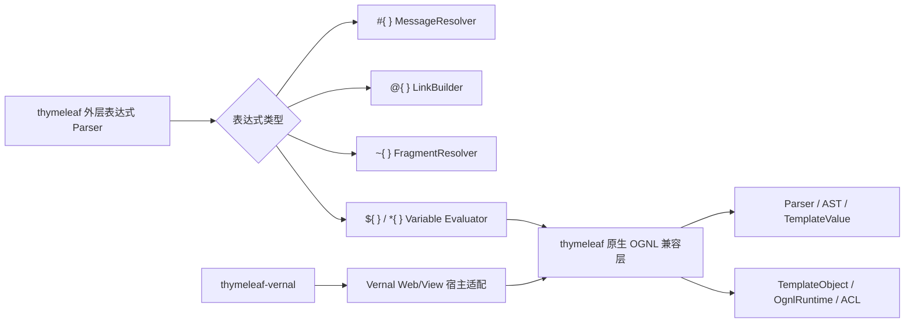

# Thymeleaf → thymeleaf-rust 功能语义迁移对照表

> **文档说明**：从可观察行为角度定义 Thymeleaf Core 到 `thymeleaf` 的迁移合同。本表回答“功能语义是否存在且是否有证据”，对象落点见[对象级对照表](对象级对照表.md)。
>
> **文档版本**：v1.0.0
> **最后更新**：2026-07-31
> **上游基线**：Thymeleaf `3.1.5.RELEASE`，提交 `10f9dd2eb8cbd98515ce14b149d115e0287d0add`
> **当前状态**：S1–S10 生产语义已按调用链批量落位；S11 对象级验证仍在进行，202 个主对象达到 BEHAVIOR_VERIFIED，277 个主对象为 IMPLEMENTED_UNVERIFIED。Foundation、根模板执行与节流合同、引擎配置冻结与诊断、Engine Context 工厂与管理器、基础 Context、Web Context、Context 工具与惰性变量、Engine Context 层级与 Web 属性、表达式 Context 与表达式对象生命周期、方言基础配置、Dialect 贡献聚合、缓存接口与标准缓存管理、完整模板资源域、完整 Resolver 域、完整 MessageResolver 域、完整 LinkBuilder 域、基础 Inline SPI、Pre/PostProcessor SPI、非元素 Processor/StructureHandler 批次及部分标准表达式垂直切片已完成 Java/Rust Golden 差分。URL 模板资源与 Resolver 已验证 file/HTTP/HTTPS，并以连接处理器 SPI 承接 JAR、FTP 和宿主自定义协议。491 个主对象及 69 个嵌套对象均已有生产落点，生产落点不等于对象级行为验证完成。

## 1. 迁移判定规则

### 1.1 状态图例

| 状态 | 含义 |
|:---|:---|
| `BEHAVIOR_VERIFIED` | Java/Rust 差分或等价合同测试通过 |
| `IMPLEMENTED_UNVERIFIED` | 存在真实实现，但尚未证明行为一致 |
| `SKELETON` | 只有形态或签名，不计入完成 |
| `NOT_STARTED` | 尚未迁移；当前实时语义表中应为 0 |
| `JAVA_ONLY_EXEMPT` | JVM 运行时形态使用批准的 Rust 等价机制 |
| `PLANNED_BLOCKED` | 存在明确外部阻断 |
| `RUST_EXTENSION` | Rust 特有能力，不计入 Java 迁移分子 |

### 1.2 语义一致的五个维度

每个功能域必须同时检查：

1. **输入**：模板、Context、Locale、Resolver attributes、selector、配置；
2. **输出**：字节、事件、Model、Response、错误；
3. **顺序**：Resolver、Processor、Dialect、Handler、迭代和作用域顺序；
4. **副作用**：缓存、Context level、变量、日志、资源读写；
5. **边界**：Null、空值、malformed 输入、递归、并发、取消和资源限制。

仅有同名 API 不能判定语义一致。

## 2. Engine 与配置

| 上游对象/入口 | 上游语义 | Rust 目标 | 验收证据 | 状态 |
|:---|:---|:---|:---|:---:|
| `TemplateEngine` | 首次 process 时初始化，之后配置冻结；冻结 getter 返回已排序配置快照 | `TemplateEngine` + immutable configuration | 38 条 Java Golden：初始化、排序、冻结、处理/Writer/selector/节流输出与错误；全量门禁 | `BEHAVIOR_VERIFIED` |
| `ITemplateEngine.process` | String、selector、TemplateSpec、Writer 与 throttled 多入口收敛 | 全部入口收敛到 `TemplateSpec`，trait 默认重载进入同一主链 | 10 / 10 接口方法；String/selector/TemplateSpec/Writer/throttled 逐记录一致 | `BEHAVIOR_VERIFIED` |
| `IThrottledTemplateProcessor` | 单线程增量处理、字符/字节背压、完成状态跨线程可见 | UTF-16 Writer、Charset 字节流、线程亲和处理器 + 可克隆 `ThrottledTemplateStatus` | 7 / 7 接口方法；0/有限/不限额、完成后零输出、模式切换错误、真实双线程完成观察 | `BEHAVIOR_VERIFIED` |
| `TemplateSpec` | template、selectors、mode、resolution attributes、output MIME/SSE | 同名对象 + 类型化属性值 | 289 条 Java Golden、Rust 合同测试、100% slice coverage | `BEHAVIOR_VERIFIED` |
| `EngineConfiguration` | 聚合 Resolver、Dialect、Message、Link、Cache、ContextFactory | 同名不可变配置 | 44 条 Java Golden + 并发义务：稳定排序、只读快照、接口/具体类型查询、定义身份、ModelFactory 单次发布与全部 Processor bucket | BEHAVIOR_VERIFIED |
| `IEngineConfiguration` | 暴露初始化后只读配置、定义、Processor 集合与服务对象 | 同名对象安全 trait；getter 返回冻结快照或共享身份 | 27 / 27 Java 声明逐项映射，随 EngineConfiguration Golden 验证全部 getter 与动态 trait 调用 | BEHAVIOR_VERIFIED |
| `DialectConfiguration` | prefix 与 Dialect 配对，区分未指定和显式 null | 同名对象 + `Arc<dyn IDialect>` | 23 条方言 Java Golden、实例同一性与前缀边界 | `BEHAVIOR_VERIFIED` |
| `DialectSetConfiguration` | 聚合 Processor、Pre/Post、ExpressionObject | 同名对象 | 59 条固定 Java Golden、上游 8 组 Processor computation、并发与定义注入合同 | `BEHAVIOR_VERIFIED` |
| `ConfigurationPrinterHelper` | 输出可诊断配置 | 同名内部对象 + tracing | 44 条批次 Golden 覆盖 DEBUG/TRACE 路由、完整 resolver/dialect/processor/pre/post/expression/execution attribute 输出及 `ConfigLogBuilder` | BEHAVIOR_VERIFIED |
| `Thymeleaf` | 从正式制品属性读取版本、构建时间和稳定性 | 编译期固化同一制品元数据 | 8 条正式制品 Java Golden | `BEHAVIOR_VERIFIED` |

### 2.1 `TemplateSpec` 已验证语义

| 可观察语义 | Rust 映射 | 验收证据 | 状态 |
|:---|:---|:---|:---:|
| `template` 必填，空字符串允许 | `Option<&str>` 构造边界 + `TemplateSpecError` | `null` 精确错误消息 | `BEHAVIOR_VERIFIED` |
| selector 的 `null`/空白拒绝、空集合归一、多值排序 | `TemplateSelectorSet` → Java UTF-16 顺序的不可变切片 | null、empty、blank、single、multi、Unicode Golden | `BEHAVIOR_VERIFIED` |
| resolution attributes 防御性复制并参与相等/哈希 | `TemplateResolutionAttributes` + 类型擦除值容器 | copy、null key/value、unmodifiable、Eq/Hash 测试 | `BEHAVIOR_VERIFIED` |
| mode 与 output content type 互斥 | `Result<TemplateSpec, TemplateSpecError>` | package 构造器合同测试 | `BEHAVIOR_VERIFIED` |
| MIME 大小写、参数和别名推导模板模式 | 归一化 MIME → `TemplateMode` | HTML/XML/JS/CSS/TEXT 全表差分 | `BEHAVIOR_VERIFIED` |
| `text/event-stream` 启用 SSE 但不强制模式 | `is_output_sse` | SSE/unknown/blank 差分 | `BEHAVIOR_VERIFIED` |
| `StringTokenizer` 的分号边界 | 忽略连续/前导分号；全分号返回类型化错误 | malformed Java 异常差分 | `BEHAVIOR_VERIFIED` |
| Java `equals` 的字段顺序与空内容类型 NPE | `equals_java` 类型化保留；`PartialEq` 安全使用 | identity/type/字段差异/NPE 差分 | `BEHAVIOR_VERIFIED` |
| `toString` 的字段顺序、换行替换和长名称截断 | `Display` 按 Java UTF-16 长度计算 | short/long/complete Golden | `BEHAVIOR_VERIFIED` |

Rust `Hash` 保留“相等对象必须产生相等哈希”的跨语言合同；JVM 的字符串、枚举和
对象数值哈希不是稳定跨运行时协议，因此不把 Java `int hashCode()` 的具体数值作为
Rust 公共兼容承诺。

### 2.2 `ContentTypeUtils` 已验证语义

| 可观察语义 | Rust 映射 | 验收证据 | 状态 |
|:---|:---|:---|:---:|
| 九组 MIME 主类型和别名识别 | `ContentTypeUtils::is_content_type_*` | 所有 HTML/XML/RSS/Atom/JS/JSON/CSS/TEXT/SSE 别名 | `BEHAVIOR_VERIFIED` |
| MIME 参数解析、重复键和插入顺序 | 私有 `ContentType` + `IndexMap` | 连续分号、无等号参数、重复键覆盖和 `Display` Golden | `BEHAVIOR_VERIFIED` |
| 模板名称扩展名归一化 | 最后扩展名执行 Java ASCII trim 与小写 | 大写、尾空白、多点、未知扩展名 | `BEHAVIOR_VERIFIED` |
| 请求路径扩展名规则 | 依次剥离 query、fragment、矩阵参数，不归一化扩展名 | null、大小写、路径段和三类后缀边界 | `BEHAVIOR_VERIFIED` |
| 模板模式与标准 MIME 推导 | 复用同一 `TemplateMode`，RSS/Atom→XML、JSON→JAVASCRIPT | 内容类型、模板名、请求路径三入口 | `BEHAVIOR_VERIFIED` |
| 字符集读取与规范名称 | `Charset` 值对象 + `encoding_rs`/Java 必备字符集映射 | UTF-8、Latin-1、UTF-16/32、Windows-1252、Shift_JIS、非法/不支持名称 | `BEHAVIOR_VERIFIED` |
| 字符集合并及原参数位置 | 覆盖已有 `charset` 不改位置，新参数追加 | null 字符集原样返回、参数顺序与大小写规范化 | `BEHAVIOR_VERIFIED` |
| Java 隐式异常边界 | `ContentTypeError` 类型化区分空令牌、null 请求路径和非法字符集 | 异常类别与 JDK 21 消息 Golden | `BEHAVIOR_VERIFIED` |

`TemplateSpec` 已删除自身重复的 MIME 匹配表，构造时直接调用
`ContentTypeUtils::compute_template_mode_for_content_type` 与
`is_content_type_sse`，恢复上游真实调用链。375 条固定 Java Golden 覆盖 21 个内容
类型输入、16 个模板名称、14 个请求路径、44 个字符集输入和 7 组字符集合并输入。

### 2.3 `SetUtils` / `Sets` 已验证语义

| 可观察语义 | Rust 映射 | 验收证据 | 状态 |
|:---|:---|:---|:---:|
| 已有 `Set` 原样返回 | `SetTarget::Set` → borrowed `JavaSet` | `LinkedHashSet`/`IndexSet` 指针身份和原迭代顺序 | `BEHAVIOR_VERIFIED` |
| 数组与 Iterable 转换 | owned `JavaSet` + `IndexSet` | 重复值保留首次位置、null 元素、空输入和顺序 Golden | `BEHAVIOR_VERIFIED` |
| primitive array 强转失败 | `SetUtilsError::ClassCast` | Java `int[]` 的 `ClassCastException` 类别差分 | `BEHAVIOR_VERIFIED` |
| 非 Iterable 类型拒绝 | `SetTarget::Unsupported` | Integer、Iterator 的 Java 类名和精确错误文本 | `BEHAVIOR_VERIFIED` |
| size/empty/contains | `SetView` 只读动态视图 | `IndexSet`、`HashSet`、`BTreeSet` 与 null target | `BEHAVIOR_VERIFIED` |
| 两个 `containsAll` 重载 | array / collection 独立 Rust API | 不同校验文本、校验顺序、空/重复/缺失元素 | `BEHAVIOR_VERIFIED` |
| 不可修改单例集合 | owned `JavaSet` 无可变入口 | 普通/null 元素及 Java `UnsupportedOperationException` Oracle | `BEHAVIOR_VERIFIED` |
| `#sets` 表达式对象委托 | `Sets` → `SetUtils` | 六个公开操作和两个重载均走真实委托链 | `BEHAVIOR_VERIFIED` |

47 条固定 Java Golden 直接编译固定基线的 `SetUtils.java` 与 `Sets.java`。
`SetView`、`SetTarget`、`JavaSet` 和类型化错误仅解决 Rust 静态类型、借用及只读
边界，不改变 Java 集合的可观察合同。

### 2.4 `ListUtils` / `Lists` 已验证语义

| 可观察语义 | Rust 映射 | 验收证据 | 状态 |
|:---|:---|:---|:---:|
| 已有 `List` 原样返回 | `ListTarget::List` → borrowed `JavaList` | LinkedList 指针身份、类型、顺序、重复/null 元素 | `BEHAVIOR_VERIFIED` |
| 对象数组与纯 Iterable 转换 | owned `JavaList` + ArrayList 类型 | 顺序、重复/null、空输入和输出类型 Golden | `BEHAVIOR_VERIFIED` |
| primitive array 与非 Iterable 拒绝 | `ClassCast` / `CannotConvert` | `int[]`、Integer、Iterator 的异常类别和精确文本 | `BEHAVIOR_VERIFIED` |
| size/empty/contains | `ListView` 只读动态视图 | LinkedList、Vec、null target 与 null element | `BEHAVIOR_VERIFIED` |
| 两个 `containsAll` 重载 | array / collection 独立 Rust API | 不同校验文本、校验顺序、空/重复/缺失元素 | `BEHAVIOR_VERIFIED` |
| 自然稳定排序 | `JavaComparable` + 稳定归并排序 | 原列表不变、独立结果、UTF-16 String、Double 的 -0/NaN/Infinity、null/异构异常 | `BEHAVIOR_VERIFIED` |
| nullable Comparator | `JavaComparator` + 两个静态类型入口 | null 回退自然顺序、降序、相等键稳定性、非 Comparable 类型和异常传播 | `BEHAVIOR_VERIFIED` |
| 结果类型反射构造 | `JavaListType` + `ListView::fill_sorted` | LinkedList/公开自定义类型保留；固定/私有构造回退 ArrayList；构造后 add 异常传播 | `BEHAVIOR_VERIFIED` |
| `#lists` 表达式对象委托 | `Lists` → `ListUtils` | 八个公开操作与两个排序入口均走真实委托链 | `BEHAVIOR_VERIFIED` |

66 条固定 Java Golden 直接编译固定基线的 `Validate.java`、`ListUtils.java` 与
`Lists.java`。Rust 适配对象显式承接 JVM 动态类型、借用身份、自然比较和 Comparator，
不把排序简化为 Rust `Ord`，也不吞掉 Java 列表实现抛出的运行时异常。

### 2.5 `Maps` / `Objects` 已验证语义

| 可观察语义 | Rust 映射 | 验收证据 | 状态 |
|:---|:---|:---|:---:|
| `#maps` 全操作委托 | `Maps` → `MapUtils` | 九个公开方法/构造器、两个键重载、两个值重载和 null 校验均走真实委托链 | `BEHAVIOR_VERIFIED` |
| 标量 null-safe 身份 | `Objects` → `ObjectUtils` | target 优先、default 回退、双 null 和 `Rc` 指针身份 | `BEHAVIOR_VERIFIED` |
| 数组克隆与组件类型 | `JavaObjectArray` | 原数组不变、结果独立且可变、运行时组件类保留 | `BEHAVIOR_VERIFIED` |
| 数组默认值延迟检查 | `JavaObjectArray::set` + `ObjectsError::ArrayStore` | 不兼容默认值只在遇到 null 槽位时抛出；无 null 时不读取默认值 | `BEHAVIOR_VERIFIED` |
| 列表 null-safe | `Vec<Option<T>>` | 固定 ArrayList 等价类型、顺序/重复/长度、独立性和可变性 | `BEHAVIOR_VERIFIED` |
| 集合 null-safe | `IndexSet<Option<T>>` | 固定 LinkedHashSet 等价类型、首次插入顺序、替换碰撞去重、独立性和可变性 | `BEHAVIOR_VERIFIED` |
| 三个集合入口 null 校验 | `ObjectsError::Validation` | 精确 `Target cannot be null` 消息 | `BEHAVIOR_VERIFIED` |

35 条固定 Java Golden 直接编译固定基线的 `MapUtils.java`、`ObjectUtils.java`、
`Maps.java` 与 `Objects.java`。Rust 没有把 Java 引用数组简化为裸 `Vec`：
`JavaObjectArray` 显式保存运行时组件类和赋值谓词，因而可观察到
`String[]` 写入 `Integer` 时的 `ArrayStoreException` 类别。

### 2.6 `Thymeleaf` 已验证语义

| 可观察语义 | Rust 映射 | 验收证据 | 状态 |
|:---|:---|:---|:---:|
| 正式制品完整版本 | `Thymeleaf::get_version()` | `3.1.5.RELEASE` Java Golden | `BEHAVIOR_VERIFIED` |
| Maven 构建时间 | `get_build_timestamp()` | `2026-04-21T20:38:36+0000` Java Golden | `BEHAVIOR_VERIFIED` |
| major/minor/patch | 三个 `i32` getter | `3 / 1 / 5` 逐项差分 | `BEHAVIOR_VERIFIED` |
| qualifier 与稳定版本 | `Option<&str>` + `bool` | `RELEASE / true` 差分 | `BEHAVIOR_VERIFIED` |
| 工具类不可实例化 | 私有字段的零状态类型 | Rust 编译期可见性 | `BEHAVIOR_VERIFIED` |

### 2.7 `ArrayUtils` / `Arrays` 已验证语义

| 可观察语义 | Rust 映射 | 验收证据 | 状态 |
|:---|:---|:---|:---:|
| 引用数组转换身份 | `ArrayTarget::Reference` → `JavaArray::Borrowed` | `String[]` 的对象身份和运行时类名 Java/Rust 差分 | `BEHAVIOR_VERIFIED` |
| Iterable 组件类推断 | `JavaArrayElement` + owned `JavaObjectArray` | 同类、异构、全 null、空 Iterable 的 `String[]`/`Object[]` 结果类差分 | `BEHAVIOR_VERIFIED` |
| typed 数组转换 | 六个 `to_*_array` 独立入口 | String/Integer/Long/Double/Float/Boolean 组件类、null 槽位和写入错误 | `BEHAVIOR_VERIFIED` |
| primitive/reference array 分派 | `ArrayTarget::{PrimitiveArray,Reference}` | 无类型转换的 ClassCast 与 typed 转换的 IllegalArgument 区别 | `BEHAVIOR_VERIFIED` |
| 上游错误文本缺陷 | `CannotConvert` 保存 `of Class` | `componentClass.getClass().getSimpleName()` 的实际 Java 输出 Golden | `BEHAVIOR_VERIFIED` |
| 查询与两个 containsAll 重载 | `contains` / `contains_all_array` / `contains_all_collection` | null、重复、缺失元素以及两个不同 target 校验文本 | `BEHAVIOR_VERIFIED` |
| 引用数组复制 | `copy_of` / `copy_of_with_type` | 类型、独立性、扩展零槽、截断、null/负长度顺序与 ArrayStore 类别 | `BEHAVIOR_VERIFIED` |
| Java char 与范围复制 | `u16` + `copy_of_chars` / `copy_of_range` | UTF-16 code unit、尾部零扩展、反向/负/越界索引及 int 环绕 | `BEHAVIOR_VERIFIED` |
| `#arrays` 表达式对象委托 | `Arrays` → `ArrayUtils` | 12 个 facade 方法全部进入固定 Golden | `BEHAVIOR_VERIFIED` |

72 条固定 Java Golden 直接编译固定上游源码；Rust 适配复用 `JavaObjectArray`
保存运行时组件类和写入谓词，并用 `JavaArray` 显式区分原实例借用与新数组所有权。

源码树中的属性值是 Maven 过滤占位符，不是发布运行时值；Oracle 明确使用 Maven
Central 对应正式制品的属性。Rust 省去 ClassLoader，固定制品场景返回值完全一致。

## 3. 模板解析主链

设计阶段 CodeGraph 曾确认下列主链；当前仓库无 `.codegraph/`，本轮只能由固定源码
和调用方检查复核静态路径，动态分派关系待索引恢复后重新验证：

```text
ITemplateEngine.process
→ TemplateEngine.process
→ TemplateManager.parseAndProcess
→ cache lookup
→ resolveTemplate
→ build TemplateData
→ choose parser
→ ModelBuilder/Processor handler chain
→ Output
```

| 上游语义 | Rust 目标 | 关键不变量 | 状态 |
|:---|:---|:---|:---:|
| cache hit 直接重放 `TemplateModel` | `TemplateModel::process` | 与未缓存路径字节一致 | IMPLEMENTED_UNVERIFIED |
| cache miss 按 Resolver order 解析 | resolver chain | 首个非空 resolution 胜出 | IMPLEMENTED_UNVERIFIED |
| cacheable 模板先构建 Model 再处理 | parse → model → cache → process | 只构建一次，Context 不泄漏 | IMPLEMENTED_UNVERIFIED |
| non-cacheable 模板 Parser 直通处理链 | event stream → handler chain | 与 Model 路径事件一致 | IMPLEMENTED_UNVERIFIED |
| process 结束 flush Writer | sink flush | flush 错误映射 `TemplateOutputException` | IMPLEMENTED_UNVERIFIED |
| Context level 在结束时回收 | scope guard | 成功/错误/取消均回收 | IMPLEMENTED_UNVERIFIED |

## 4. Template Resolver、Resource 与 Cache

| 功能 | 上游对象 | Rust 语义 | 验收场景 | 状态 |
|:---|:---|:---|:---|:---:|
| Resolver SPI | `ITemplateResolver` | name/order；可空入口按 configuration→template 顺序报错；解析失败保留 cause，只有明确“不适用”才继续链 | 动态 SPI、null 校验和短路调用计数 Golden | `BEHAVIOR_VERIFIED` |
| 抽象 Resolver | `AbstractTemplateResolver` | pattern 拒绝、null resource、存在性检查均不提前计算 mode/validity；成功结果保留 verified/decoupled | 113 条 Resolver Golden 中的短路与调用次数 | `BEHAVIOR_VERIFIED` |
| 可配置 Resolver | `AbstractConfigurableTemplateResolver` | alias `putAll` 合并、原始 UTF-16 拼接、prefix/suffix、mode pattern/扩展名优先级、cache pattern/TTL | 默认值、别名覆盖、孤立代理项、模式与有效性 Golden | `BEHAVIOR_VERIFIED` |
| 默认 Resolver | `DefaultTemplateResolver` | 固定正文、动态 SPI、HTML 默认模式、null 正文与 mode setter 精确异常 | 空/固定正文、模式和 null Golden | `BEHAVIOR_VERIFIED` |
| 字符串 Resolver | `StringTemplateResolver` | template 本身为内容；默认不缓存；禁止解耦逻辑；支持负 TTL | Unicode、空模板、缓存和精确异常 Golden | `BEHAVIOR_VERIFIED` |
| 文件 Resolver | `FileTemplateResolver` | 文件路径到 Resource；构造错误传播，存在性结果保留 | 真实临时文件、reader/base name/空路径 Golden | `BEHAVIOR_VERIFIED` |
| ClassLoader Resolver | `ClassLoaderTemplateResolver` | Java 名称/文件 1:1；ClassLoader 由 Rust 有序资源根表达 | 真实资源根、reader/base name/空路径 Golden | `BEHAVIOR_VERIFIED` |
| URL Resolver | `UrlTemplateResolver` | 仅 malformed URL 表示不适用；空路径报错；Java regex 行终止符语义决定 `;jsessionid` 是否禁用缓存；实例级协议处理器传递给资源 | malformed/空 URL、大小写和换行 Golden + 自定义协议义务测试 | `BEHAVIOR_VERIFIED` |
| Web Resolver | `WebApplicationTemplateResolver` | WebApplication 必填、路径/描述透传、默认不预检存在；资源错误传播 | null app、真实 Fake Host 路径与空路径 Golden | `BEHAVIOR_VERIFIED` |
| Resource SPI | `ITemplateResource` | description/base/UTF-8 reader/exists/relative；不强制线程安全 | 动态实现、I/O、错误类别与重复读取 | `BEHAVIOR_VERIFIED` |
| 字符串资源 | `StringTemplateResource` | null 拒绝、空字符串合法、永远存在、无 base name、独立 reader、不支持 relative | 22 条 Java Golden，Unicode/CRLF/NUL 与三种 relative 参数 | `BEHAVIOR_VERIFIED` |
| 文件资源 | `FileTemplateResource` | 逻辑清理路径与原文件路径分离、延迟打开、流式 charset 解码、相对路径继承字符集 | 48 条新增 Java Golden，真实临时文件、BOM、非法字节、缺失文件与编码错误优先级 | `BEHAVIOR_VERIFIED` |
| 资源路径工具 | `TemplateResourceUtils` | 纯词法 `cleanPath`、relative location 和 base name，不 canonicalize | 上游全部路径向量、Windows 分隔符、隐藏文件和异常边界 | `BEHAVIOR_VERIFIED` |
| ClassLoader 资源 | `ClassLoaderTemplateResource` | 1:1 文件/类型恢复；Java ClassLoader 映射为有序资源根，保留路径清理、去首 `/`、reader、exists、relative、base name 与 charset | 固定 Java Golden + Rust 临时资源根覆盖构造校验、真实 I/O、fresh reader、缺失优先级和相对路径 | `BEHAVIOR_VERIFIED` |
| URL 资源 | `UrlTemplateResource` | 保留 URL 描述；file/HTTP/HTTPS reader、HEAD exists、relative 与 charset；JAR/FTP/自定义协议通过实例级 `UrlResourceConnectionHandler` 映射 Java `URLStreamHandler`，相对资源继承同一处理器 | 74 条固定 Java Golden；Rust 义务测试验证处理器调用次数、relative 继承、成功内容和 I/O 错误传播 | `BEHAVIOR_VERIFIED` |
| Web 应用资源 | `WebApplicationTemplateResource` | 保留应用对象优先 null 校验、`/` 根路径、IWebApplication 动态分派、reader/exists/relative 与 charset | 固定 Java Golden + Rust Fake Host 覆盖精确路径调用、Latin-1、fresh reader、缺失 FileNotFound 和校验顺序 | `BEHAVIOR_VERIFIED` |
| Resolution | `TemplateResolution` | `Rc` 保留非线程安全资源身份；verified、mode、decoupled 与 `Arc` validity 逐项保留 | 66 条 Java Golden：校验顺序、六种模式、标志组合、动态身份与“未验证不等于不存在” | `BEHAVIOR_VERIFIED` |
| Cache SPI | `ICache<K,V>` + `ICacheEntryValidityChecker<K,V>` | `Arc<V>` 共享身份、Option miss、显式 checker 覆盖、失效删除、清理和 key 快照 | 14 条 Java Golden、动态 trait 调用与所有接口操作 | `BEHAVIOR_VERIFIED` |
| 标准缓存 | `StandardCache` | put-if-absent、插入顺序 FIFO、默认/显式 checker、惰性删除、可选计数器与比例；Rust 当前仅声明软引用模式，没有 JVM `SoftReference` 内存压力自动回收 | 37 条固定 Java Golden、12 个单元测试覆盖显式合同；自动回收语义仍缺可执行 Rust 等价机制与压力差分 | `IMPLEMENTED_UNVERIFIED` |
| 标准缓存管理 | `AbstractCacheManager` + `ICacheManager` + `StandardCacheManager` | 默认配置、setter、惰性单例、并发只初始化一次、禁用缓存永久记忆 `null`、初始化后配置不替换缓存、一次清理 | 固定 Java Golden 37 条记录；Rust Golden 全量一致；2 个并发/禁用缓存义务测试；修正重复清理偏差 | `BEHAVIOR_VERIFIED` |
| 解析模板有效性委托 | `StandardParsedTemplateEntryValidator` | 忽略 key/创建时间；只调用 `isCacheStillValid()`；不调用 `isCacheable()`；传播 validity 异常；null validity 保留增强 NPE | 固定 Java Golden 13 条记录；Rust 逐行一致；修正普通 `expect` panic 与 Java NPE 类别/消息不一致 | `BEHAVIOR_VERIFIED` |
| Template Cache | `ICache<TemplateCacheKey, TemplateModel>` | 可选、容量、有效性、统计 | hit/miss/evict/clear | IMPLEMENTED_UNVERIFIED |
| Template Cache Key | `TemplateCacheKey` | owner、模板、selectors、offsets、mode、resolution attributes 全字段复合键 | 58 条缓存键 Java Golden、null/空集合/身份/UTF-16 顺序/相等-hash 合同 | `BEHAVIOR_VERIFIED` |
| Expression Cache Key | `ExpressionCacheKey` | 表达式类型、第一表达式和可选第二表达式；Java UTF-16 `int` hash | 58 条缓存键 Java Golden、null/空串/补充字符/哈希碰撞 | `BEHAVIOR_VERIFIED` |
| Validity | `ICacheEntryValidity` + Always/TTL/Non-cacheable | 永久、禁用、Java `long` 环绕 TTL 与墙上时钟 | 31 条 Java Golden、边界时钟与溢出测试 | `BEHAVIOR_VERIFIED` |

Selector 只由 Parser 使用，不能传给 Resolver 改变资源内容，否则会破坏 Parser 的选择语义。
`ExpressionCacheKey` 的数值 hash 与 Java 完全相同；`TemplateCacheKey` 所含枚举和普通对象
在 JVM 中使用进程身份 hash，因此 Rust 只承诺相等对象 hash 相同、全部字段参与及构造时
缓存，不把 JVM 进程相关数值误当作跨运行时协议。

## 5. TemplateMode 与 Parser

`TemplateMode` 对象与 Parser 实现分开验收，避免用 enum 已存在掩盖六种解析器尚未迁移的事实：

| `TemplateMode` 语义 | Rust 目标 | 差分证据 | 状态 |
|:---|:---|:---|:---:|
| 六个枚举值与显示名称 | 同名 enum variants 与 `Display` | 86 条 Foundation Java Golden | `BEHAVIOR_VERIFIED` |
| markup/text/case-sensitive flags | `is_markup` / `is_text` / `is_case_sensitive` | 六种模式逐项对照 | `BEHAVIOR_VERIFIED` |
| null、空字符串、纯空白 | `TemplateModeParseError` | Java `IllegalArgumentException` 消息对照 | `BEHAVIOR_VERIFIED` |
| 已知名称大小写不敏感 | `parse` | 六种名称大小写组合 | `BEHAVIOR_VERIFIED` |
| 未知或未 trim 名称 | warning + HTML fallback | `MARKDOWN` 与 `" XML "` 对照 | `BEHAVIOR_VERIFIED` |

| 模式 | 上游 Parser | 必须迁移的语义 | 状态 |
|:---|:---|:---|:---:|
| HTML | `HTMLTemplateParser` | 宽容 HTML、大小写不敏感、selector、源码位置 | IMPLEMENTED_UNVERIFIED |
| XML | `XMLTemplateParser` | 严格 XML、大小写敏感、CDATA、XML 声明、namespace | IMPLEMENTED_UNVERIFIED |
| TEXT | `TextTemplateParser` | 文本原型语法、自然文本输出 | IMPLEMENTED_UNVERIFIED |
| JAVASCRIPT | `JavaScriptTemplateParser` | 文本模式 + JS inlining/serialization | IMPLEMENTED_UNVERIFIED |
| CSS | `CSSTemplateParser` | 文本模式 + CSS inlining/serialization | IMPLEMENTED_UNVERIFIED |
| RAW | `RawTemplateParser` | 原样输出，不执行普通 Processor | IMPLEMENTED_UNVERIFIED |

### 5.1 `TextParser` 流式扫描核心

`TextTemplateParser`、`JavaScriptTemplateParser` 和 `CSSTemplateParser` 的上层入口仍未
迁移，但三者共用的 package-private `TextParser` 已完成行为验证。这里的完成状态只覆盖
流式文本扫描核心，不能外推为三种模板模式已经可由 Engine 调用。

| 可观察语义 | Rust 映射 | 验收证据 | 状态 |
|:---|:---|:---|:---:|
| Java UTF-16 `char[]` 与任意 Reader 切分 | `TextParserReader` + `Vec<u16>` 流式缓冲 | 1–96 缓冲大小、UTF-16 代理项、零长度读取和 EOF Golden | `BEHAVIOR_VERIFIED` |
| open/standalone/close、块/行注释、引号/反引号/正则字面量 | 同序 `TextParsing*Util` 判定与事件 handler 链 | 16 类文档、配置矩阵、原始终止事件与伪 `/` 候选 | `BEHAVIOR_VERIFIED` |
| 跨缓冲未完成结构搬移与倍增 | `TextParseStatus` + `BufferPool` | 960 种切分组合、Java `int` 回绕和分配失败局部捕获 | `BEHAVIOR_VERIFIED` |
| Reader 与 handler 失败分类 | `Result` 保留 checked；已知 JVM runtime panic 归一为 cause；未知 panic 等价 Java Error | 首次/中途 read、close、各终止 handler、未知 panic finally 清理 | `BEHAVIOR_VERIFIED` |
| 默认大小数组身份与槽位复用 | 内部 `BufferPool` + 原槽索引 | 池为空/耗尽/复用/不同大小/中毒恢复合同 | `BEHAVIOR_VERIFIED` |

固定 Java Golden 244 条记录全部匹配；该已验证切片的行、函数、区域覆盖率均为
100%，不得外推为当前全工作区覆盖率。`AbstractTextTemplateParser` 及三种模式入口已
有生产实现，仍按 `IMPLEMENTED_UNVERIFIED` 管理，等待 S11 统一验证。

### 5.2 文本注释 Reader 状态机

`AbstractTextTemplateParser` 在 TEXT 模式外包一层
`ParserLevelCommentTextReader`，在 JAVASCRIPT/CSS 模式则先包
`PrototypeOnlyCommentTextReader` 再包解析器级 Reader。本切片已迁移这条真实依赖链，
上层 Parser 已有生产实现，但不在本切片既有 Golden 证据范围内。

| 可观察语义 | Rust 映射 | 验收证据 | 状态 |
|:---|:---|:---|:---:|
| `/*[-`…`-]*/` 容器与内容全部丢弃 | `ParserLevelCommentTextReader` + `BlockAction::DiscardAll` | 上游两个 JUnit 方法、定界符位置生成器、120 条 Java Golden | `BEHAVIOR_VERIFIED` |
| `/*[+`…`+]*/` 仅丢弃容器并保留内容 | `PrototypeOnlyCommentTextReader` + `BlockAction::DiscardContainer` | 上游两个 JUnit 方法、定界符位置生成器、120 条 Java Golden | `BEHAVIOR_VERIFIED` |
| 任意 `char[]` offset/len 与跨缓冲定界符 | UTF-16 `TextParserReader` 动态链和 overflow buffer | 原 JUnit 三重缓冲循环、逐次 read 返回序列、代理项 | `BEHAVIOR_VERIFIED` |
| 未闭合块、底层读取和 close 失败 | `TextParserReaderError` 保留 Java 类名与消息 | EOF、补全定界符失败、普通读取失败和关闭失败差分 | `BEHAVIOR_VERIFIED` |

四个上游测试文件的 `test01` 生成规则和 `test02` 手写回归集合均已登记为
`SOURCE_PARITY`。Markup Reader 固定 `<!--/*`…`*/-->` 全丢弃和
`<!--/*/`…`/*/-->` 仅丢容器语义，并由 `AbstractMarkupTemplateParser` 以
prototype-only → parser-level 顺序嵌套。全工作区覆盖率为 21,223 行、1,947
函数、29,016 区域，三项 100%；reader 包 5 / 5 个对象已闭环。

### 5.3 Parser 公共语义

| 语义 | 上游对象 | Rust 验收 | 状态 |
|:---|:---|:---|:---:|
| standalone parse | `ITemplateParser.parseStandalone` | Resource → events | IMPLEMENTED_UNVERIFIED |
| string parse | `ITemplateParser.parseString` | owner + offsets + String → events | IMPLEMENTED_UNVERIFIED |
| 读取缓冲池 | reader/parser pool | 并发解析无数据串扰 | IMPLEMENTED_UNVERIFIED |
| selector | markup selector | 整页、id、fragment 选择 | IMPLEMENTED_UNVERIFIED |
| decoupled logic | `DecoupledTemplateLogic*` | 外部逻辑合并且位置可诊断 | IMPLEMENTED_UNVERIFIED |
| line/column | parser adapters | Unicode 和 CRLF 位置准确 | IMPLEMENTED_UNVERIFIED |
| malformed input | parser errors | 错误分类、模板名、位置 | IMPLEMENTED_UNVERIFIED |

## 6. Event、Model 与 Handler

### 6.1 事件模型

| 事件 | 上游接口/实现 | Rust 目标 | 状态 |
|:---|:---|:---|:---:|
| Template boundaries | `ITemplateStart` / `ITemplateEnd` | 同名事件 | IMPLEMENTED_UNVERIFIED |
| Text | `IText` / `Text` | 零拷贝优先文本事件 | IMPLEMENTED_UNVERIFIED |
| Element | open/close/standalone tags | 属性、synthetic、位置、关联事件 | IMPLEMENTED_UNVERIFIED |
| Comment | `IComment` / `Comment` | 内容和写出 | IMPLEMENTED_UNVERIFIED |
| CDATA | `ICDATASection` / `CDATASection` | 内容和写出 | IMPLEMENTED_UNVERIFIED |
| DocType | `IDocType` / `DocType` | 关键字/public/system/internal subset | IMPLEMENTED_UNVERIFIED |
| Processing instruction | `IProcessingInstruction` | target/content | IMPLEMENTED_UNVERIFIED |
| XML declaration | `IXMLDeclaration` | version/encoding/standalone | IMPLEMENTED_UNVERIFIED |

### 6.2 Model 语义

| 上游语义 | Rust 不变量 | 状态 |
|:---|:---|:---:|
| `TemplateModel` 不可变、可缓存、可重放 | Arc-backed immutable events | IMPLEMENTED_UNVERIFIED |
| `Model` 可编辑 | insert/replace/remove/reset | IMPLEMENTED_UNVERIFIED |
| 外部 Model 禁止插入 TemplateStart/End | 构造/插入时拒绝 | IMPLEMENTED_UNVERIFIED |
| 不同 EngineConfiguration 的 Model 不可混合 | configuration identity 检查 | IMPLEMENTED_UNVERIFIED |
| 不同 TemplateMode 的 Model 不可混合 | mode 检查 | IMPLEMENTED_UNVERIFIED |
| 插入 TemplateModel 时去除外层 boundaries | 精确事件范围 | IMPLEMENTED_UNVERIFIED |

### 6.3 Handler 链

| Handler | 语义 | 状态 |
|:---|:---|:---:|
| `ModelBuilderTemplateHandler` | 将 Parser 事件规范化为 Engine event 并构建 Model | IMPLEMENTED_UNVERIFIED |
| `ProcessorTemplateHandler` | 匹配并执行 Processor，应用 StructureHandler | IMPLEMENTED_UNVERIFIED |
| PreProcessor chain | `IPreProcessor` / `PreProcessor` 以不可分离的 `TemplateHandlerClass` 保存 Handler 名称与可失败构造器；每次执行创建新 Handler，在中央 Processor 前变换事件 | `BEHAVIOR_VERIFIED` |
| PostProcessor chain | `IPostProcessor` / `PostProcessor` 使用同一类型令牌模型；每次执行创建新 Handler，在中央 Processor 后、Output 前变换事件 | `BEHAVIOR_VERIFIED` |
| `OutputTemplateHandler` | 按事件写出并保留位置错误 | IMPLEMENTED_UNVERIFIED |
| Throttled handler | 可暂停、继续、限制步骤/字符 | IMPLEMENTED_UNVERIFIED |

## 7. Context 与作用域

| 语义 | 上游对象 | Rust 目标 | 状态 |
|:---|:---|:---|:---:|
| 基础变量与 Locale | `IContext` / `Context` | owned/borrowed value map + locale | IMPLEMENTED_UNVERIFIED |
| 表达式 Context | `IExpressionContext` | configuration + variables + locale | IMPLEMENTED_UNVERIFIED |
| 模板 Context | `ITemplateContext` | template stack、inliner、selection、model factory | IMPLEMENTED_UNVERIFIED |
| Engine Context | `IEngineContext` | level、local variables、element stack | IMPLEMENTED_UNVERIFIED |
| Engine Context 创建、复用与 level 增减 | `IEngineContextFactory`、`StandardEngineContextFactory`、`EngineContextManager` | 显式 prepare/dispose 边界；已有 Context 保持 `Arc` 身份，新 Context 委托线程安全工厂 | 46 条 Java Golden + 12 线程义务：普通/Web 分流、变量复制、工厂次数、层级和 TemplateData 栈恢复 | BEHAVIOR_VERIFIED |
| lazy variable | `ILazyContextVariable` | once-cell/lazy closure | IMPLEMENTED_UNVERIFIED |
| selection target | `th:object` | level-scoped selection root | IMPLEMENTED_UNVERIFIED |
| Web Context | `IWebContext` / `WebContext` / `WebExpressionContext` | 中立 `IWebExchange` 身份、父构造校验顺序及完整表达式 capability | BEHAVIOR_VERIFIED |
| request parameters | `WebEngineContext` maps | 多值、只读、延迟访问 | IMPLEMENTED_UNVERIFIED |
| session/application attributes | Web maps | 宿主生命周期映射 | IMPLEMENTED_UNVERIFIED |

## 8. Dialect 与 Processor SPI

| 功能 | 上游对象 | Rust 目标 | 状态 |
|:---|:---|:---|:---:|
| Dialect 基础 | `IDialect` / `AbstractDialect` | 可空 trait 名称 + 非空基础实现 | `BEHAVIOR_VERIFIED` |
| Processor Dialect 接口 | `IProcessorDialect` | `IDialect` 子 trait + 可空默认/调用前缀 + `i32` 方言级 precedence + 可空 `ProcessorSet`/元素 + 动态分派 | `BEHAVIOR_VERIFIED` |
| Processor Dialect 基础实现 | `AbstractProcessorDialect` | 组合 `AbstractDialect` 的非空名称状态，保留可空默认 prefix、完整 `i32` 方言级 precedence、不可变 getter；具体方言单独实现 processors 扩展点 | `BEHAVIOR_VERIFIED` |
| Expression objects | `IExpressionObjectDialect` | nullable 共享 factory；0/1/N 聚合分支与后注册覆盖顺序 | `BEHAVIOR_VERIFIED` |
| Execution attributes | `IExecutionAttributeDialect` | nullable Map、null key/value 与跨方言重复键拒绝 | `BEHAVIOR_VERIFIED` |
| Pre/Post Dialect 贡献 | `IPreProcessorDialect` / `IPostProcessorDialect` | nullable Set/entry/mode/handler；配置阶段校验 Handler 接口与公开无参构造器；按 Processor 自身排序 | `BEHAVIOR_VERIFIED` |
| Dialect 聚合快照 | `DialectSetConfiguration` / `AggregateExpressionObjectFactory` | 五阶段聚合、Processor bucket、定义注入一次性、不可变并发发布 | `BEHAVIOR_VERIFIED` |
| Processor 基础接口 | `IProcessor` | 可空 TemplateMode + `i32` precedence + trait object 动态分派 | `BEHAVIOR_VERIFIED` |
| Processor 基础实现 | `AbstractProcessor` | 组合式基础状态 + `Validate.notNull` 等价校验 + 不可变 TemplateMode/precedence + `IProcessor` 动态分派 | `BEHAVIOR_VERIFIED` |
| PreProcessor 配置 SPI | `IPreProcessor` / `PreProcessor` | 六种 TemplateMode、完整 `i32` precedence、Handler 类型令牌、动态分派、构造校验顺序与精确错误；排序按配置实现类名而非 Handler 类名 | `BEHAVIOR_VERIFIED` |
| PostProcessor 配置 SPI | `IPostProcessor` / `PostProcessor` | 与 PreProcessor 对称；构造失败保留原因链，并由 TemplateManager 映射固定 Java 外层消息 | `BEHAVIOR_VERIFIED` |
| Element Processor | tag/attribute matching | exact matching + prefix | IMPLEMENTED_UNVERIFIED |
| 非元素事件 Processor | Text、Comment、CDATA、DocType、PI、XML 声明、模板边界共七组 Processor 接口/抽象实现 | 事件不可变；闭包映射 `doProcess`；处理异常保留身份并补位置，其他异常按运行时类名、事件位置和 cause 包装 | 固定 Java/Rust Golden + 现有真实 Processor/Engine `.thtest`；14 / 14 对象 `BEHAVIOR_VERIFIED` |
| 非元素 StructureHandler | 七类引擎状态机与七个公开 handler SPI | 最后互斥动作获胜；先 reset 后校验；精确 null 消息；模板边界变量/selection/inliner 可组合且 nullable 名称可保留 | 固定 Java/Rust Golden 覆盖动作、状态、副作用顺序与身份；14 / 14 对象 `BEHAVIOR_VERIFIED` |
| Element StructureHandler | element remove/replace/insert/body/iterate/variables/attributes | 结构动作互斥而变量/属性跨动作保留；属性严格按 remove→replace→set 三阶段；真实 `EngineContext` 固定按 variables→removals→selection→inliner→TemplateData 应用 | Java/Rust Golden 及真实 `OpenElementTag`、`Model`、`EngineContext` 链路 | BEHAVIOR_VERIFIED |

### 8.1 顺序合同

Processor 结果必须由以下关键字段确定：

1. Dialect precedence；
2. Processor precedence；
3. Processor 类型和 matcher；
4. 注册稳定顺序。

同一输入和配置的执行顺序必须确定性一致。

### 8.2 专用 Dialect 批次证据

| 语义切片 | Java 配置 | Rust 执行路径 | 证据 | 结论 |
|:---|:---|:---|:---|:---:|
| 元素栈与自定义 Processor | `StandardDialect + ElementStackDialect` | 生产 `TemplateEngine`、`AbstractProcessorDialect`、属性/文本/模型 Processor、fragment handler chain | 上游 `elementstack01..13.thtest`，13 / 13 | 局部证据通过 |
| 无 Standard Dialect 的内联边界 | 仅 `Dialect01` | Engine 中不注册 `StandardDialect`；测试 Context 字段仍由独立固定 OGNL fixture 求值 | 上游 `inlining/nostandard01..48.thtest`，48 / 48 | 局部证据通过 |
| HTML 片段平衡 | Java `HTMLTemplateParser` 固定 `ElementBalancing.AUTO_CLOSE` | Rust 删除错误 auto-open，不再合成 `<html>/<body>/<tbody>`，继续保留 auto-close | 首轮元素栈 0 / 13 暴露统一差异；修复后 13 / 13 | 局部证据通过 |

这里的“局部证据通过”只表示上述 61 个端到端用例覆盖的组合语义已经结算，不把
`Element Processor`、`StructureHandler` 或整个 HTML parser 的对象状态整体升级为
`BEHAVIOR_VERIFIED`。

## 9. Standard Expression

### 9.1 外层表达式

| 语法 | 上游对象 | 语义 | Rust 求值边界 | 状态 |
|:---|:---|:---|:---|:---:|
| `${...}` | `VariableExpression` | 变量表达式 | 中立 evaluator；默认原生实现 | IMPLEMENTED_UNVERIFIED |
| `*{...}` | `SelectionVariableExpression` | selection root 表达式 | evaluator + selection target | IMPLEMENTED_UNVERIFIED |
| `#{...}` | `MessageExpression` | 本地化消息和参数 | `IMessageResolver` | BEHAVIOR_VERIFIED |
| `@{...}` | `LinkExpression` | URL、路径/查询参数 | `ILinkBuilder` | IMPLEMENTED_UNVERIFIED |
| `~{...}` | `FragmentExpression` | 模板/selector/参数 | TemplateManager + Fragment | IMPLEMENTED_UNVERIFIED |
| `__...__` | `StandardExpressionPreprocessor` | 解析前预处理 | 显式递归/安全限制 | IMPLEMENTED_UNVERIFIED |

### 9.2 表达式结构

| 语义 | 上游对象 | 状态 |
|:---|:---|:---:|
| token 和 parsing state | `ExpressionParsingState`、`ExpressionParsingNode` | IMPLEMENTED_UNVERIFIED |
| literal | Text/Number/Boolean/Null/NoOp literals | IMPLEMENTED_UNVERIFIED |
| binary operation | `BinaryOperationExpression` | IMPLEMENTED_UNVERIFIED |
| conditional | `ConditionalExpression` | IMPLEMENTED_UNVERIFIED |
| default/Elvis | `DefaultExpression` | IMPLEMENTED_UNVERIFIED |
| assignment list | `Assignation` / `AssignationSequence` | IMPLEMENTED_UNVERIFIED |
| expression list | `ExpressionSequence` | IMPLEMENTED_UNVERIFIED |
| iteration | `Each` | IMPLEMENTED_UNVERIFIED |
| fragment signature | `FragmentSignature` | IMPLEMENTED_UNVERIFIED |
| conversion context | `StandardExpressionExecutionContext` | 三个公开规范单例、六组限制/转换标志及 `with/withoutTypeConversion` 的原实例与规范单例身份复用 | `BEHAVIOR_VERIFIED` |
| parse cache | `ExpressionCache` | IMPLEMENTED_UNVERIFIED |

### 9.3 Vernal Expression 的关系

参考 `vernal-expression` 的迁移方法，但不把它变成核心依赖：



`vernal-expression` 是 SpEL 语义而非 OGNL 实现，因此不能替换 `${}`/`*{}` 的语言层。
`thymeleaf-vernal` 只负责 Vernal Web/View 宿主适配，并继续调用 `thymeleaf` 原生
OGNL 兼容层。该兼容层采用“表达式 → Parser/AST → `TemplateValue` → 属性/索引/
运算/函数与受控方法注册 → 求值器”的独立实现；`serde_json::Value` 只允许作为输入
适配，不得损失 Java UTF-16、数值包装类型、null/absent 与对象身份语义。

异常语义同样属于兼容合同。null source 使用类型化 `ognl.OgnlException`；未注册的
类型与方法分别保留 `java.lang.ClassNotFoundException` 和
`java.lang.NoSuchMethodException` cause，不通过字符串拼接伪造异常类。属性访问按
JavaBean getter 应用 ACL：`Class.name`/`simpleName` 映射允许的 getter，
`Class.package` 映射受限 getter，`Map.Entry.key`/`value` 映射
`getKey`/`getValue`。这些映射只提供只读安全子集，不开放任意反射、静态方法、构造器
或赋值。

## 10. Standard Dialect Processor

| 功能域 | 代表 Processor | 关键行为 | 状态 |
|:---|:---|:---|:---:|
| 文本 | `StandardTextTagProcessor` | escaped text | IMPLEMENTED_UNVERIFIED |
| 非转义文本 | `StandardUtextTagProcessor` | raw model/text，受安全策略约束 | IMPLEMENTED_UNVERIFIED |
| 条件 | If/Unless/Switch/Case | truthiness、短路、case 匹配 | IMPLEMENTED_UNVERIFIED |
| 迭代 | `StandardEachTagProcessor` | iterable、Map、状态变量、scope | IMPLEMENTED_UNVERIFIED |
| selection | `StandardObjectTagProcessor` | 设置 selection root | IMPLEMENTED_UNVERIFIED |
| local variables | `StandardWithTagProcessor` | 顺序赋值和 level scope | IMPLEMENTED_UNVERIFIED |
| 属性 | Attr/append/prepend/fixed/removable | mode-aware 属性变换 | IMPLEMENTED_UNVERIFIED |
| URL 属性 | Href/Src/Action/FormAction | LinkExpression + URL escaping | IMPLEMENTED_UNVERIFIED |
| Fragment 声明 | `StandardFragmentTagProcessor` | signature 与参数声明 | IMPLEMENTED_UNVERIFIED |
| Fragment 插入 | Insert/Replace/Include | model selection、参数绑定、替换边界 | IMPLEMENTED_UNVERIFIED |
| 删除 | `StandardRemoveTagProcessor` | all/tag/body/all-but-first | IMPLEMENTED_UNVERIFIED |
| block | `StandardBlockTagProcessor` | 无输出容器 | IMPLEMENTED_UNVERIFIED |
| inline | HTML/XML/Textual + boundary processors | mode-aware inline enablement | IMPLEMENTED_UNVERIFIED |
| 注释/CDATA | inlining processors | inline 后事件类型保持 | IMPLEMENTED_UNVERIFIED |
| DOM event | `StandardDOMEventAttributeTagProcessor` | 禁止不可信字符串直接注入 | IMPLEMENTED_UNVERIFIED |
| namespace/XML | XmlBase/Lang/Ns/Space | XML 属性规则 | IMPLEMENTED_UNVERIFIED |

## 11. Fragment 语义

| 行为 | 必须迁移的合同 | 状态 |
|:---|:---|:---:|
| fragment expression | template、selector、parameters 独立解析 | IMPLEMENTED_UNVERIFIED |
| 当前模板 fragment | 省略 template 时从当前 TemplateData 解析 | IMPLEMENTED_UNVERIFIED |
| empty/no-op fragment | 明确 EMPTY 和 NO-OP 行为 | IMPLEMENTED_UNVERIFIED |
| 参数签名 | named、synthetic、位置参数和数量校验 | IMPLEMENTED_UNVERIFIED |
| insert | 保留宿主 tag，插入 fragment body/model | IMPLEMENTED_UNVERIFIED |
| replace | fragment 替换宿主节点 | IMPLEMENTED_UNVERIFIED |
| include | 兼容旧语义并登记 deprecated 行为 | IMPLEMENTED_UNVERIFIED |
| nested template stack | message/link/template data 使用正确 owner | IMPLEMENTED_UNVERIFIED |
| recursion | 深度、循环检测和诊断 | IMPLEMENTED_UNVERIFIED |

## 12. Inline、转义与 Serializer

| 上下文 | escaped | unescaped | 额外规则 | 状态 |
|:---|:---|:---|:---|:---:|
| HTML | HTML escape | 原样/结构解析 | text 与 attribute context 不同 | IMPLEMENTED_UNVERIFIED |
| XML | XML escape | 原样/结构解析 | 合法字符和 namespace | IMPLEMENTED_UNVERIFIED |
| TEXT | 文本输出 | 文本输出 | 原型控制标记 | IMPLEMENTED_UNVERIFIED |
| JAVASCRIPT | JS serializer | raw JS | 引号、斜杠、Unicode、`</script>` | IMPLEMENTED_UNVERIFIED |
| CSS | CSS serializer | raw CSS | 字符串和 identifier escape | IMPLEMENTED_UNVERIFIED |
| RAW | 不处理 | 不处理 | 完全原样 | IMPLEMENTED_UNVERIFIED |

基础内联 SPI 与解析阶段内联预处理 SPI 已先行闭环：

| 语义 | 上游对象 | Rust 合同 | 证据 | 状态 |
|:---|:---|:---|:---|:---:|
| 文本类节点内联动态合同 | `IInliner` | `IInliner` trait 保留名称及 Text、CDATA、Comment 三条独立动态分派入口；`Send + Sync` 是 Engine Context 跨线程共享的 Rust 义务 | 23 条固定 Java Golden 中的接口签名、`ProbeInliner` 返回值与三类调用计数；Rust 通过 `dyn IInliner` 重建同一记录 | `BEHAVIOR_VERIFIED` |
| 禁用内联单例 | `NoOpInliner` | `OnceLock<Arc<NoOpInliner>>`、`instance()`、`shared()` 保留唯一对象身份；三个 nullable 入口完全忽略上下文/事件并返回 `None`；外部直接构造由 compile-fail doctest 拒绝 | 23 条 Golden 覆盖 final/private/INSTANCE 形态、名称、null/非 null 返回、8 线程身份；2 个 Rust 测试和 compile-fail doctest验证共享分配与构造边界 | `BEHAVIOR_VERIFIED` |
| 解析阶段内联事件边界 | `IInlinePreProcessorHandler` | 同名 trait 保留 text、普通/auto element 边界和 attribute 共 12 个同步回调；不增加 CDATA/注释回调 | 25 条固定 Java Golden 验证动态分派、参数顺序、UTF-16 可变 buffer 与 null | `BEHAVIOR_VERIFIED` |

安全规则：

- `th:text` 默认安全转义；
- `th:utext` 和 unescaped inline 必须在 API/文档中显式标记风险；
- DOM event 属性只接受被安全上下文允许的结果；
- URL、JavaScript、CSS、HTML、XML 不共享同一个 escape 函数；
- 输出限制、递归限制和表达式预算必须可配置。

## 13. Message 与 Link

| 语义 | 上游对象 | 验收 | 状态 |
|:---|:---|:---|:---:|
| message resolver order | `IMessageResolver` | 按 order 调用，首个非空结果胜出 | BEHAVIOR_VERIFIED |
| origin-aware message | template stack + origin | 模板栈自顶向下，具体 origin 覆盖父类型 | BEHAVIOR_VERIFIED |
| absent/default message | resolver fallback | key 校验、locale 后缀、活默认消息容器 | BEHAVIOR_VERIFIED |
| message parameters | expression sequence | UTF-16 pattern、索引参数、number/choice/date/time 与 locale | BEHAVIOR_VERIFIED |
| link builder order | `ILinkBuilder` | nullable 结果保留链式“无法处理”语义；名称、顺序和线程安全合同 | BEHAVIOR_VERIFIED |
| context relative | `StandardLinkBuilder` | context path 只作用于 `/...`，`computeContextPath` 接收原始参数映射 | BEHAVIOR_VERIFIED |
| server relative | `~/...` | 去除 `~` 后保持 host root path，不错误附加 context path | BEHAVIOR_VERIFIED |
| absolute/protocol relative | URL schemes | absolute、protocol-relative 与 fragment-only 不错误前缀化；精确拒绝 `javascript:` | BEHAVIOR_VERIFIED |
| path/query/fragment | parameter map | Java UTF-16 索引、路径/段/查询差异化编码、重复变量、null/list/空 list、末尾 fragment | BEHAVIOR_VERIFIED |

`LinkExpression` 对 `@{...}` 的解析与表达式编排仍单独保持
`IMPLEMENTED_UNVERIFIED`；本批只闭合其后端 `ILinkBuilder` /
`AbstractLinkBuilder` / `StandardLinkBuilder` 三对象。固定 Java Golden 共 63 条记录，
覆盖链接分类、参数消耗顺序、孤立代理项、扩展钩子及 nullable 结果；Rust 另以组合式
抽象类测试和 8 线程共享测试验证继承映射与 `Send + Sync` 义务。

2026-07-31 对固定上游 `messageresolver` 四对象完成 CodeGraph 调用链复核，并生成
[`MessageResolverGolden.java`](../../tests/java/MessageResolverGolden.java) 的固定 Java
行为记录。109 条 V3 Golden 记录现已由
[`message_resolver_java_parity.rs`](../../tests/message_resolver_java_parity.rs) 全部消费，
覆盖基类状态、nullable SPI、默认消息活容器、真实 TemplateEngine 消息表达式与 absent
representation、properties 基础/语言/国家/变体覆盖、注释、分隔符、延续行、转义键、
控制字符、重复键和非法 Unicode escape。Golden 已扩为 109 条，并覆盖
MessageFormat 的原始 UTF-16 字面量/参数、索引、嵌套引号、缺失参数、locale number、
integer、currency、percent/per-mille、自定义正负 decimal、可选小数、科学计数、
NaN/Infinity、精确 BigInteger/BigDecimal、choice 边界、date/time 和非法 pattern。
Rust 另以显式 `TypeId` 父类型元数据保留具体 origin 优先回退，并以真实解析路径验证
模板加载、origin 加载、格式化和 absent representation 四类 Java protected override
的组合钩子。

四对象现按“语义功能族 100% 覆盖”结算为 `BEHAVIOR_VERIFIED`。这里的覆盖分母是
28 个方法/构造器及其可观察功能分支，不是无限输入空间：

- `MessageFormat` 已覆盖 fast path、引号、索引、缺参、空值、精确整数/小数、
  DecimalFormat 自定义样式、choice、date/time、Locale 差异与非法 pattern；
- `Properties.load(Reader)` 已覆盖注释、分隔符、转义键值、延续行、控制字符、
  Unicode escape、重复键、空键值和畸形 Unicode；
- JVM `ClassLoader` 自动发现批准映射为 Rust 宿主显式 `TypeId` 消息和父类型登记；
  具体类优先、父类回退、Locale 隔离、冲突/循环拒绝与解析器实例缓存均已验证；
- protected 继承扩展点批准映射为组合钩子，并由模板、origin、formatter 与 absent
  四条真实调用链验证，不以未实际调用的同名函数充数。

## 14. 完整渲染、节流与流式

| 上游语义 | Rust 目标 | 状态 |
|:---|:---|:---:|
| String/Writer 输出 | `RenderedTemplate::Full(Bytes)` 或 Writer sink | IMPLEMENTED_UNVERIFIED |
| `IThrottledTemplateProcessor` | 可恢复状态机 | IMPLEMENTED_UNVERIFIED |
| process(numberOfChars) | 字符/字节预算的批准差异 | IMPLEMENTED_UNVERIFIED |
| processAll | 直到完成或错误 | IMPLEMENTED_UNVERIFIED |
| isFinished | 完成状态 | IMPLEMENTED_UNVERIFIED |
| output buffer | 仅返回新输出，不重复 | IMPLEMENTED_UNVERIFIED |
| backpressure | `Stream<Frame<Bytes>>` 按 poll 推进 | IMPLEMENTED_UNVERIFIED |
| cancellation | drop 终止解析/处理并回收 Context | IMPLEMENTED_UNVERIFIED |
| partial response error | 明确 stream error，不伪装完整响应 | IMPLEMENTED_UNVERIFIED |

Java 的字符预算与 Rust UTF-8 字节/Frame 预算并不天然相同，必须通过 ADR 固定公开语义并提供 Unicode 边界测试。

## 15. Web 中立合同与宿主整合

| 上游 Java 形态 | Rust 等价语义 | 落点 | 状态 |
|:---|:---|:---|:---:|
| `IWebApplication` | 应用级资源/属性 | `thymeleaf::web` | IMPLEMENTED_UNVERIFIED |
| `IWebExchange` | request/response/session/application 聚合 | `thymeleaf::web` | IMPLEMENTED_UNVERIFIED |
| `IWebRequest` | method/path/query/headers/parameters | `thymeleaf::web` | IMPLEMENTED_UNVERIFIED |
| `IWebSession` | session id/attributes | `thymeleaf::web` | IMPLEMENTED_UNVERIFIED |
| Jakarta/Javax Servlet wrappers | 宿主框架 wrapper | `thymeleaf-{framework}` | IMPLEMENTED_UNVERIFIED |
| Spring ViewResolver | ViewEngine/Resolver bridge | `thymeleaf-vernal` | IMPLEMENTED_UNVERIFIED |
| WebFlux data-driven context | backpressure-aware data stream | 支持流式的整合 crate | IMPLEMENTED_UNVERIFIED |

2026-07-31 的 Rust 宿主义务批次已为 14 个整合 crate 建立 28 个直接合同：
`RenderedTemplate` 的 Full/Stream/Trailer、状态码和 Header 传递；Actix/Ntex
Responder；Axum 脱敏错误；Tide 流式 Reader；Warp 对无法保真的流式响应显式拒绝；
Vernal Data/Trailer；Tower/Tonic 渲染器身份注入。Hyper 代表实现进一步覆盖
request/session/application/exchange 的稳定身份、多值 Header/参数/Cookie 顺序、会话
惰性创建、应用资源流、Locale、响应元数据和属性操作。与固定 Jakarta Servlet 源码
逐项核对时修复了两个语义差异：Cookie 数量现在按实例而不是唯一名称统计；Java
`Validate.notNull` 对空名称/路径的失败不再被静默折叠为“缺失”。

这些证据闭合了当前 Rust 适配器基础合同，但没有把真实服务器断连、取消、Trailer
支持差异或每个框架的 Error 生命周期外推为完成，因此本节对象仍保持
`IMPLEMENTED_UNVERIFIED`，等待 S11 宿主矩阵全部结束后统一晋级。

## 16. 错误与诊断

| 错误域 | 上游类型 | Rust 要求 | 状态 |
|:---|:---|:---|:---:|
| engine | `TemplateEngineException` | 同名 trait + `std::error::Error` 原因链 | `BEHAVIOR_VERIFIED` |
| input | `TemplateInputException` | message、template、line、col、cause | `BEHAVIOR_VERIFIED` |
| processing | `TemplateProcessingException` | template、line、col、cause、mutation | `BEHAVIOR_VERIFIED` |
| output | `TemplateOutputException` | template、line、col、底层输出 cause | `BEHAVIOR_VERIFIED` |
| assertion | `TemplateAssertionException` | 表达式、模板、位置与精确消息 | `BEHAVIOR_VERIFIED` |
| mode | `TemplateMode.parse` 的 `IllegalArgumentException` | `TemplateModeParseError` | `BEHAVIOR_VERIFIED` |
| cache | `TemplateProcessingException`/validity | cache key 和 validity context | IMPLEMENTED_UNVERIFIED |
| expression | parsing/evaluation errors | expression text、offset、安全上下文 | IMPLEMENTED_UNVERIFIED |

错误消息不要求逐字符翻译，但错误类别、位置、原因链和触发条件必须一致。

## 17. 并发、缓存与可观测性

| 非功能语义 | Rust 目标 | 验收 | 状态 |
|:---|:---|:---|:---:|
| Engine 初始化线程安全 | `OnceLock`/原子状态 | 并发首次 process | IMPLEMENTED_UNVERIFIED |
| 配置只读共享 | `Arc<EngineConfiguration>` | Send + Sync | IMPLEMENTED_UNVERIFIED |
| 请求 Context 隔离 | 每次渲染独立状态 | 并发变量污染测试 | IMPLEMENTED_UNVERIFIED |
| 缓存并发 | Moka 或等价抽象 | stampede/eviction/TTL | IMPLEMENTED_UNVERIFIED |
| Parser 池/缓冲复用 | 有界池 | 并发无串扰 | IMPLEMENTED_UNVERIFIED |
| tracing | resolve/parse/process/output spans | 错误与 cache outcome | IMPLEMENTED_UNVERIFIED |
| metrics | latency、cache、bytes、errors | 标签基数受控 | IMPLEMENTED_UNVERIFIED |

## 18. 批准的 Rust 形态差异

| Java 机制 | Rust 等价 | 名称策略 | 必须保留的语义 |
|:---|:---|:---|:---|
| OGNL evaluator | 核心原生 Parser/AST/evaluator + `TemplateObject`/`OgnlRuntime` SPI；Vernal 不替换表达式语言 | `Native*` | 属性/索引/调用/projection/selection/运算/类型转换/ACL；禁止用 SpEL、Rhai、CEL 等冒充 OGNL |
| ClassLoader | embedded/file/resource loader | `Embedded*` / `ResourceLoaderUtils` | 相对资源、exists、reader、description |
| Servlet | 中立 Web trait + 宿主 wrapper | host-specific | request/session/application/exchange 可见性 |
| Writer | Bytes/Writer/Stream sink | Rust sink 类型 | 顺序、flush、输出错误 |
| Java inheritance | trait + composition + enum | Java 主对象名默认保留 | SPI、动态分派、precedence |
| null | `Option<T>` / `TemplateValue::Null` | Rust 原生 | Null 与 absent 必须区分 |
| synchronized/concurrent maps | `Arc` + lock/concurrent map | Rust 原生 | 线程安全和原子性 |

上述差异不是降级；每一项都必须以行为测试证明等价。

### 18.1 已验证通用工具语义

| 功能 | 上游对象 | Rust 语义 | 验收证据 | 状态 |
|:---|:---|:---|:---|:---:|
| 数字分隔点类型 | `NumberPointType` | 五个成员、声明顺序、大写名称、严格匹配和显示文本 | 32 条工具基础 Java Golden 中覆盖所有成员及 null/空/大小写/空格/未知名称 | `BEHAVIOR_VERIFIED` |
| 引用身份计数 | `IdentityCounter<T>` | `Rc::ptr_eq` 保留引用身份；强引用持有、重复身份去重、null 身份、非线程安全 | alias、值相等但分配不同、重复 count、null、负容量和最大 `i32` 容量差分 | `BEHAVIOR_VERIFIED` |
| 参数与集合校验 | `Validate` | 八个公开重载完整映射；显式非法参数与隐式空引用异常分型；null 消息、Java 空白字符、集合/数组元素逐项短路顺序保持一致 | 36 条 Java Golden 覆盖成功、首个失败元素、null/空/空白输入、可空消息及异常类别；Rust 单元测试覆盖全部分支 | `BEHAVIOR_VERIFIED` |
| Map 查询工具 | `MapUtils` | `HashMap` 承接 Map 查询；null target、null 键值、数组/Collection 重载、空集合、重复请求和 Java `Map#size` 饱和值语义保持一致 | 40 条 Map/Object Java Golden 中覆盖全部公开方法、重载、成功与精确校验错误 | `BEHAVIOR_VERIFIED` |
| null 安全对象选择 | `ObjectUtils` | 双层 `Option` 保留 target/default 各自可空性；移动 `Rc` 验证选中对象身份不变 | target 优先、default 回退、双 null 及引用身份 Java/Rust 差分 | `BEHAVIOR_VERIFIED` |
| Map 表达式 facade | `Maps` | 九个公开入口全部委托 `MapUtils`，保持重载和校验顺序 | 35 条 Map/Object 表达式 Golden 中覆盖全部入口 | `BEHAVIOR_VERIFIED` |
| 集合 null-safe 表达式 | `Objects` | 标量身份、同组件数组克隆、延迟数组存储检查、ArrayList/LinkedHashSet 等价输出及替换后去重 | 数组、列表、集合类型/内容/独立性/可变性及异常 Golden | `BEHAVIOR_VERIFIED` |
| 数值聚合与 `#aggregates` facade | `AggregateUtils` / `Aggregates` | 16 组工具重载与 16 组真实委托入口；BigDecimal unscaled/scale、Number 运行时分派、Iterable 两次遍历、null/强转优先级、精确除法及 `max(scale,10)` HALF_UP 回退均保持一致 | 68 条固定 Golden 覆盖 32 个公开入口；20,010 个确定性 `f64` 位模式完成输出哈希差分 | `BEHAVIOR_VERIFIED` |
| 数组转换、复制与 `#arrays` facade | `ArrayUtils` / `Arrays` | 引用数组身份、Iterable 组件类推断、六种 typed 转换、两个 containsAll 重载、引用/char 复制及 JVM 异常顺序保持一致 | 72 条 Java Golden 覆盖 28 个公开入口及组件类、primitive、负长度和索引溢出边界 | `BEHAVIOR_VERIFIED` |
| 表达式真值与集合/数组求值 | `EvaluationUtils` / `Bools` | null、数值/字符/字符串/LiteralValue 真值；`BigDecimal(double)` 精确二进制构造；Iterable/Map/八种 primitive array 转换；不可修改列表、Map 条目快照/身份及引用数组原样返回；14 个 `#bools` 表达式方法与短路规则 | 90 条 Java Golden 覆盖固定边界，并对 20,010 个确定性 `f64` 位模式执行精确十进制输出哈希差分 | `BEHAVIOR_VERIFIED` |
| 表达式文本字面量包装 | `LiteralValue` | 可空 UTF-16 文本、默认引用相等、null/字面量/其他对象三路 unwrap；其他对象保留同一引用 | 27 条标准表达式基础 Golden 中覆盖 getter、两个 null 边界、同一/不同实例及解包身份 | `BEHAVIOR_VERIFIED` |
| 标准表达式执行上下文 | `StandardExpressionExecutionContext` | 私有构造意图由只读规范单例表达；变量/外部访问、危险结果和类型转换四标志完整；转换开关返回原实例或对应单例 | 27 条标准表达式基础 Golden 中覆盖三类公开上下文、六个规范状态、幂等、往返与重复转换身份 | `BEHAVIOR_VERIFIED` |
| 标准表达式类型转换 | `IStandardConversionService` / `AbstractStandardConversionService` / `StandardConversionService` | trait + 封闭 blanket impl 保留 final `convert` 模板方法；String.class 的 null/原引用快路径、对象 `toString()` 的 null/借用/新建/异常、目标类校验及两个子类钩子完整；上下文以可空动态引用原样透传，允许宿主实现下转 | 21 条 Java Golden 覆盖默认/自定义服务、上下文透传、String 身份、对象返回共享字符串身份、运行时异常、Integer/数组目标错误和扩展转换结果 | `BEHAVIOR_VERIFIED` |
| NO-OP 表达式值 | `NoOpToken` | 私有构造意图、唯一公开 `VALUE`、默认引用相等和固定 `_` 文本 | 标准转换服务 Golden 覆盖单例身份、相等和显示；Rust 单元测试覆盖同一静态地址 | `BEHAVIOR_VERIFIED` |
| Token 值、字符判定与解析 trace | `Token<T>` / `TokenParsingTracer` | 泛型组合代替 `extends SimpleExpression` 的字段继承；保留可空原值身份、Java `toString()` 的可空/借用/拥有/异常结果；按 UTF-16 code unit 精确迁移 ASCII、Unicode BMP 区间及连字符前后扫描；trace 逐码元将 token 字符替换为 `#` | 46 条固定 Golden 覆盖 getter/string/null/异常/索引与 trace 边界；完整 65,536 BMP 单字符和连字符左右上下文、完整 BMP trace，以及 20,000 个确定性 UTF-16 上下文哈希差分 | `BEHAVIOR_VERIFIED` |
| 属性值引号 enum | `AttributeValueQuotes` | `DOUBLE`、`SINGLE`、`NONE` 名称、声明顺序、ordinal 和显示保持一致 | 三个值逐项 Java Golden | `BEHAVIOR_VERIFIED` |
| HTML 元素类别 enum | `HTMLElementType` | 五个成员、声明顺序和显示保持一致；仅 `VOID.is_void()` 为真 | 五个值的名称、ordinal、显示和 void 标志逐项 Golden | `BEHAVIOR_VERIFIED` |
| 标准内联模式 enum | `StandardInlineMode` | 六个成员且无 RAW；parse 使用 Java UTF-16 `trim()` 空值检查和 `equalsIgnoreCase()`，保留长 s、点上/无点 I、未 trim 输入和精确 IllegalArgument 消息 | 64 条 enum Golden；每个候选名称的每个位置遍历全部 65,536 BMP code unit，另覆盖孤立代理项错误消息的 UTF-16 | `BEHAVIOR_VERIFIED` |
| 引擎增量处理合同 | `IEngineProcessable` | 不施加线程安全或幂等约束；`&mut self` 保留实现按调用次序更新内部状态的能力，trait object 保留 Java 接口动态分派 | 7 条 Java Golden 覆盖四次交替返回、最终调用计数和同一实现对象身份 | `BEHAVIOR_VERIFIED` |
| 模板流控状态 | `TemplateFlowController` | package-private 类型/构造器/字段映射为 `pub(crate)`；两个标志默认 false 且可由 engine 同包逻辑独立修改，不增加公共 getter/setter | 同包 Java Oracle 覆盖默认值、单字段顺序变更和第二实例不受影响 | `BEHAVIOR_VERIFIED` |
| UTF-16 内存写入器 | `FastStringWriter` | `Vec<u16>` 保留 Java `char`、孤立代理项和 `write(int)` 低 16 位截断；null 字符串写入 `"null"`；字符串/字符数组重载分别保留异常类、消息、整数回绕与短路顺序；`flush`/`close` 为空操作，`toString` 为独立快照，继承的三个 `Writer#append` 入口返回同一对象 | 46 条 Java Golden 覆盖全部构造器和公开重载、关闭后写入、快照/链式身份、null 与越界异常；穷举 -65,536..131,071 的 `write(int)` 并对字符串/数组范围矩阵执行哈希差分 | `BEHAVIOR_VERIFIED` |
| 共享字符数组视图 | `CharArrayWrapperSequence` | `Arc<RwLock<Vec<u16>>>` 保留原 `char[]` 引用、外部修改可见性、子序列/浅 clone 共享与线程安全；offset/length 使用 `i32` 回绕，保留空数组拒绝、负/溢出 length 延迟失败、UTF-16 代理项、String 兼容哈希及仅同类型 equals | 57 条 Java Golden 覆盖两个构造器、浅 clone、外部修改、访问/子序列/字符串物化异常、相等/哈希；构造器和子序列边界矩阵执行哈希差分 | `BEHAVIOR_VERIFIED` |
| 文本解析扫描状态 | `TextParseStatus` | package-private 类型/构造器/字段全部映射为 `pub(crate)`；三个 `i32`、两个 bool 和 UTF-16 literal marker 保留 Java 默认零值与独立实例可变性，不增加公共 getter/setter | 同包 Java Oracle 覆盖默认值、极值/代理项修改及第二实例不受影响 | `BEHAVIOR_VERIFIED` |
| 文本解析定位计数 | `ParsingLocatorUtil` | locator[0]/[1] 分别为行/列；仅 LF 增行并重置列为 1，CR/NUL/代理项只增列；`i32` 回绕、null/短数组异常类型与消息、LF 在第二次数组访问失败前的部分写入均保持一致 | 18 条共享 text parser Foundation Golden 覆盖正常序列、整数溢出、null、0/1/3 长度 locator 及失败后状态 | `BEHAVIOR_VERIFIED` |
| 文本解析 checked exception | `TextParseException` | 八个公开构造器完整映射；消息使用 `JavaString` 保留 null/孤立代理项；显式负行列原样保存；同类型且带位置的 cause 传播行列并按上游无分隔符分支拼接嵌套消息；普通 cause 不传播位置；`TextParseCause` 保留 Java 类名、可空消息和 source 身份 | 27 条 Java Golden 覆盖全部构造器、null 组合、显式位置、普通/同类型 cause、行列传播、嵌套前缀和原因身份 | `BEHAVIOR_VERIFIED` |
| 文本解析事件处理器 | `ITextHandler` | 11 个事件入口完整映射为可变动态 trait；Java 可空 `char[]` 用 `Option<&mut [u16]>` 表达，UTF-16 缓冲区可由处理器修改；全部 offset/len、位置、minimized 和时钟参数原序透传；checked exception 以 Box 存储但语义原样传播 | Java Oracle 逐一调用全部事件并校验动态分派、参数序列、null 和同一缓冲区；Rust 合同测试覆盖所有入口 | `BEHAVIOR_VERIFIED` |
| 文本事件默认空操作 | `AbstractTextHandler` | Rust 同名可组合对象替代 Java 抽象类继承；11 个回调均不读取 null buffer、非法范围、极值位置或时间且无副作用；私有对象标记避免零大小单例化 | 39 条 handler adapter Oracle 中对每个回调分别传 null/非 null buffer，并验证缓冲区完全不变 | `BEHAVIOR_VERIFIED` |
| 文本事件处理器链 | `AbstractChainedTextHandler` | `Option<Box<dyn ITextHandler>>` 组合替代继承；11 个回调同步透传同一参数/buffer，保持修改、checked Box 和 runtime payload 身份；null next 延迟到回调并产生精确增强 NPE | 39 条 Oracle 覆盖成功链、11 个 checked/runtime 身份、失败前修改、getNext 身份及 11 种 null-next NPE | `BEHAVIOR_VERIFIED` |
| 文本注释事件预处理 | `CommentProcessorTextHandler` | 普通注释转为 outer text；`[#...]`、`[/...]` 解包为元素事件；标准方言 `[(...)]`/`[[...]]` 先输出表达式再缓存自然模板文本，按引号、对象/数组嵌套和顶层分隔符计算过滤偏移；仅规定的五类事件刷新，失败后保留过滤状态及 locator 已发生的副作用；缓冲区按 256 增长，Java `int` 回绕、数组异常、增强 NPE 和 null-next 调用点保持一致 | 110 条固定 Java Oracle 覆盖普通/元素/表达式注释、全部刷新与非刷新事件、引号/嵌套/分隔符、空与多块缓存、256/512/800 增长、复制独立性、checked failure 重试状态、直接 `System.arraycopy` 和 null/越界/溢出边界；Rust 逐行匹配且全量三项覆盖率 100% | `BEHAVIOR_VERIFIED` |
| 文本事件结构预处理 | `EventProcessorTextHandler` / `StructureNamesRepository` | 元素栈按 10 增长并严格后进先出；属性名大小写敏感去重且按 3 增长；UTF-16 名称按 Java 二分探测顺序驻留、同名共享身份、仓库按 5 增长；完整保留先转发后入栈、先出栈后转发、先登记属性后转发和文档结束先弹栈后报错的部分副作用 | 48 条 Java Oracle 覆盖正常/错误栈、属性重复与修改、失败次序、增长、仓库排序/身份/复制及空/非空仓库下的 null/负数/越界异常 | `BEHAVIOR_VERIFIED` |
| 文本注释解析 | `TextParsingCommentUtil` | `/*...*/` 边界、content/outer 范围、同步回调、数组修改可见性、`i32` 回绕和 Java 运行时异常顺序保持一致 | 40 条共享 Oracle 中覆盖正常/空/嵌入/畸形/null/越界/溢出、handler 失败及 363 项谓词矩阵 | `BEHAVIOR_VERIFIED` |
| 正则字面量起点 | `TextParsingLiteralUtil` | `/` 之前的非空白仅接受 `(`、`=`、`,`；块/行注释优先排除；完整复现 BMP `Character.isWhitespace(char)` | 固定场景、注释前缀与异常测试，并对全部 65,536 个 UTF-16 代码单元执行 Java/Rust 哈希差分 | `BEHAVIOR_VERIFIED` |
| 文本通用结构扫描 | `TextParsingUtil` | 十个 package-private 扫描入口完整迁移：单双引号、结构/注释/字面量边界、反斜杠奇偶、Java BMP 空白、运算符和 locator 更新；null/数组越界类别、增强 NPE 参数名、`i32` 回绕及短数组部分副作用保持一致 | 87 条固定 Oracle 覆盖全部入口和运行时边界；四类扫描穷举 65,536 个 BMP 码元，分隔符覆盖 0–12 个反斜杠；新文件三项覆盖率 100% | `BEHAVIOR_VERIFIED` |
| 文本属性序列解析 | `TextParsingAttributeSequenceUtil` | 完整迁移名称、运算符和值的四阶段扫描，保持 name-only、空值、单双引号内容范围、UTF-16 缓冲区修改可见性、回调参数顺序、checked/runtime 异常传播、null handler 增强 NPE、`i32` 回绕和 Java 数组范围失败语义 | 56 条固定 Java Oracle 覆盖正常、畸形、嵌入范围、handler 修改/异常/null 与运行时边界；空白、引号、语法和 offset/len 四个确定性穷举集合执行哈希差分；新文件三项覆盖率 100% | `BEHAVIOR_VERIFIED` |
| 文本元素解析 | `TextParsingElementUtil` | 完整迁移 open/standalone/close 三类元素、无名元素、名称首字符规则、结束符谓词、属性事件和 close 禁止属性；保持 handler 修改可见性、checked/runtime 异常、UTF-16 错误原文、增强 NPE、数组短路、定位及 `i32` 回绕 | 99 条固定 Java Oracle 覆盖合法/非法形状、属性、引号、内部 `]`、多行、handler 与运行时边界；BMP 名称首字符、谓词范围、标签语法和解析范围四个确定性集合执行哈希差分；新文件三项覆盖率 100% | `BEHAVIOR_VERIFIED` |
| 日志模板名压缩 | `LoggingUtils` | Java UTF-16 长度和 substring 边界、LF 替换、120/121 阈值及原字符串身份复用 | 38 条 Java Golden 覆盖 ASCII、CR/LF 和高/低孤立代理项 | `BEHAVIOR_VERIFIED` |
| 字符串模式编译 | `PatternUtils` | 严格复现 `.()[]?$+` 的顺序转义、`*` 的非贪婪片段、`\Q...\E` 引用段、Java ASCII 字符类、行终止符及 `Matcher#matches` 全输入边界 | 79 条 Pattern Java Golden 中覆盖源文本、通配、完整/未终止引用、备选、量词、字符类、空值与语法错误 | `BEHAVIOR_VERIFIED` |
| 有序模式集合 | `PatternSpec` | `IndexSet` 保留字符串插入顺序与去重；独立编译向量保留 Java `Pattern` 身份集合语义，并保持 add/set 编译失败后的部分变更 | Pattern Java Golden 与 Rust 单元测试覆盖只读集合、重复 add、null、clear、匹配顺序及失败后状态 | `BEHAVIOR_VERIFIED` |
| 宽容版本解析 | `VersionUtils` / `VersionSpec` | Java ASCII `trim`、UTF-16 `charAt`、Unicode 15.0 数字/字母分类、三段 `i32` 解析和溢出回退保持一致；null、空白、畸形输入返回 `UNKNOWN`，限定符分隔符与构建时间戳原样保留 | 668 条 Java Golden 覆盖 35 个版本/时间戳场景、全部 BMP 数字/字母分类区间、全部 getter、稳定发布判断和三个 `isAtLeast` 重载 | `BEHAVIOR_VERIFIED` |
| 孤立代理项限定符 | `VersionQualifier` | Rust `str` 无法表达 Java 限定符中的孤立低代理项；紧耦合包装保存原始 UTF-16，并为有效 Unicode 提供 `as_str()`，不以替换字符参与版本重建 | 补充平面字母 Oracle 逐码元对比；单元测试覆盖精确码元、无损/有损读取 | `RUST_EXTENSION` |
| UTF-16 文本比较、搜索与散列 | `TextUtils` | 51 / 51 清单方法完整处置；保留 UTF-16 code unit、`char[]`/任意 `CharSequence` 动态访问、重载求值顺序、JDK 21 单码元 upper/lower、朴素 contains 回退、逆序 endsWith、精确 compare 差值、Java binary-search midpoint/插入点、`int` 散列回绕与异常类别 | 74 条固定 Java Golden 覆盖 48 个 public 重载、稳定异常和动态 trace；完整 BMP 摘要、360 组 contains corpus（含上游 338 条断言）；函数/行/区域均 100% | `BEHAVIOR_VERIFIED` |
| 动态 Java 文本与异常边界 | `JavaCharSequence` / `TextUtilsError` | Rust extension；trait 不把动态序列预复制成 `String`，实现者显式选择真实 String 快路径；typed error 保存 Java class/message 和数组/String 越界差异 | failure/short-circuit matrix、可变 `CharArrayWrapperSequence`、动态调用轨迹及异常差分 | `RUST_EXTENSION` |

### 18.1 引擎配置冻结与诊断批次

本批冻结 `ConfigurationPrinterHelper`、`EngineConfiguration` 和
`IEngineConfiguration` 三个对象的 79 个 Java 声明。固定 Java 导出器
[`EngineConfigurationGolden.java`](../../tests/java/org/thymeleaf/EngineConfigurationGolden.java)
生成 44 条记录，由
[`engine_configuration_java_parity.rs`](../../tests/engine_configuration_java_parity.rs)
及 `configuration_printer_helper.rs` 内部测试共同消费。

| 语义域 | Rust 承接 | 差分证据 | 状态 |
|:---|:---|:---|:---:|
| 初始化后配置冻结 | Resolver、MessageResolver 与 LinkBuilder 在构造时按 Java comparator 排序，getter 暴露不可变快照；Dialect、定义、缓存和 TemplateManager 保留共享身份 | shape、排序、不可变快照、定义身份与全部 getter Golden | `BEHAVIOR_VERIFIED` |
| Dialect 类型查询 | 已知接口类型按 Java `Class#isInstance` 的能力语义匹配，具体类型仍按 `TypeId` 精确匹配 | 具体类、`IDialect`、Processor/执行属性/表达式对象/Pre/PostProcessor 六类接口查询 Golden | `BEHAVIOR_VERIFIED` |
| ModelFactory 惰性发布 | `OnceLock` 保证首次访问只构造并发布一个实例，所有线程观察同一身份 | Java 身份记录 + Rust 12 线程 Barrier 并发测试 | `BEHAVIOR_VERIFIED` |
| Model reshape 与 Processor bucket | 六种 TemplateMode 的 reshape 决策、元素/文本/DocType/CDATA/注释/XML 声明/PI/模板边界 Processor 集合保持 Java 分类 | 44 条 Golden 中逐 mode 决策与全部 bucket 数量 | `BEHAVIOR_VERIFIED` |
| 配置诊断 | TRACE 优先于 DEBUG；输出版本、构建、缓存类、resolver、dialect、processor、pre/post、表达式对象和执行属性；重复 `{}` 替换、类名规范化与换行规则保持一致 | 完整约 91 KiB DEBUG 文本、TRACE/DEBUG 路由与 `ConfigLogBuilder` Golden | `BEHAVIOR_VERIFIED` |

构建时间戳在比较前规范为 `<BUILD_TIMESTAMP>`，因为它来自被重新编译的 Maven 制品；
执行属性值规范为 `<VALUE>`，避免诊断输出泄漏对象地址或敏感值。Java
`ProcessorComparators` 对同类同优先级对象最终使用 `identityHashCode`，其相对顺序
跨 JVM 运行不稳定，因此仅对连续 Processor 明细行进行字典序规范化；对象集合、类名、
matching 名称和 precedence 均逐项保留，稳定 comparator 分支另有直接测试。

### 18.2 Engine Context 工厂与管理器生命周期批次

本批冻结 `IEngineContextFactory`、`StandardEngineContextFactory` 和
`EngineContextManager` 三个对象的 7 个 Java 声明。固定导出器
[`EngineContextFactoryGolden.java`](../../tests/java/org/thymeleaf/engine/EngineContextFactoryGolden.java)
生成 46 条记录；Rust 由
[`engine_context_factory_java_parity.rs`](../../tests/engine_context_factory_java_parity.rs)
和 `engine_context_manager.rs` 内部生命周期测试消费。

| 语义域 | Rust 承接 | 差分/义务证据 | 状态 |
|:---|:---|:---|:---:|
| 工厂 SPI | `IEngineContextFactory: Send + Sync` | Java 接口签名、根模板只创建一次的合同、12 线程共享工厂并返回 12 个独立上下文 | `BEHAVIOR_VERIFIED` |
| 普通 Context 创建 | `StandardEngineContextFactory` → `EngineContext` | 空/非空变量、名称快照后逐名读取的调用轨迹、null 值、Locale、解析属性、根模板和初始 level | `BEHAVIOR_VERIFIED` |
| Web Context 创建 | `IWebContext#get_exchange_arc` → `WebEngineContext` | `WebContext` 与 `WebExpressionContext` 均返回 Web 引擎上下文，保留同一 exchange 身份与变量/Locale | `BEHAVIOR_VERIFIED` |
| 新 Context 生命周期 | `EngineContextManager::prepare_engine_context` → factory → increase | 工厂恰好调用一次，返回 level 1；dispose 后 level 0 且根 TemplateData 栈不变 | `BEHAVIOR_VERIFIED` |
| 嵌套 Context 复用 | Engine capability 的 `Arc` 身份复用 → increase → set TemplateData | 不调用工厂；返回同一对象；嵌套栈 `root,nested`，dispose 后恢复根模板和 level 0 | `BEHAVIOR_VERIFIED` |

Java `Set` 不承诺变量名称迭代顺序，`EngineContext` 的普通实现实际使用 `HashSet`；
因此仅在比较结果名称集合时排序。变量从原始 Context 复制到工厂的读取轨迹仍按输入
名称快照逐项精确断言，没有把变量值、调用次数或 Web exchange 身份规范化掉。Java
null Context 的精确错误也保留在 Golden；Rust `&dyn IContext` 在类型层面使该非法
调用不可构造。

### 18.3 表达式对象工厂、生命周期与安全包装批次

本批冻结五个对象的 36 个 Java 声明，由
[`ExpressionObjectsGolden.java`](../../tests/java/org/thymeleaf/standard/expression/ExpressionObjectsGolden.java)
生成 114 条固定记录，并由
[`expression_object_lifecycle_java_parity.rs`](../../tests/expression_object_lifecycle_java_parity.rs)
逐项消费。

| 语义域 | Rust 承接 | 差分/义务证据 | 状态 |
|:---|:---|:---|:---:|
| 工厂与容器 SPI | `ExpressionObjectNames = Arc<[Option<JavaString>]>`、`IExpressionObjectFactory`、`IExpressionObjects` | 完整名称集、顺序、nullable 边界和同一共享集合身份 | `BEHAVIOR_VERIFIED` |
| 惰性构建与缓存 | `ExpressionObjects` + 含 null 的缓存项 | 未知名称不调用工厂；cacheable 包括 null 只构建一次；非缓存对象逐次重建 | `BEHAVIOR_VERIFIED` |
| 标准对象工厂 | `StandardExpressionObjectFactory` | 26 个名称、cacheable 规则、Locale、Context/selection、template-only 对象、8 个进程单例和 4 个 fresh 对象 | `BEHAVIOR_VERIFIED` |
| Servlet 对象移除 | `ValidateError::IllegalArgument` | request/response/session/servletContext 的异常类别和完整说明文本一致 | `BEHAVIOR_VERIFIED` |
| OGNL 包装器等价物 | `NativeExpressionObjectsWrapper` | restricted 名称、表达式对象优先、本地 Map、null key、全部禁止操作、异常类别/消息和 `toString` | `BEHAVIOR_VERIFIED` |
| `HashMap#putAll` 运行时细节 | 绕过覆盖后的单项 `put`，直接写入本地 Map | Java Golden 证明同名 `custom` 可写入但读取仍返回表达式对象；Rust 保留相同优先级 | `BEHAVIOR_VERIFIED` |
| Rust 所有权与并发 | Context 使用 `Weak<dyn IExpressionContext>`，缓存使用锁保护 | 12 线程读取预热缓存保持同一 `Arc`；释放 Context 后不泄漏且不再调用工厂 | `BEHAVIOR_VERIFIED` |

### 18.4 基础 Context 与表达式 Context 批次

本批冻结六个对象的 29 个 Java 声明，由
[`BasicContextGolden.java`](../../tests/java/org/thymeleaf/context/BasicContextGolden.java)
生成 71 条固定记录，并由
[`basic_context_java_parity.rs`](../../tests/basic_context_java_parity.rs) 逐项消费。

| 语义域 | Rust 承接 | 差分/义务证据 | 状态 |
|:---|:---|:---|:---:|
| Context 安全边界 | `IContext` trait，不实现 Map | Locale、contains、变量名与变量读取均经显式合同；null 键、显式 null 值和缺失值保持可区分 | `BEHAVIOR_VERIFIED` |
| 构造与浅复制 | `AbstractContext` + `Context` 组合 | 默认 Locale 在构造瞬间冻结；输入条目容器独立，值 `Arc` 身份共享；三组 Java 构造形态完整覆盖 | `BEHAVIOR_VERIFIED` |
| 实时变量名视图 | 稳定 `Arc<dyn IContextVariableNames>` 连接同一 `RwLock<IndexMap>` | 多次 getter 返回同一视图身份；后续 set 立即可见；remove/removeAll/retainAll/clear 反向修改 Context | `BEHAVIOR_VERIFIED` |
| 有序变量修改 | `IndexMap` 的 insert/shift_remove/clear | 替换不移动原位置，`setVariables` 覆盖旧值并按源顺序追加新键，null 输入无副作用 | `BEHAVIOR_VERIFIED` |
| 表达式配置与惰性容器 | `AbstractExpressionContext` / `ExpressionContext` + `OnceLock` | 配置引用身份、首次 getter 才创建容器、重复和 12 线程访问均返回同一容器 | `BEHAVIOR_VERIFIED` |
| 具体 Context 工厂身份 | `Arc::new_cyclic` + 具体类型 `Weak<dyn IExpressionContext>` | 自定义方言工厂收到调用方持有的具体 `ExpressionContext`，而不是内部组合基础对象 | `BEHAVIOR_VERIFIED` |
| Java 不支持操作 | 变量名 trait 不暴露 add/addAll | Java `keySet.add` 的 `UnsupportedOperationException` 由 Rust 编译期不可构造替代；所有允许的可变操作仍运行时差分 | `BEHAVIOR_VERIFIED` |

### 18.5 Web Context 批次

本批冻结 `IWebContext`、`WebContext` 和 `WebExpressionContext` 三个对象的 9 个
Java 声明，由
[`WebContextGolden.java`](../../tests/java/org/thymeleaf/context/WebContextGolden.java)
生成 43 条固定记录，并由
[`web_context_java_parity.rs`](../../tests/web_context_java_parity.rs) 逐项消费。

| 语义域 | Rust 承接 | 差分/义务证据 | 状态 |
|:---|:---|:---|:---:|
| 中立 Web capability | `IWebContext` 返回 `&dyn IWebExchange` | 直接类型与 trait 动态调用均保持宿主 exchange 同一身份，不绑定任一 Web 框架 | `BEHAVIOR_VERIFIED` |
| Web Context 构造 | `WebContext` 组合 `AbstractContext` | 三个公开构造形态、Locale/变量浅复制、实时变量名视图及 exchange 身份 | `BEHAVIOR_VERIFIED` |
| Java 构造顺序 | 先创建父 Context，再执行 exchange `notNull` | 同时非法输入时保留配置校验优先级；exchange null 使用精确 Java 消息 | `BEHAVIOR_VERIFIED` |
| Web Expression Context | 外层 `WebExpressionContext` 自持 `OnceLock<ExpressionObjects>` | 配置/exchange 身份、惰性单例、factory 收到具体外层类型并能向下观察 Web capability | `BEHAVIOR_VERIFIED` |
| Rust 所有权与并发 | `Arc::new_cyclic` + `Weak<WebExpressionContext>` | 避免 Context/ExpressionObjects 强引用环；12 线程读取保持容器和 exchange 身份稳定 | `BEHAVIOR_VERIFIED` |

### 18.6 Context 工具、惰性变量与 ID 序列批次

本批冻结 `ILazyContextVariable`、`LazyContextVariable`、`IdentifierSequences` 和
`Contexts` 四个对象的 16 个 Java 声明。固定导出器
[`ContextUtilitiesGolden.java`](../../tests/java/org/thymeleaf/context/ContextUtilitiesGolden.java)
生成 46 条记录，Rust 由
[`context_utilities_java_parity.rs`](../../tests/context_utilities_java_parity.rs) 和
`identifier_sequences.rs` 的私有状态单元测试共同消费。

| 语义域 | Rust 承接 | 差分/义务证据 | 状态 |
|:---|:---|:---|:---:|
| 一级惰性 Context 变量 | `ILazyContextVariable` + `TemplateObject::resolve_lazy_context_variable` | 首次延迟、同一值身份、null 缓存、loader 首次失败后再次求值及 Java 类名 | `BEHAVIOR_VERIFIED` |
| 单次发布与并发 | `LazyContextVariable<T,F>` + `OnceLock` | Java 双重检查/volatile 对应 Rust 单次发布；12 线程读取仅执行一个 loader 并观察同一 `Arc` | `BEHAVIOR_VERIFIED` |
| 唯一 ID 序列 | `IdentifierSequences` + 私有 `HashMap` | next/previous/increment、独立 key、Unicode、null/未生成错误和 `i32` 回绕 | `BEHAVIOR_VERIFIED` |
| Context capability | `Contexts` + `IContext` capability methods | engine/Web 判定、转换引用身份、exchange 身份和非兼容转换的 `ClassCastException` 等价 failure | `BEHAVIOR_VERIFIED` |
| Servlet 边界 | `IWebExchange::as_servlet_web_exchange` 默认无 capability | 中立 exchange 为 false，只有显式 Servlet host 可声明 capability；非法获取失败，不把中立 Web 模型退化为 Servlet | `BEHAVIOR_VERIFIED` |

### 18.7 Engine Context 层级与 Web 属性批次

本批冻结 `AbstractEngineContext`、`ITemplateContext`、`IEngineContext`、`EngineContext`
和 `WebEngineContext` 的 86 个 Java 声明。固定导出器
[`EngineContextGolden.java`](../../tests/java/org/thymeleaf/context/EngineContextGolden.java)
生成 41 条记录，并由
[`engine_context_java_parity.rs`](../../tests/engine_context_java_parity.rs) 逐项消费。

| 语义域 | Rust 承接 | 差分/义务证据 | 状态 |
|:---|:---|:---|:---:|
| 延迟上下文服务 | `AbstractEngineContext` 的 `OnceLock<ExpressionObjects>` / `OnceLock<IdentifierSequences>` | Java factory 在构造后为 0、首次 get 后为 1、重复 get 仍为 1；对象身份稳定 | `BEHAVIOR_VERIFIED` |
| 普通变量层级 | `EngineContext` 的 `LevelEntry` / 删除标记 | nullable、局部覆盖、下降恢复、lazy 值与根/嵌套模板栈逐项比较 | `BEHAVIOR_VERIFIED` |
| selection 三态 | `SelectionTarget { value: Option<_> }` | 父层值、未设置、显式 null 三态；显式 null 停止回退并在下降后恢复父值 | `BEHAVIOR_VERIFIED` |
| Web exchange 层级 | `WebEngineContext` + `WebLevelChanges` | 写入立即反映 exchange；下降按对象身份回滚；变量名的首次变更顺序保持 Java 数组顺序 | `BEHAVIOR_VERIFIED` |
| 诊断可观察性 | 普通 core 与 Web 专用 level-map 格式 | `getStringRepresentationByLevel()` 的变量、selection、TemplateData 和层级文本与 Java Golden 精确一致 | `BEHAVIOR_VERIFIED` |

### 18.8 EngineEventUtils 文本事件判定批次

`EngineEventUtils` 由 14 条 Java Golden 记录验证三类事件的 whitespace 与 inline marker
判定。Rust 使用 UTF-16 code unit 扫描，保留 Java `Character.isWhitespace` 的 `U+2007`
排除行为，并同时验证 `[[...]]` 与 `[(...)]` 从尾向前识别、空文本和 malformed marker
均为 false。属性表达式缓存仍走 `AbstractProcessableElementTag` 与 Standard Expression
调用链，不以测试用简化 parser 代替。

### 18.9 元素 Processor 动态重算批次

`ElementProcessorIterator` 使用真实定义仓储、属性快照和 `OpenElementTag` 替换链消费
9 条 Java Golden。它保留处理器的对象身份 visited 状态：新属性 Processor 即使排序在
已执行项之前也会执行，仍存在的旧 Processor 不会重放，删除属性后其 Processor 立刻
从快照移除。Rust 标签实例以单调身份号模拟 Java 引用身份，避免短生命周期 `Arc` 的
地址复用误判为同一标签；重复请求与同 precedence 的双类名失败诊断继续按 Java 合同处理。

## 19. 当前统计

| 维度 | 实时状态 |
|:---|:---|
| Java 主对象生产落点 | 491 / 491 |
| 内部/伴随对象生产落点 | 69 / 69 |
| 主对象状态 | 202 `BEHAVIOR_VERIFIED`；277 `IMPLEMENTED_UNVERIFIED`；12 `JAVA_ONLY_EXEMPT` |
| 缺失 / 类型错配 / 路径碰撞 / STUB | 0 / 0 / 0 / 0 |
| Java 声明方法处置 | 4,291 / 4,291；其中无 `review_required` |
| Core `.thtest` | 2,608 个可执行资源全部处置：2,595 个不同用例通过 Rust 行为验证，12 个上游禁用 `execinfo` 资源和 1 个任意 Java 反射链具名处置，0 未解释 |
| 框架整合 | 13 个独立框架 crate + `thymeleaf-vernal` 已有生产实现并可编译；28 个适配器/Hyper 宿主合同测试通过，真实服务器生命周期矩阵待 S11 |
| 语义功能覆盖 | 对象 560 / 560、方法 4,291 / 4,291、`.thtest` 2,608 / 2,608 均完整处置；2,595 / 2,595 可比较行为一致，13 / 13 策略差异具名，0 未解释 |
| 全 workspace 源码覆盖率 | region 42.28%、function 36.46%、line 42.41%；信息性指标，不设 100% 门禁 |

这些数字证明生产承接面完整，不证明行为兼容。只有 S11 的 Java/Rust 差分、全部
`.thtest`、安全/并发/背压验证和 `cargo llvm-cov` 门禁完成后，才能对外声明兼容程度。

---

**文档版本**：v1.0.0
**创建日期**：2026-07-28
**最后更新**：2026-07-31
**文档状态**：S1–S10 生产语义已批量落位；既有 Golden 切片保留
`BEHAVIOR_VERIFIED`，其余语义统一为 `IMPLEMENTED_UNVERIFIED` 并进入 S11 集中验证
