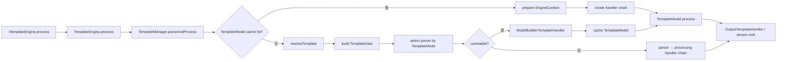
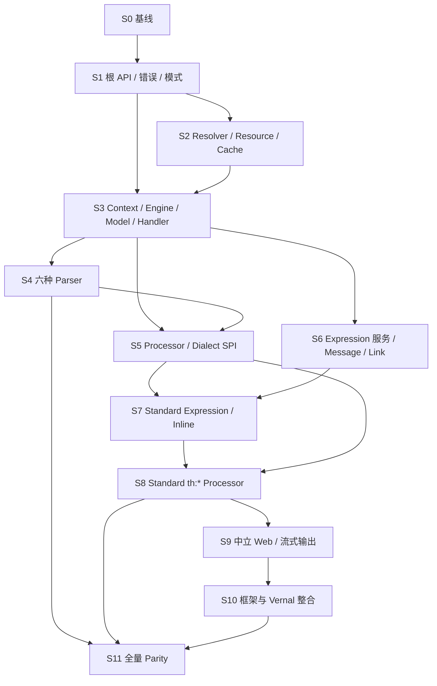
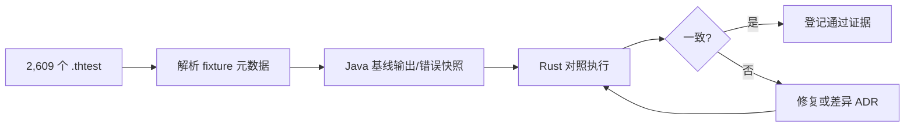

# thymeleaf-rust 全量语义迁移路线图

> **文档说明**：以 Thymeleaf Core 为功能语义基线，规定 `thymeleaf` 核心 crate 从零实现到完全语义迁移的阶段、依赖、验收证据和发布门禁。
>
> **文档版本**：v1.0.0
> **最后更新**：2026-07-29
> **上游基线**：Thymeleaf `3.1.5.RELEASE`，提交 `10f9dd2eb8cbd98515ce14b149d115e0287d0add`
> **目标分支**：`dev`
> **状态**：迁移实施中；Foundation、`TemplateSpec` 与 `Thymeleaf` 垂直切片已完成行为验证

## 1. 总目标

`thymeleaf-rust` 的目标不是翻译 Java 语法，而是在 Rust 中完整迁移 Thymeleaf Core 的可观察功能语义：

1. 模板解析、事件模型、Processor、Dialect、表达式、Fragment、缓存和输出行为一致；
2. HTML、XML、TEXT、JAVASCRIPT、CSS、RAW 六种 `TemplateMode` 行为可对照验证；
3. 完整渲染和节流/流式渲染具备等价的顺序、错误和取消语义；
4. Java 反射、ClassLoader、Servlet、OGNL 等运行时机制使用 Rust 等价机制承载，不丢失业务语义；
5. 核心仅发布一个 `thymeleaf` crate，其他发布 crate 均为 `thymeleaf-{framework}` 或 `thymeleaf-vernal` 整合层；
6. 每项兼容结论都有对象、测试或差异登记作为证据。

### 1.1 “功能语义完全迁移”的完成定义

只有同时满足以下条件，才能使用“完全迁移”表述：

| 门禁 | 完成条件 |
|:---|:---|
| 对象覆盖 | 491 个 Java 主对象和 69 个内部/伴随对象全部迁移或完成有证据的 Rust 等价映射 |
| 名称覆盖 | 540 个直接迁移类型名称一致；20 个 Java 运行时相关类型全部登记并验证批准的等价名称 |
| 语义覆盖 | [语义迁移对照表](语义迁移对照表.md)不存在 `NOT_STARTED`、`SKELETON`、`IMPLEMENTED_UNVERIFIED` 或未经解释的差异 |
| 核心测试 | 上游 `thymeleaf-tests-core` 的 2,609 个 `.thtest` 用例全部进入清单，并通过 Rust Golden/Parity 测试或批准差异 |
| API 行为 | `TemplateEngine`、`TemplateSpec`、Context、Model、Dialect/Processor SPI 和错误合同通过公共 API 对照 |
| 模式覆盖 | HTML/XML/TEXT/JAVASCRIPT/CSS/RAW 全部通过解析、处理、转义和输出测试 |
| 非功能要求 | 并发、缓存、背压、取消、资源限制、诊断位置和安全门禁通过 |
| 文档一致性 | 路线图、对象表、语义表、名称检查和架构设计引用同一上游基线 |

文件数、代码行数和测试数量只能作为诊断指标，不能单独证明语义完成。

## 2. 基线证据

### 2.1 上游源码基线

| 证据 | 结果 |
|:---|:---|
| 上游仓库 | [thymeleaf/thymeleaf](https://github.com/thymeleaf/thymeleaf) |
| 固定提交 | [`10f9dd2`](https://github.com/thymeleaf/thymeleaf/tree/10f9dd2eb8cbd98515ce14b149d115e0287d0add) |
| Maven 版本 | `3.1.5.RELEASE` |
| 核心源码范围 | `lib/thymeleaf/src/main/java` |
| Java 主对象文件 | 491 |
| 内部/伴随对象 | 69 |
| Java 类型合计 | 560 |
| Core 测试 Java 文件 | 209 |
| Core `.thtest` 用例 | 2,609 |
| Core 测试目录文件合计 | 2,881 |

### 2.2 CodeGraph 证据

上游 `.codegraph/` 索引在本次制定路线图时为最新状态：

| 指标 | 数量 |
|:---|---:|
| 索引文件 | 1,783 |
| 符号节点 | 29,289 |
| 关系边 | 75,439 |
| Java 文件 | 1,543 |

CodeGraph 已确认主执行链：



该调用链是阶段依赖顺序的主要依据：在解析器和 Standard Dialect 之前，必须先稳定事件、Model、Context 和 Handler 合同。

### 2.3 Vernal Expression 方法参考

本套文档参考 Vernal 仓库 `dev` 分支、提交 `a4d24ae75d679c3ba4c68f4b6182e88a0b3b80ad` 下的四份迁移治理文档：

| 参考文档 | 本项目吸收的方法 |
|:---|:---|
| [`迁移路线图.md`](https://github.com/easy-4-rust/vernal/blob/dev/docs/vernal-expression/迁移路线图.md) | 分阶段范围、前置依赖、退出门禁 |
| [`对象级对照表.md`](https://github.com/easy-4-rust/vernal/blob/dev/docs/vernal-expression/对象级对照表.md) | 一文件一主对象、状态图例、逐对象验收 |
| [`语义迁移对照表.md`](https://github.com/easy-4-rust/vernal/blob/dev/docs/vernal-expression/语义迁移对照表.md) | 将“对象存在”与“功能语义成立”分开检查 |
| [`对象名称一致性检查.md`](https://github.com/easy-4-rust/vernal/blob/dev/docs/vernal-expression/对象名称一致性检查.md) | exact/missing/extra/equivalent 统计和自动门禁 |

本项目没有复制其中的 Spring Expression 对象数量或完成状态，而是用 Thymeleaf 固定提交和 CodeGraph 重新建立了 491/69/560 的独立基线。

## 3. 范围边界

### 3.1 逐对象迁移范围

以下目录是对象级迁移的规范基线：

```text
lib/thymeleaf/src/main/java/org/thymeleaf
```

完整对象落点见[对象级对照表](对象级对照表.md)。

### 3.2 语义吸收但不逐类迁移

| 上游模块 | 使用方式 | Rust 落点 |
|:---|:---|:---|
| `thymeleaf-spring5` / `thymeleaf-spring6` | 提取 ViewResolver、WebFlux、SpEL 整合和数据驱动渲染行为 | `thymeleaf-vernal` 与各 `thymeleaf-{framework}` |
| Spring Security extras | 提取 Dialect、权限表达式和安全输出用例 | 后续安全 Dialect/整合 crate |
| examples | 提取真实模板、Dialect 扩展和宿主整合场景 | examples 与端到端测试 |
| testing | 提取测试 DSL、缓存和模板引擎夹具 | Rust test support；不单独发布 `thymeleaf-testkit` |

### 3.3 明确不采用的迁移方式

- 不复制 Java 继承树、反射调用、Servlet 类型或 ClassLoader；
- 不将 491 个对象拆成多个核心 crate；
- 不以空文件、空 trait、`todo!()` 或 `unimplemented!()` 计入进度；
- 不以“同名”替代行为测试；
- 不在测试矩阵未通过前声明兼容百分比或完全兼容。

## 4. 全局迁移原则

1. **语义先于形态**：可观察输入、输出、顺序、错误和副作用一致，实现使用 Rust 原生所有权、trait、enum、闭包和异步流。
2. **一个核心 crate**：Engine、Parser、Expression、Standard Dialect、Web 中立合同全部位于 `thymeleaf`。
3. **一文件一主对象**：一个 Java 主对象对应一个 `.rs` 文件；内部类和伴随 Builder 可留在主对象文件。
4. **名称默认一致**：类型保持 Java 简单名称；目录/文件/方法/参数转 snake_case。
5. **中立内核**：`thymeleaf` 不依赖 Axum、Actix Web、Topcoat、Vernal 或其他宿主。
6. **表达式分层**：`${}`、`*{}`、`#{}`、`@{}`、`~{}` 外层语义属于 `thymeleaf`；变量内部求值由中立 evaluator 承担。
7. **测试驱动迁移**：先登记上游行为，再写失败的 Rust 测试，最后实现。
8. **差异必须显式**：所有 `JAVA_ONLY_EXEMPT` 项必须记录原因、替代机制、影响和回归测试。

## 5. 阶段总览

| 阶段 | 主对象数 | 交付主题 | 前置阶段 | 退出门禁 |
|:---:|---:|:---|:---:|:---|
| S0 | 0 | 基线、对象表、语义表、名称门禁 | — | 四份迁移文档一致 |
| S1 | 20 | crate 骨架、根 API、错误、模板模式 | S0 | 核心类型可编译，禁止 STUB |
| S2 | 30 | Resource、Resolver、Cache | S1 | 解析顺序与有效性测试通过 |
| S3 | 128 | Context、Engine、Event、Model、Handler | S1–S2 | 主处理链可用内存事件跑通 |
| S4 | 41 | 六种模板模式 Parser 与解耦逻辑 | S3 | 解析 Golden 测试通过 |
| S5 | 48 | Processor/Dialect/Pre/Post/Inline SPI | S3–S4 | precedence 与结构处理门禁通过 |
| S6 | 64 | 核心表达式对象、Message、Link、Util | S3 | 服务 SPI 与值模型稳定 |
| S7 | 88 | Standard Expression、Inline、Serializer | S5–S6 | 外层表达式和内联语义通过 |
| S8 | 56 | Standard `th:*` Processor | S5–S7 | Standard Dialect 主功能通过 |
| S9 | 16 | 中立 Web 合同和 Servlet 语义等价迁移 | S3–S8 | 完整/流式 Body 合同通过 |
| S10 | — | `thymeleaf-{framework}`、`thymeleaf-vernal` | S9 | 每个适配器独立测试通过 |
| S11 | — | 全量 Parity、安全、性能和发布 | S1–S10 | 2,609 个 `.thtest` 全部结案 |



## 6. 阶段详细计划

### 6.1 S0：迁移治理基线

**交付物**

- [迁移路线图](迁移路线图.md)
- [对象级对照表](对象级对照表.md)
- [语义迁移对照表](语义迁移对照表.md)
- [对象名称一致性检查](对象名称一致性检查.md)

**验收**

- 四份文档引用同一版本和提交；
- 491 个主对象全部有唯一 Rust 目标；
- 491 个默认目标路径碰撞数为 0；
- 语义域、阶段和对象包之间无未分类项；
- 当前未实现状态如实为 0%，不把规划写成完成。

### 6.2 S1：根 API、错误与模板模式

**范围：20 个主对象**

- `org.thymeleaf` 根包 10 个；
- `exceptions` 9 个；
- `templatemode.TemplateMode` 1 个。

**关键交付**

- `TemplateEngine`、`ITemplateEngine`、`TemplateSpec`；
- 初始化前可配置、初始化后冻结的配置状态机；
- `TemplateEngineException`、输入/处理/输出异常及源码位置；
- `TemplateMode::{HTML, XML, TEXT, JAVASCRIPT, CSS, RAW}`。

**验收**

- 所有 `TemplateEngine.process` 重载语义映射到清晰的 Rust API；
- `TemplateSpec` 的 selector、mode、resolution attributes 校验完整；
- 未知模板模式回退/报错策略与上游差异有显式决定；
- 每个错误保留模板名、行、列和原因链。

**当前进度**

- `exceptions` 9 / 9 个主对象达到 `BEHAVIOR_VERIFIED`；
- `TemplateMode` 1 / 1 个主对象达到 `BEHAVIOR_VERIFIED`；
- 根包 `TemplateSpec`、`Thymeleaf`、`DialectConfiguration` 达到 `BEHAVIOR_VERIFIED`，其余 7 个对象保持 `NOT_STARTED`；
- Foundation Java Oracle 生成 86 条 Golden 记录；
- `TemplateSpec` Java Oracle 生成 289 条 Golden 记录；
- `Thymeleaf` Java Oracle 生成 8 条 Golden 记录；
- 方言基础配置 Java Oracle 生成 23 条 Golden 记录；
- 缓存有效性 Java Oracle 生成 31 条 Golden 记录；
- 缓存键 Java Oracle 生成 58 条 Golden 记录；
- 缓存合同 Java Oracle 生成 14 条 Golden 记录；
- 标准缓存 Java Oracle 生成 37 条 Golden 记录；
- 模板资源 Java Oracle 生成 144 条 Golden 记录；
- 模板解析结果 Java Oracle 生成 66 条 Golden 记录；
- 通用参数校验 Java Oracle 生成 36 条 Golden 记录；
- Map/Object 工具 Java Oracle 生成 40 条 Golden 记录；
- 模式规则工具 Java Oracle 生成 79 条 Golden 记录；
- 版本解析工具 Java Oracle 生成 668 条 Golden 记录；
- 内容类型工具 Java Oracle 生成 375 条 Golden 记录；
- Set/`#sets` Java Oracle 生成 47 条 Golden 记录；
- 138 个 Rust 单元测试和 17 个 Java/Rust 差分测试通过，共固定 2,033 条 Java 记录；
- 当前 Rust 源码 6,078 行、709 个函数、9,596 个区域，覆盖率均为 100%；
- 完整 Java API 清单登记 4,291 个方法/构造器和 6,936 个参数。
- `cargo xtask migration-check` 已进入 CI，当前报告 39 个已验证对象、2 个已实现待完整验证对象、0 路径冲突、0 STUB。

### 6.3 S2：模板资源、解析和缓存

**范围：30 个主对象**

- `cache` 13 个；
- `templateresolver` 10 个；
- `templateresource` 7 个。

**关键语义**

- Resolver 按 order 顺序尝试，第一个非空 `TemplateResolution` 胜出；
- selector 由 Parser 使用，不传给 Resolver；
- `TemplateResolution` 同时携带资源、模式、解耦逻辑和缓存有效性；
- Always/TTL/Non-cacheable validity；
- Template、Expression、Specific 缓存隔离；
- Java ClassLoader 等价为 Embedded/ResourceLoader。

**验收**

- 多 Resolver 顺序、未命中、存在性预检和失败策略测试；
- 缓存命中、过期、清理单模板、全量清理测试；
- UTF-8、文件、内存、嵌入资源和不可 seek 资源测试；
- 缓存键包含 owner、selector、offset、mode 和 resolution attributes。

**当前进度**

- `ICacheEntryValidity`、`AlwaysValidCacheEntryValidity`、
  `NonCacheableCacheEntryValidity`、`TTLCacheEntryValidity`、`ExpressionCacheKey` 与
  `TemplateCacheKey`、`ICache` 与 `ICacheEntryValidityChecker` 共 8 / 30 个 S2 主对象
  达到 `BEHAVIOR_VERIFIED`；`ITemplateResource`、`StringTemplateResource`、
  `FileTemplateResource`、`TemplateResourceUtils` 与 `TemplateResolution` 使 S2
  验证进度达到 13 / 30；
- `UrlTemplateResource` 已有真实实现和 74 条新增 Java Golden，file/HTTP/HTTPS 主路径
  已通过差分；因 JAR、FTP、JNLP、自定义 URL handler 和 HTTPS 成功路径尚未完整验证，
  当前保持 `IMPLEMENTED_UNVERIFIED`，使 S2 已实现对象达到 14 / 30；
- `StandardCache` 与其内部 `CacheDataContainer`、`CacheEntry` 已迁移 put-if-absent、
  FIFO、有效性检查、惰性删除、清理、计数器和比例，37 条 Java Golden 已通过；
  Rust 以 `Arc`/`Weak` 和显式 `sacrifice_soft_references()` 保留可回收语义，但没有
  JVM 内存压力自动通知，因此保持 `IMPLEMENTED_UNVERIFIED`，S2 已实现对象达到 15 / 30；
- 固定 Java Oracle 生成 31 条 Golden，覆盖公开构造器、单例身份、动态接口调用、
  零/负数/最大/最小 TTL 与实际过期；
- 缓存键固定 Java Oracle 生成 58 条 Golden，覆盖必填项、null/空集合身份、
  UTF-16 selector 顺序、显示格式、所有字段相等性与 hash 合同；
- 缓存合同固定 Java Oracle 生成 14 条 Golden，覆盖 miss、共享值身份、checker
  参数、显式 checker 覆盖、失效删除、key 快照和两种清理操作；
- 模板资源固定 Java Oracle 生成 144 条 Golden，覆盖 null/空模板、Unicode/CRLF/NUL、
  独立 reader、动态接口、文件路径清理、真实 I/O、charset/BOM/非法字节、relative
  和文件/编码组合失败优先级，以及 URL 描述、file/HTTP reader、HEAD 状态与连接失败；
- 模板解析结果固定 Java Oracle 生成 66 条 Golden，覆盖两种构造器、null 校验顺序、
  六种模板模式、资源存在性验证与解耦逻辑标志，以及资源/有效性动态实例身份；
- Rust 确定性测试额外覆盖严格过期边界、墙上时钟回拨、纪元前毫秒取整和 Java
  `long` 环绕加法；
- `ExpressionCacheKey` 精确保留 Java UTF-16 `int` hash 数值；`TemplateCacheKey`
  对 JVM 枚举/对象身份 hash 采用合同等价的安全哈希，不承诺不可移植的跨进程数值；
- S2 其余 16 个主对象保持 `NOT_STARTED`。

### 6.4 S3：Context、Engine、Event、Model 与 Handler

**范围：128 个主对象**

- `context` 20 个；
- `engine` 88 个；
- `model` 20 个。

**关键语义**

- `EngineContextManager` 的创建、level 增减和嵌套模板栈；
- selection target、inliner、变量层级和元素栈；
- TemplateStart/End、Text、Comment、CDATA、DocType、PI、XML 声明和元素事件；
- 不可变 `TemplateModel` 与可变 `Model`；
- Model 插入时禁止外部加入 TemplateStart/End；
- `ITemplateHandler` 链和结构处理 Handler；
- `TemplateManager.parseAndProcess` 缓存命中/未命中双路径。

**验收**

- 事件顺序可重放；
- 不同 EngineConfiguration/TemplateMode 的 Model 禁止混合；
- Context level 在成功和错误路径均正确回收；
- 缓存模型和直通 Parser 的输出一致；
- Handler 链可注入 Pre/Processor/Post/Output 节点。

### 6.5 S4：六种 Parser 与解耦逻辑

**范围：41 个主对象**

- Parser 抽象；
- markup、text、raw、reader；
- decoupled logic。

**关键语义**

| 模式 | 关键语义 |
|:---|:---|
| HTML | 宽容标记解析、大小写不敏感、HTML 修复和 selector |
| XML | 严格 XML、大小写敏感、声明/CDATA/命名空间 |
| TEXT | 文本原型语法和可见控制标记 |
| JAVASCRIPT | 文本模式 + JavaScript 内联与序列化 |
| CSS | 文本模式 + CSS 内联与序列化 |
| RAW | 原样输出，不执行普通模板语义 |

**验收**

- 每种事件类型保留 template name、line、column；
- standalone 与 string parsing 行为一致；
- selector、offset、嵌套模板和 decoupled logic 测试通过；
- malformed 输入、超大输入、深嵌套和 Unicode 测试通过。

### 6.6 S5：Processor 与 Dialect SPI

**范围：48 个主对象**

- `processor` 34 个；
- `dialect` 8 个；
- pre/post processor 各 2 个；
- inline SPI 2 个。

**关键语义**

- Processor 按 Dialect precedence、Processor precedence 和匹配规则稳定排序；
- TemplateBoundaries、Element、Text、Comment、CDATA、DocType、PI、XML 声明均可处理；
- StructureHandler 支持 remove、replace、insert、iterate、set body/attribute/local variable；
- PreProcessor、PostProcessor 与 Output Handler 顺序固定；
- Dialect 可贡献 Processor、ExpressionObject、ExecutionAttribute、Pre/PostProcessor。

**验收**

- 相同 precedence 的稳定顺序可重复；
- 结构修改不会重复执行或跳过事件；
- 自定义 Dialect 示例覆盖全部 SPI；
- 多 Dialect prefix、无 prefix、冲突和覆盖测试通过。

### 6.7 S6：表达式服务、Message、Link 与通用对象

**范围：64 个主对象**

- 核心 `expression` 20 个；
- message resolver 4 个；
- link builder 3 个；
- util/temporal 37 个。

**关键决策**

- Thymeleaf 外层表达式由 `thymeleaf` 解析；
- 变量/selection 内部表达式通过 `IStandardVariableExpressionEvaluator`；
- 默认实现为 Rust 原生 evaluator；
- `thymeleaf-vernal` 可桥接 `vernal-expression`，核心不能反向依赖；
- Message 按 resolver order、locale、template stack 回退；
- LinkBuilder 处理 context-relative、server-relative、absolute、protocol-relative 和参数编码。

**验收**

- 值模型覆盖 Null、Boolean、Number、String、List、Map、Object；
- 属性、索引、函数和受控方法调用具备安全白名单；
- Locale、消息参数、缺失消息和默认消息测试；
- URL 编码、路径变量、query、fragment、base URL 测试。

**当前进度**

- `NumberPointType`、`IdentityCounter`、`Validate`、`MapUtils`、`ObjectUtils`、
  `SetUtils`、`Sets`、`PatternUtils`、`PatternSpec` 与 `VersionUtils` 共 10 / 64 个 S6 主对象达到
  `BEHAVIOR_VERIFIED`；
- 固定 Java Oracle 生成 902 条 Golden，覆盖五个枚举成员及顺序、严格名称匹配、
  引用 alias、值相等但身份不同、null 身份、容量边界，以及八个参数校验重载的成功与
  异常路径，并覆盖 Map 全部查询重载、null 安全对象选择、字符串模式转换及有序模式
  集合的匹配与失败后状态、Set 转换与 `#sets` 委托，以及版本解析、限定符、构建时间戳和三层版本比较；
- `IdentityCounter` 使用 `Rc` 保留上游非线程安全和强引用身份语义，不以值哈希替代
  `IdentityHashMap` 的引用比较；
- `Validate` 使用 `ValidateError` 区分 Java 显式 `IllegalArgumentException` 与循环
  解引用触发的隐式 `NullPointerException`，并由 `StandardCache` 复用统一空白判定；
- `MapUtils` 复用 `ValidateError` 保留 null target/keys/values 的校验顺序与精确消息，
  `ObjectUtils` 则以移动语义保持被选中引用的对象身份；
- `SetUtils` 通过只读 `JavaSet` 同时保留已有集合身份、`LinkedHashSet` 首次插入顺序、
  primitive array 强转异常和不可修改单例；`Sets` 的六个操作均走该工具的真实委托链；
- `PatternUtils` 按上游替换顺序生成 Java 正则文本，`PatternSpec` 保留字符串集合的
  插入顺序、去重规则、重复编译对象以及编译失败时不回滚的可观察状态；
- `VersionUtils` 保留 Java `String#trim()`、UTF-16 `charAt()`、Unicode 15.0
  `Character` 分类、`Integer.parseInt` 溢出和失败回退 `UNKNOWN`；`Thymeleaf`
  版本入口已改为复用该解析链。

### 6.8 S7：Standard Expression、Inline 与 Serializer

**范围：88 个主对象**

- Standard root 1 个；
- Standard expression 70 个；
- Standard inline 9 个；
- serializer 5 个；
- Standard util 3 个。

**关键语义**

- `${}` variable；
- `*{}` selection variable；
- `#{}` message；
- `@{}` link；
- `~{}` fragment；
- literal、token、binary operation、conditional、default、assignation、each 和 expression sequence；
- `__...__` preprocessing；
- `[[...]]` escaped inline 与 `[(...)]` unescaped inline；
- JavaScript/CSS serializer 的字符串、集合、Map、Bean 和转义规则；
- 禁止不可信字符串进入 `th:on*` 等事件属性。

**验收**

- Expression Cache 的键与预处理后输入一致；
- parsing/execute/type-conversion context 分离；
- short-circuit、null、类型转换和错误位置测试；
- JavaScript/CSS/HTML/XML/TEXT 各上下文转义 Golden 测试。

### 6.9 S8：Standard `th:*` Processor

**范围：56 个主对象**

**P0 Processor**

- `th:text`、`th:utext`；
- `th:if`、`th:unless`、`th:switch`、`th:case`；
- `th:each`；
- `th:object`、`th:with`；
- `th:attr`、`th:attrappend`、`th:attrprepend` 及固定属性 Processor；
- `th:insert`、`th:replace`、兼容性 `th:include`；
- `th:fragment`、`th:remove`、`th:block`；
- `th:inline` 和注释/CDATA 内联。

**验收**

- 每个 Processor 至少一组成功、空值、错误和边界测试；
- fragment 参数、synthetic 参数、签名和嵌套选择测试；
- `th:each` 覆盖 List、Map、iterator、状态变量和空集合；
- 属性冲突、布尔属性、DOM event 安全限制和 XML namespace 测试。

### 6.10 S9：中立 Web 与完整/流式输出

**范围：16 个主对象**

- `web` 4 个中立接口；
- `web.servlet` 12 个对象做宿主等价迁移，不进入核心 Servlet API。

**目标合同**

```rust
RenderedTemplate::Full(Bytes)
RenderedTemplate::Stream(Stream<Frame<Bytes>>)
```

**验收**

- Web application/exchange/request/session 的中立 trait；
- request parameter、session/application attribute 可见性；
- 完整输出与流式输出字节一致；
- 背压、取消、flush、trailers、最大输出限制和中途错误策略；
- Servlet 对象全部在名称例外清单中有宿主等价证据。

### 6.11 S10：框架与 Vernal 整合

整合 crate 不计入 491 个核心对象，但属于正式发布面：

| 整合 | 验收重点 |
|:---|:---|
| `thymeleaf-topcoat` | View/Page/Fragment/受控 RawHtml |
| `thymeleaf-actix-web` | Responder、MessageBody、Stream |
| `thymeleaf-axum` | IntoResponse、Body |
| `thymeleaf-gotham` | Handler、Response |
| `thymeleaf-hyper` | 标准 HTTP Response/Body |
| `thymeleaf-ntex` | Responder、Service、Body |
| `thymeleaf-poem` | IntoResponse、Endpoint、Stream |
| `thymeleaf-rocket` | Responder、ByteStream |
| `thymeleaf-salvo` | Handler、Response Body |
| `thymeleaf-tide` | Endpoint、Response |
| `thymeleaf-warp` | Reply、Rejection |
| `thymeleaf-tower` | Service、Layer、Body |
| `thymeleaf-tonic` | 动态 String/Bytes、Gateway、Service 内容 |
| `thymeleaf-vernal` | ViewEngine、ViewResolver、Context、Expression、Cache、HTTP bridge |

每个整合 crate 必须独立可用；用户不应为了使用 `thymeleaf-axum` 而依赖 Vernal。

### 6.12 S11：全量 Parity 与发布

**上游用例迁移流程**



**发布门禁**

- `cargo fmt --check`；
- `cargo clippy --workspace --all-targets --all-features -- -D warnings`；
- `cargo test --workspace --all-features`；
- Golden/Parity 全通过；
- Miri 覆盖核心 unsafe 边界；原则上核心不使用 unsafe；
- Parser、Expression、Fragment fuzz；
- Criterion 基准和内存上限；
- 文档、License、NOTICE 和上游归属检查；
- 公开 API 与名称检查无未批准差异。

## 7. 测试迁移策略

### 7.1 测试层级

| 层级 | 目标 | 主要证据 |
|:---|:---|:---|
| 单元 | 每个对象的局部合同 | Rust 单元测试 |
| 组件 | Parser、Expression、Processor、Cache | 固定输入输出和错误快照 |
| Golden | Java/Rust 模板输出一致 | 上游 `.thtest` |
| 差分 | 随机/边界输入行为一致 | Java oracle + Rust runner |
| 整合 | Web 框架响应和流式 Body | 每个整合 crate 的真实服务器测试 |
| 安全 | XSS、路径、递归、资源限制 | 恶意模板语料和 fuzz |
| 性能 | 延迟、吞吐、内存、首帧 | Criterion 与端到端基准 |

### 7.2 `.thtest` 迁移台账

每个上游用例必须记录：

- 上游相对路径；
- 适用 TemplateMode；
- 输入模板和 Context；
- 期望输出或期望错误；
- Java 基线版本/提交；
- Rust 测试路径；
- 状态：通过、批准差异、阻塞；
- 差异 ADR 链接。

不允许只抽样常用用例后宣称完整迁移。

## 8. 风险与控制

| 风险 | 影响 | 控制措施 | 阻断门禁 |
|:---|:---|:---|:---|
| HTML 宽容解析与源码位置不一致 | 高 | 事件 Golden + malformed corpus | S4 |
| Java 动态对象模型无法直接映射 | 高 | TemplateValue + accessor/evaluator trait | S6 |
| Processor 重处理和 precedence 错误 | 高 | 顺序快照 + 结构变换属性测试 | S5/S8 |
| Fragment 递归或参数绑定差异 | 高 | 深度限制 + 签名/参数 Golden | S8 |
| 流式渲染错误已写出部分响应 | 高 | 显式 preflight/stream error policy | S9 |
| OGNL/SpEL 行为混淆 | 高 | 外层语法与内部 evaluator 分层 | S6/S7 |
| Servlet 形态污染核心 | 高 | 中立 Web trait + 整合 crate | S9 |
| 上游版本漂移 | 中 | 固定 commit；升级单独生成差异清单 | 全程 |
| 许可证归属遗漏 | 高 | 保留 Apache-2.0 归属和修改说明 | S11 |

## 9. 进度更新协议

每次合并实现时必须同时更新：

1. [对象级对照表](对象级对照表.md)中的对象状态；
2. [语义迁移对照表](语义迁移对照表.md)中的功能状态和测试证据；
3. [对象名称一致性检查](对象名称一致性检查.md)的统计；
4. 本路线图的阶段状态；
5. 若有批准差异，新增或更新 ADR。

状态更新不得基于文件存在；必须基于真实逻辑和通过的测试。

## 10. 当前结论

| 维度 | 当前状态 |
|:---|:---|
| 迁移治理文档 | ✅ 已建立 |
| Java 主对象行为验证 | 39 / 491 |
| Java 主对象已实现待完整验证 | 2 / 491 |
| Java 类型已实现 | 45 / 560 |
| `.thtest` 迁移 | 0 / 2,609 |
| Cargo workspace | ✅ `thymeleaf` 已创建 |
| Java API 机器清单 | ✅ 4,291 方法 / 6,936 参数 |
| 核心 API | S1 Foundation、方言基础配置，S2 缓存/解析/资源切片及 S6 参数、集合、`#sets`、对象、模式、版本工具已验证；URL 资源和 `StandardCache` 的 JVM 运行时边界待完整验证；Engine 尚未实现 |
| 当前源码覆盖率 | 行 / 函数 / 区域 100% |
| 兼容性声明 | 不允许 |

下一步先为 URL 资源补齐可注册协议 handler、JAR/FTP/自定义协议和本地 TLS Oracle，
再继续 S2 Cache/Resolver 依赖链，并收敛 S1 根包与 S5 方言 SPI；Java API JSON、
静态布局审计与覆盖率检查已经进入正式 CI 门禁。

---

**文档版本**：v1.0.0
**创建日期**：2026-07-28
**最后更新**：2026-07-29
**文档状态**：迁移实施中；39 / 491 个主对象已验证，2 个主对象已实现待完整验证；其中 S1 完成 13 / 20、S2 验证 13 / 30（已实现 15 / 30）、S6 验证 10 / 64
