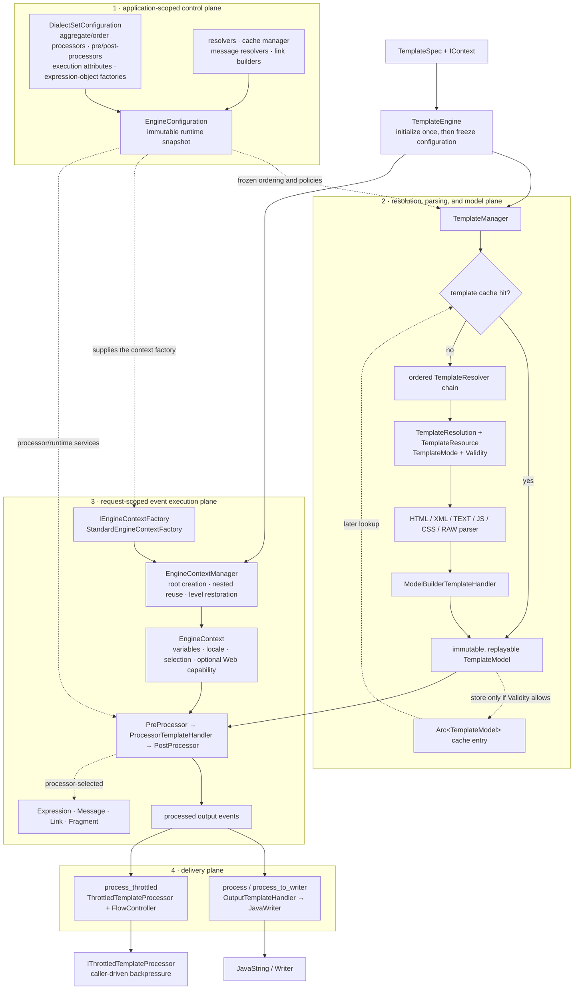
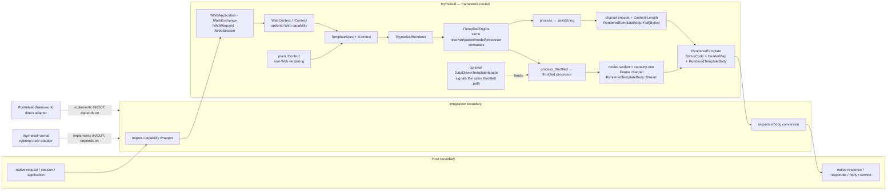
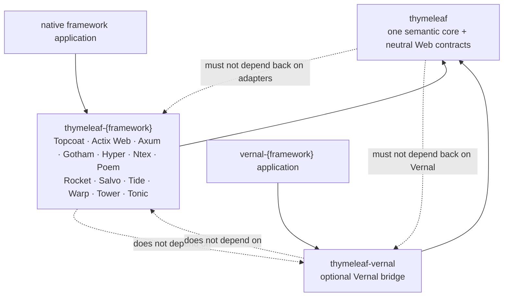

<a id="readme-top"></a>

<div align="center">

# thymeleaf-rust

**A framework-neutral Rust template engine migrating Thymeleaf core semantics.**

[](#project-status)
[](LICENSE)

[English](README.md) | [简体中文](README.zh-CN.md)

[Overview](#overview) · [Architecture](#architecture) · [Crate model](#crate-model) ·
[Integrations](#integration-model) · [Remaining roadmap](#remaining-roadmap) ·
[Contributing](#contributing)

</div>

---

> **Project status: runtime surface implemented; semantic verification and release preparation in progress**
>
> The workspace now contains the `thymeleaf` engine, all six parser modes, event model,
> standard dialect, processors, safe expression subset, neutral web output, 13 independent
> framework integrations, and `thymeleaf-vernal`. Every fixed-upstream object, method,
> JUnit entry, and `.thtest` has a disposition, but only 202 of 491 main objects currently
> meet the object-level `BEHAVIOR_VERIFIED` bar. The crate is not yet on crates.io, and
> real HTTP full/stream/error/cancellation tests still need expansion.

## Overview

`thymeleaf-rust` is the project and repository name for a Rust dynamic content rendering
engine that migrates [Thymeleaf](https://www.thymeleaf.org/) 3.1.5.RELEASE core template
semantics at object, method, and behavioral levels.

The public core crate name is **`thymeleaf`**, although it has not yet been uploaded to
crates.io. Framework integration crates use the `thymeleaf-{framework}` pattern; no
published crate or Rust module will use a `thymeleaf-rust-*` prefix.

The project is intended to support two equal integration paths:

1. direct, independent integration with Rust web frameworks;
2. optional integration as the dynamic rendering engine for Vernal and its web adapters.

The engine core will remain independent of Topcoat, Actix Web, Axum, Gotham, Hyper, Ntex, Poem, Rocket, Salvo, Tide, Warp, Tower, Tonic, and Vernal.

This is an independent project. It is not an official Thymeleaf project.

## Goals and boundaries

### Goals

- Provide natural HTML templates with Thymeleaf-style processing semantics.
- Support variables, selection expressions, messages, links, fragments, processors, and dialects.
- Build immutable, cacheable, replayable template models.
- Support complete and backpressure-aware streaming rendering.
- Expose a neutral `RenderedTemplate`/HTTP body contract.
- Offer independently versioned adapters for supported Rust web frameworks.
- Offer an optional `thymeleaf-vernal` bridge without making Vernal a core dependency.
- Develop upstream compatibility through traceable parity and golden tests.

### Non-goals

- Reproduce Java inheritance, reflection, Servlet, or Spring types in the core.
- Claim complete Thymeleaf compatibility before a versioned compatibility matrix exists.
- Make a framework-specific response type part of the engine API.
- Turn runtime templates automatically into Topcoat reactive components.
- Treat gRPC payloads as ordinary browser HTML responses.
- Present planned crates, APIs, tests, or benchmarks as implemented.

## Architecture

```text
template + model + locale
          │
          ▼
┌────────────────────────────── thymeleaf ──────────────────────────────┐
│ CONTROL      EngineConfiguration · DialectSetConfiguration · cache   │
│     │                                                                │
│     ▼                                                                │
│ MODEL        resolver → resource → parser → immutable TemplateModel  │
│     │                                                                │
│     ▼                                                                │
│ EXECUTION    pre → ProcessorTemplateHandler → post → output events   │
│     │                                                                │
│     ▼                                                                │
│ DELIVERY     process → String/Writer                                 │
│              process_throttled → IThrottledTemplateProcessor         │
│                                                                      │
│ Shared semantics: expression · message · link · fragment · dialect   │
│ Neutral Web: ThymeleafRenderer calls the delivery APIs               │
│              → RenderedTemplate(status, headers, Full/Stream body)    │
└──────────────────────────────────┬───────────────────────────────────┘
                                   │ stable neutral contracts
                  ┌────────────────┴─────────────────┐
                  ▼                                  ▼
        thymeleaf-{framework}                thymeleaf-vernal
        direct host adapter                  optional peer bridge
                  │                                  │
                  ▼                                  ▼
        native framework response             vernal-{framework}
```

The arrows above describe runtime data flow. Cargo dependencies point in the opposite
direction: applications and integration crates depend on `thymeleaf`; the core never
depends on a host framework or Vernal.

```text
host application → thymeleaf-{framework} → thymeleaf
vernal application → thymeleaf-vernal → thymeleaf

Never:
thymeleaf crate → framework integration
thymeleaf crate → Vernal
```

### Core rendering call chain

The current implementation, verified with CodeGraph, retains Thymeleaf's event-driven
topology instead of delegating templates to Tera, Askama, or Handlebars:



The current Rust implementation materializes a `TemplateModel` on every cache miss.
Cache validity controls whether that model is retained, not whether parsing bypasses
the model. Full and throttled rendering share resolution, parsing, processor,
expression, and output-event semantics; only the output driver and backpressure
boundary differ.

At the root template boundary, `StandardEngineContextFactory` selects `EngineContext`
or `WebEngineContext` from the source context's `IWebContext` capability. Nested
templates reuse the same engine context: `EngineContextManager` raises its level,
pushes `TemplateData`, and restores the previous level on disposal. Ordinary and Web
rendering therefore diverge only by context capability, not by creating separate
template engines.

Four constrained planes make up the core architecture. The configuration plane
aggregates dialect capabilities and freezes them during first initialization. The
parsing/model plane turns resources into replayable events. The request execution plane
interprets those events through processors. Only the delivery plane selects full,
throttled, or HTTP output. A Web integration has exactly two host-facing ports:
an inbound capability wrapper that supplies request/session/application observations,
and an outbound conversion from `RenderedTemplate` to the native response/body. It must
not manipulate configuration, parsers, template models, processor chains, or expression
semantics.

### Neutral web layer and adapters



Neutrality is bidirectional. On input, adapters expose only the web capabilities needed
by contexts, link builders, and web template resources. On output, they convert only
status, headers, and body types. They must not reimplement resolvers, parsers,
expressions, processors, charset handling, or streaming control. Direct adapters and
`thymeleaf-vernal` are peer consumers of the same contracts; neither path depends on
the other. See the detailed
[feasibility and architecture design](docs/Thymeleaf-Rust-可行性与架构设计.md) for
call-chain evidence and risks.

The neutral inbound traits are implemented today by the Hyper host bridge. The other
framework crates currently focus on outbound `RenderedTemplate` conversion; equivalent
native request/session/application wrappers remain part of their acceptance work.

| Boundary | Owned by `thymeleaf` | Owned by an integration crate |
|:---|:---|:---|
| Request side | Neutral web capability traits and template context semantics | Native request/session/application wrappers |
| Rendering | Resolver, parser, model, processors, expressions, links, messages, fragments, cache | No rendering semantics |
| Response side | `RenderedTemplate`, metadata, charset encoding, full/stream body | Native Response/Responder/Reply/Service conversion |
| Lifecycle | Throttled progress, frame errors, data-driven signaling | Request scope, disconnect observation, host error mapping |

Failures follow the same boundary:

| Failure stage | Observable behavior | Owner |
|:---|:---|:---|
| Engine initialization / dialect aggregation | Fails synchronously before rendering; no response body exists | `thymeleaf` |
| Resolver / parser / processor in Full mode | `render_full` returns synchronously with an error; no response body exists | `thymeleaf` |
| Resolver / parser / processor in Stream mode | Terminates `RenderedTemplateBody::Stream` with an error item; already-sent headers cannot be replaced | Defined by `thymeleaf`, forwarded losslessly by the adapter |
| Client disconnect / dropped body | Consumption stops and the sender closes; the host observes connection lifecycle | Integration crate |
| Native response conversion | Maps to the host error type without re-running the template | Integration crate |

Neutrality therefore covers success, initialization failure, rendering failure, and
late streaming failure—not only a shared success response.

The same core supports three deployment modes without changing template semantics:

| Mode | Dependency path | Web capabilities | Output |
|:---|:---|:---|:---|
| Non-Web rendering | application → `thymeleaf` | none; plain `IContext` | `JavaString` or `JavaWriter` |
| Direct Web integration | application → `thymeleaf-{framework}` → `thymeleaf` | adapter wraps native request/session/application objects | native framework response |
| Vernal integration | Vernal application → `thymeleaf-vernal` → `thymeleaf` | Vernal bridge supplies the same neutral capabilities | Vernal HTTP/view result |

Direct adapters and `thymeleaf-vernal` are peers. Neither is the canonical route through
which the other must pass.



Solid arrows show Cargo/API dependencies. Runtime rendered data moves in the opposite
direction: `thymeleaf` produces `RenderedTemplate`, and the selected adapter converts
it into the host response.

## Naming and publication contract

| Layer | Name | Status |
|:---|:---|:---:|
| Project and Git repository | `thymeleaf-rust` | Confirmed |
| crates.io core | `thymeleaf` | Workspace created; not published |
| Public Rust path | `thymeleaf::...` | Foundation API implemented |
| Integration crates | `thymeleaf-{framework}` | 13 adapter crates implemented; basic response contracts pass; end-to-end verification pending |
| Optional Vernal integration | `thymeleaf-vernal` | HTTP protocol bridge implemented; status/header/data/trailer contract passes |

Names such as `thymeleaf-rust-core`, `thymeleaf-rust-axum`, and the Rust root module `thymeleaf_rust` are explicitly excluded.

## Crate model

The engine is one cohesive core crate. Parser modes, expression handling, the standard dialect, neutral web output, and test support are internal modules or test infrastructure of `thymeleaf`; they are not separate published crates.

| Core crate | Responsibility |
|:---|:---|
| `thymeleaf` | Engine, context, template model, parser modes, expression evaluation, standard dialect and `th:*` processors, neutral rendered output, stable public API, and core test infrastructure |

Everything else is an integration crate: `thymeleaf-{framework}` adapts the neutral `thymeleaf` output to one host framework, while `thymeleaf-vernal` provides the optional Vernal integration. Its name follows the same core-first convention as `thymeleaf-spring`. Integration crates must remain thin and must not duplicate parsing or rendering logic.

## Integration model

The architecture defines both direct use and optional Vernal composition for every
target framework. Direct adapters are implemented today; each `vernal-{framework}`
combination remains subject to the corresponding Vernal host adapter.

| Host | Independent adapter | Vernal composition | Intended output |
|:---|:---|:---|:---|
| Topcoat | `thymeleaf-topcoat` | `thymeleaf-vernal` + `vernal-topcoat` | View, page, fragment, controlled raw HTML |
| Actix Web | `thymeleaf-actix-web` | `thymeleaf-vernal` + `vernal-actix-web` | Responder, message body, stream |
| Axum | `thymeleaf-axum` | `thymeleaf-vernal` + `vernal-axum` | IntoResponse and body |
| Gotham | `thymeleaf-gotham` | `thymeleaf-vernal` + `vernal-gotham` | Handler and response |
| Hyper | `thymeleaf-hyper` | `thymeleaf-vernal` + `vernal-hyper` | Standard HTTP response/body |
| Ntex | `thymeleaf-ntex` | `thymeleaf-vernal` + `vernal-ntex` | Responder, service, body |
| Poem | `thymeleaf-poem` | `thymeleaf-vernal` + `vernal-poem` | IntoResponse, endpoint, stream |
| Rocket | `thymeleaf-rocket` | `thymeleaf-vernal` + `vernal-rocket` | Responder and byte stream |
| Salvo | `thymeleaf-salvo` | `thymeleaf-vernal` + `vernal-salvo` | Handler and response body |
| Tide | `thymeleaf-tide` | `thymeleaf-vernal` + `vernal-tide` | Endpoint and response |
| Warp | `thymeleaf-warp` | `thymeleaf-vernal` + `vernal-warp` | Reply and rejection mapping |
| Tower | `thymeleaf-tower` | `thymeleaf-vernal` + `vernal-tower` | Service, layer, response body |
| Tonic | `thymeleaf-tonic` | `thymeleaf-vernal` + `vernal-tonic` | Dynamic string/bytes, gateway, service content |

Release order may be phased, but the architecture must not require independent users to depend on Vernal.

## Project status

| Deliverable | Status | Evidence |
|:---|:---:|:---|
| Feasibility and architecture baseline | Available; CodeGraph reviewed | [`docs/Thymeleaf-Rust-可行性与架构设计.md`](docs/Thymeleaf-Rust-可行性与架构设计.md) |
| Naming and neutrality decisions | Documented | Architecture proposal ADRs |
| Cargo workspace | Available | [`Cargo.toml`](Cargo.toml) |
| Rust core API | Semantic inventory closed | Engine, configuration, resolvers, six parsers, event model, context, caches, standard dialect, processor SPI, safe expression subset, and neutral web output have real implementations |
| Framework adapters | Available; host tests need expansion | 13 independent framework crates plus `thymeleaf-vernal` compile; 28 adapter/Hyper host contract tests pass |
| Upstream compatibility matrix | Structural inventory closed; behavior verification ongoing | All 491 main objects, 69 nested objects, and 4,291 methods have dispositions; main-object status is 202 verified, 277 implemented-unverified, and 12 Java-only host equivalents |
| Migration governance | Automated | `cargo xtask migration-check` validates baseline, manifest, layout, documentation, and red lines |
| Tests and CI | Semantic gate passing | Java five-module baseline 2,156/2,156; SOURCE_PARITY 875/875 with 0 missing; Rust matches 2,595/2,595 comparable `.thtest` cases; source coverage is informational |
| crates.io package | Not published | `thymeleaf` remains a planned publication name |

## Documentation quick start

To reproduce the complete semantic parity gate against the fixed upstream checkout:

```bash
git clone --branch dev https://github.com/easy-4-rust/thymeleaf-rust.git
cd thymeleaf-rust
cargo test --workspace --all-features
THYMELEAF_UPSTREAM=/absolute/path/to/thymeleaf \
THYMELEAF_SCOPE=semantic_all \
cargo test -p thymeleaf-test --test thtest_upstream_plain_batch

# Optional diagnostic; no fail-under threshold
cargo llvm-cov --workspace --all-features --summary-only
```

Then read:

- [Feasibility and architecture baseline](docs/Thymeleaf-Rust-可行性与架构设计.md)
- [Migration roadmap](docs/migration/迁移路线图.md)
- [Object-level mapping](docs/migration/对象级对照表.md)
- [Method-level mapping](docs/migration/方法级对照表.md)
- [Semantic migration matrix](docs/migration/语义迁移对照表.md)
- [Object naming consistency check](docs/migration/对象名称一致性检查.md)
- [Migration technical requirements](docs/migration/Thymeleaf-Rust-迁移技术要求.md)
- [Migration test ledger](docs/migration/迁移测试对照表.md)
- [Chinese README](README.zh-CN.md)

## Compatibility direction

Compatibility is pinned to Thymeleaf 3.1.5.RELEASE commit
`10f9dd2eb8cbd98515ce14b149d115e0287d0add`. Evidence includes object and method
inventories, 875/875 SOURCE_PARITY dispositions covering 2,156 Java runtime cases,
61 Java/Rust Golden groups with 4,384 records, and 2,595 comparable upstream `.thtest`
results. The latest verified batch covers `ConfigurationPrinterHelper`,
`EngineConfiguration`, and `IEngineConfiguration`, including immutable ordered snapshots,
interface-capability dialect lookup, concurrent model-factory publication, and complete
DEBUG/TRACE configuration diagnostics.
The Engine Context factory/manager lifecycle batch additionally verifies plain/web selection,
ordered variable copying, built-in Web capability preservation, nested context identity and
TemplateData stack restoration.

Remaining evidence work focuses on raising conservative object-level maturity labels,
expanding adapter full/stream/error/cancellation tests, and maintaining the explicit
difference register.

The upstream Thymeleaf project is licensed under Apache License 2.0. Any source, tests, or fixtures adapted from upstream must preserve the applicable copyright, license, NOTICE, attribution, and modification requirements.

## Remaining roadmap

| Phase | Planned deliverable | Exit condition |
|:---|:---|:---|
| P0 | Framework-adapter acceptance | Every adapter has real HTTP full/stream/error/cancellation tests |
| P0 | Streaming execution model | Load-test one-thread-per-response behavior; introduce a configurable executor or bounded pool if required |
| P1 | Third-party dialect compatibility suite | Custom processors, pre/post-processors, and expression-object factories pass plugin contracts |
| P1 | Published capability matrix | Document the safe OGNL subset, host policy differences, MSRV, and supported targets |
| P2 | crates.io release | Packaging, documentation, security review, and parity gates pass |

Release dates are intentionally omitted until host-framework acceptance, streaming-load,
security, and packaging gates are closed.

## Usage status

The core API can be used from the source workspace, but the crate has not been
published. Until this README explicitly marks a crates.io release, use a Git checkout
and the commands in “Documentation quick start”; do not run `cargo add thymeleaf`.

## Contributing

The project currently welcomes implementation and verification work in these areas:

- HTML parser fidelity and source spans;
- immutable event/model representation;
- expression safety and Rust value access;
- processor and dialect contracts;
- full and streaming output semantics;
- framework adapter boundaries;
- upstream compatibility and test methodology.

Changes are expected to include documentation, tests, compatibility impact, and clear
dependency-direction checks.

## Security

The parser and rendering runtime are executable. Expression evaluation defaults to a
read-only safe subset and does not expose arbitrary classes, reflection, or static
method calls. Release preparation still needs explicit input-size, recursion,
render-output, slow-processor cancellation, thread-budget, and unescaped-content
policies.

Do not publish suspected vulnerabilities or sensitive proof-of-concept data in a public issue. A private reporting channel will be finalized before executable releases.

## License

This repository is licensed under the [MIT License](LICENSE).

Upstream-derived material remains subject to its original license and attribution requirements.

---

<div align="center">

[Back to top](#readme-top) · [Architecture](docs/Thymeleaf-Rust-可行性与架构设计.md) ·
[Issues](https://github.com/easy-4-rust/thymeleaf-rust/issues)

</div>
